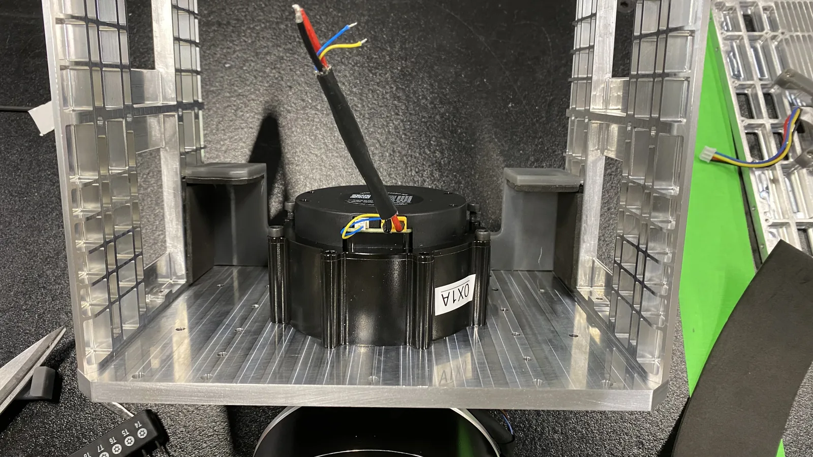
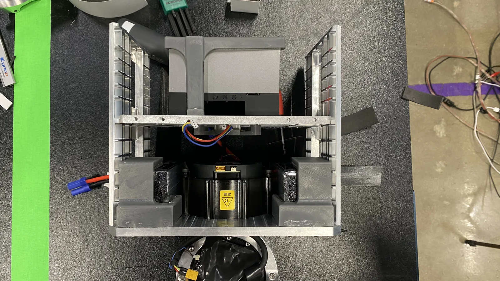
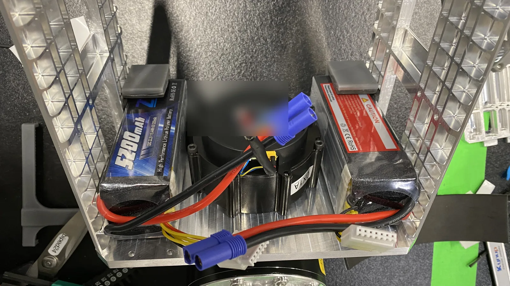

# Torso and waist

The structural core: the plate frame, the single waist joint that connects the
pelvis to the upper body, and the mounting for the onboard computer, the battery
packs, the CAN adapters and the IMU. Everything else bolts to this, and the
camera gimbals bolt to its top plate.

!!! missing "Structure only — do not attempt a torso from this page"
    The order below follows the plate frame and the electronics the parts list
    contains. Fastener sizes, torques, mounting patterns, thermal clearances and
    retention schemes have never been recorded. Do not attempt a torso from this
    page.

!!! warning "Blocking prerequisite — configure the waist actuator first"
    Set the waist actuator to **CAN ID 1** on the bench before it goes into the
    frame. See [Motor ID and config](../bringup/motor-id-and-config.md).

## The waist joint

| Joint | Actuator | CAN ID | Bus | Model limit |
| --- | --- | --- | --- | --- |
| `waist` | RobStride 03 | 1 | `can22` | ±90° |

`can22` is shared with both arms' `shoulder_1` actuators (IDs 10 and 20). That
bus therefore runs from the torso into both shoulders, and it is the only bus
that touches three separate subassemblies.

## Machined parts in the torso

| Part ID | Description |
| --- | --- |
| `CNC_body01_x1_bottom_plate` | Bottom plate |
| `CNC_body02_x2_side_plate` | Side plate |
| `CNC_body03_x1_top_plate` | Top plate — carries the camera gimbal columns |
| `CNC_body04_x4_front_plate` | Front plate |

!!! unverified "A second, conflicting set of body plates is in the same sheet"
    The machining sheet also carries `B1_body_base_plate`, `B2_body_top_plate`,
    `B3_body_side_plate_x2` and `B5_body_shelf` — an older numbering that
    appears to describe the same structure as the four `CNC_bodyNN` plates
    above, at different prices. Which set is current is unknown, and ordering
    both would roughly double the torso's machining cost.
    Resolving this is tracked on [CNC parts](../bom/cnc-parts.md).
    *Owner: hardware lead.*

    Note also that `B5_body_shelf` has no `CNC_bodyNN` equivalent. If the torso
    has an internal shelf carrying the computer or the packs, it is missing from
    the current numbering entirely. The team's torso-frame CAD animation does
    show one: an internal central spine with shelf flanges, between the front
    electronics bay and the rear battery bay. Whether that is `B5_body_shelf`
    or a part that is not machined at all is **UNVERIFIED**{ .dh-unverified }.
    The same animation shows four ribbed edge rails; by count they could be
    `CNC_body04_x4_front_plate` (**UNVERIFIED**{ .dh-unverified }).

## What lives inside the torso

From the electronics parts list. Quantities here are for the whole robot.

| Item | Qty | Note |
| --- | --- | --- |
| MINISFORUM X1-470 mini PC | 1 | The onboard computer |
| Zeee 6S 22.2 V 10000 mAh LiPo pack | 2 | Sold as a two-pack in the parts list |
| CANable PRO V2.0 USB-CAN adapter | 6 | One per CAN bus |
| Waveshare ST/SC bus servo driver board | 2 | One per gripper |
| Vention USB hub | 3 | |
| SYD Dynamics TransducerM TM171 IMU | 1 | 9-axis AHRS, dual-port |
| DC 20–60 V to 12 V encased buck converter | 1 | |
| 48 V to 12 V buck converter | 2 | |
| TVS diode, 53 V working / 85 V clamp | 10 | |

## What the CAD animations show

The team's CAD shows the torso in four layers: the plate frame, a front
electronics bay, a rear battery bay and two covers. None of the animations
carries a label or part ID, so every identification of an electronics item
below is an inference.

<figure markdown>
  <video class="dh-clip" autoplay loop muted playsinline preload="metadata" width="1280" height="720"
    poster="../../assets/exploded/body-frame-poster.webp" aria-label="Exploded view of the torso plate frame"><source src="../../assets/exploded/body-frame.mp4" type="video/mp4"><a href="../../assets/exploded/body-frame.mp4">Exploded view of the torso plate frame</a></video>
  <figcaption>Team's unlabelled CAD animation: torso frame: top, bottom and two side plates, four ribbed rails, the internal spine, both shoulder-pitch actuators and the waist actuator.</figcaption>
</figure>

**Frame.** One top plate with a roughly hexagonal central opening and a field
of bolt holes; one bottom plate with a large round central opening; two side
plates, each with a round shoulder-actuator opening and a square window; four
ribbed edge rails; one internal central spine with shelf flanges; both
shoulder-pitch actuators, one in each side-plate opening; and the waist
actuator in the bottom-plate opening.

<figure markdown>
  <video class="dh-clip" autoplay loop muted playsinline preload="metadata" width="1280" height="720"
    poster="../../assets/exploded/body-front-poster.webp" aria-label="Exploded view of the torso front electronics bay"><source src="../../assets/exploded/body-front.mp4" type="video/mp4"><a href="../../assets/exploded/body-front.mp4">Exploded view of the torso front electronics bay</a></video>
  <figcaption>Team's unlabelled CAD animation: front electronics bay. Identifications of the boxes are <strong class="dh-unverified">UNVERIFIED</strong> (see text).</figcaption>
</figure>

**Front bay.** Six identical small boxes, each with a cable strain relief at
one end, on the inner face of a side plate next to the spine; one large
rounded-square box with cables at top and bottom, on the central spine; two
orange bars, each carrying seven plug connectors; a small multi-hole block; a
black bar with two plugs; and a small flanged box with a plug on the top face
of the top plate, over the central opening. The counts suggest the six
CANable PRO V2.0 adapters, the mini PC, the upper-body power and ground
distribution blocks and the IMU. All of these identifications are
**UNVERIFIED**{ .dh-unverified }.

<figure markdown>
  <video class="dh-clip" autoplay loop muted playsinline preload="metadata" width="1280" height="720"
    poster="../../assets/exploded/body-back-poster.webp" aria-label="Exploded view of the torso rear bay with two upright packs"><source src="../../assets/exploded/body-back.mp4" type="video/mp4"><a href="../../assets/exploded/body-back.mp4">Exploded view of the torso rear bay with two upright packs</a></video>
  <figcaption>Team's unlabelled CAD animation: rear bay, two upright packs and small blocks. No pack retention part is drawn.</figcaption>
</figure>

**Rear bay**, behind the central spine. Two tall dark packs standing upright
side by side, each with two lead stubs on top (consistent with the two Zeee 6S
10000 mAh packs; **UNVERIFIED**{ .dh-unverified }); a stepped block with a
round stub and two small plain blocks above the packs (unidentified); and a
two-row screw-terminal strip at the bottom of the bay. **No pack retention
part is drawn.**

<figure markdown>
  <video class="dh-clip" autoplay loop muted playsinline preload="metadata" width="1248" height="702"
    poster="../../assets/exploded/body-cover-poster.webp" aria-label="Exploded view of the torso front and back covers"><source src="../../assets/exploded/body-cover.mp4" type="video/mp4"><a href="../../assets/exploded/body-cover.mp4">Exploded view of the torso front and back covers</a></video>
  <figcaption>Team's unlabelled CAD animation: front and back torso covers, each a perforated frame plus a perforated panel.</figcaption>
</figure>

**Covers.** A front cover and a back cover, each in two layers: a perforated
rectangular frame and a perforated panel with a grid of square holes. The back
panel has a large window near its top; the front panel has a slot near its top
and a cut-out emblem.

The pelvis block below the waist (the waist actuator plus four hip actuators)
has its own animation on [Leg](leg.md#what-the-cad-animations-show).

*Source: team exploded-view CAD animations of the torso frame, front bay, rear
bay and covers; data and power wiring diagrams (V2) for the counts.*

> **Figure** labelled version not produced yet —
> `assets/assembly/torso-exploded.png`: the animations above carry no labels.
> Still needed: the torso exploded — four plate types, waist actuator,
> computer, both packs, the six CAN adapters, the hubs and the IMU — every item
> labelled and every electronics item shown in its mounting position.

!!! unverified "UNVERIFIED — whether the shoulder-pitch actuators are built into the torso or the arms"
    The [Assembly index](index.md) counts the torso as one RobStride (the
    waist). The torso-frame CAD also holds both shoulder-pitch actuators
    (`shoulder_1`, RobStride 03), one in each side plate, and the
    [Arm](arm.md) page builds them as the first joint of each arm. Which
    subassembly they are fitted in, and in what order, is not recorded.
    *Owner: hardware lead.*

## Sub-assembly A — the plate frame

{{ step(1, "Configure and label the waist actuator") }}

Parts needed

| Part ID | Qty | Description |
| --- | --- | --- |
| RobStride 03 | 1 | `waist`, CAN ID 1, bus `can22` |
| Masking tape and marker | As needed | Label |

{{ checkpoint("The waist actuator answers at ID 1 on a bench adapter and carries a physical label.") }}

{{ step(2, "Assemble the plate frame") }}

Parts needed

| Part ID | Qty | Description |
| --- | --- | --- |
| `CNC_body01_x1_bottom_plate` | **TODO**{ .dh-missing } | Bottom plate |
| `CNC_body02_x2_side_plate` | **TODO**{ .dh-missing } | Side plates |
| `CNC_body04_x4_front_plate` | **TODO**{ .dh-missing } | Front plates |
| Threadlocker | As needed | Grade on [Tools](tools.md) |

Build the frame square and check it before anything else goes in. Every later
alignment on the robot — the hips, the shoulders, and above all the two camera
columns — is referenced to this frame.

The torso-frame animation above shows which plates make up the frame, but not
the order they join in.

> **Figure** not produced yet —
> `assets/assembly/torso-step-02.png`: the plate frame exploded, showing how the
> bottom, side and front plates join and in what order.

!!! missing "MISSING — plate frame: assembly order, location method, squareness tolerance, fasteners, torque"
    Assembly order of the plates. Whether the joints are doweled or rely on
    fastener location. How squareness is checked, and to what tolerance.
    Fasteners: size, count, head type, tightening pattern. Torque. Threadlocker.
    *Owner: hardware lead, from a photographed build.*

{{ checkpoint("The frame is square within the stated tolerance, sits flat on a surface plate, and does not rack when pushed by hand.") }}

{{ step(3, "Install the waist joint") }}

Parts needed

| Part ID | Qty | Description |
| --- | --- | --- |
| RobStride 03 — ID 1 | 1 | `waist` |
| Threadlocker | As needed | Grade on [Tools](tools.md) |

In the team CAD the waist actuator sits in the large round opening of the
bottom plate, **driver-board side up** into the torso, with its output facing
down into the pelvis block through a star-shaped flange, a thin ring and a
square coupler. *Source: team exploded-view CAD animations of the torso frame
and the pelvis block.*

!!! missing "MISSING — waist joint: part IDs for the flange, ring and coupler; bearing, fasteners, torque"
    No machined part in the sheet is named for the waist joint. The CAD shows
    where the actuator sits and the stack below it (flange, ring, coupler), but
    not which part IDs those are, whether they are the shared `RS03` coupler and
    retainer parts, or whether the ring is a bearing and which one. Resolve
    before ordering.
    Bearing specification, fasteners, torque, threadlocker: unknown.
    *Owner: hardware lead.*

<figure markdown>
  { loading=lazy }
  <figcaption>Illustrative only: single-leg phase build, March 2025; whether this survives in the final robot is <strong class="dh-unverified">UNVERIFIED</strong>. Body box of pocketed aluminium plates, waist actuator vertical at the centre, printed battery holders either side.</figcaption>
</figure>

> **Figure** not produced yet —
> `assets/assembly/torso-step-03.png`: the waist actuator in the frame, showing
> which side is pelvis and which is upper body, and the yaw axis.

{{ checkpoint("The waist rotates freely through its full travel with no axial play, and the upper body is square to the pelvis at the zero position.") }}

{{ step(4, "Fit the top plate") }}

Parts needed

| Part ID | Qty | Description |
| --- | --- | --- |
| `CNC_body03_x1_top_plate` | **TODO**{ .dh-missing } | Top plate |
| Threadlocker | As needed | Grade on [Tools](tools.md) |

The top plate is the datum for both camera gimbal columns. In the published
camera model the two yaw axes sit at **y = ±0.065 m** either side of centre and
at **z = 0.52 m** in the robot's base frame, and the whole
[head and camera gimbal](head-and-camera-gimbal.md) geometry is measured from
this plate. Anything that makes the plate non-flat or non-square shows up
directly as a camera extrinsic error at
[Camera calibration](../bringup/camera-calibration.md).

The CAD-parse description on [Head and camera gimbal](head-and-camera-gimbal.md)
calls the plate's centre opening "one central large hole"; the torso-frame
animation shows a roughly hexagonal opening. Which shape the released plate
has is **UNVERIFIED**{ .dh-unverified }; check against the CAD.

> **Figure** not produced yet —
> `assets/assembly/torso-step-04.png`: top plate with the two gimbal mounting
> interfaces dimensioned, the ±65 mm offsets called out, and the through-holes
> for the camera cabling marked.

!!! missing "MISSING — gimbal mounting interface on the top plate: bolt pattern, datum, flatness tolerance"
    The gimbal mounting interface on the plate: bolt pattern, pilot or dowel
    location, and the flatness and squareness tolerance the cameras need.
    Fasteners, torque, threadlocker: unknown.
    *Owner: hardware lead, from the CAD.*

{{ checkpoint("The top plate is flat and square to the frame, and both gimbal mounting interfaces measure the same relative to the frame datum.") }}

## Sub-assembly B — electronics and power

{{ step(5, "Mount the onboard computer") }}

Parts needed

| Part ID | Qty | Description |
| --- | --- | --- |
| MINISFORUM X1-470 mini PC | 1 | Onboard computer |
| Computer mount | **TODO**{ .dh-missing } | **TODO**{ .dh-missing } — no mounting part exists in any list |
| Threadlocker | As needed | Grade on [Tools](tools.md) |

!!! unverified "UNVERIFIED — which computer the robot carries"
    The parts list and the team power wiring diagram name a **MINISFORUM
    X1-470** mini PC. The team design log and its mass budget call the
    computer the "jetson" and link a Jetson Orin NX forum thread, and the log's
    single-leg-phase photo of the computer mount is captioned "jetson". Which
    computer the finished robot carries is not stated in one place.
    *Owner: hardware lead.*

!!! missing "MISSING — onboard computer: mount, retention, thermal clearance, port orientation"
    Where the computer mounts, how it is retained against walking shock, what
    thermal clearance
    its intake and exhaust need, and which way the ports face. A mini PC in a
    closed aluminium box on a walking robot is a thermal question before it is
    a mechanical one, and nothing has been recorded about it. A partial hint
    for the location: the front-bay CAD animation shows one large
    rounded-square box mounted on the central spine
    (**UNVERIFIED**{ .dh-unverified } that it is the computer).
    *Owner: hardware lead.*

<figure markdown>
  { loading=lazy }
  <figcaption>Illustrative only: single-leg phase build, March 2025; whether this survives in the final robot is <strong class="dh-unverified">UNVERIFIED</strong>. A computer module in printed T-brackets on a crossbar above the waist actuator (the team log calls it the "jetson"; the BOM computer is a MINISFORUM X1-470).</figcaption>
</figure>

> **Figure** not produced yet —
> `assets/assembly/torso-step-05.png`: computer in position, airflow path shown,
> port face and cable exits visible.

{{ checkpoint("The computer is retained so that it cannot move when the torso is shaken, its intake and exhaust are clear, and every port that needs a cable is reachable without removing it.") }}

{{ step(6, "Mount the battery packs") }}

Parts needed

| Part ID | Qty | Description |
| --- | --- | --- |
| Zeee 6S 22.2 V 10000 mAh LiPo | 2 | |
| Pack retention | **TODO**{ .dh-missing } | **TODO**{ .dh-missing } — no retention part exists in any list |

!!! danger "Battery safety"
    Two 6S 10000 mAh LiPo packs is a large amount of stored energy inside an
    aluminium frame. Retention, abrasion protection and a way to get a pack out
    quickly are safety features, not conveniences. Read
    [Safety](../before-you-start/safety.md) before this step, and keep the packs
    disconnected until [Pre-power checks](../electrical/pre-power-checks.md)
    passes.

**How the packs are connected.** Two Zeee 6S 10000 mAh LiPo packs are
connected in series (one pack's + to the other's −) and feed a bus labelled
48V through a surge protector. Computed, not stated in the diagram:
2 × 22.2 V = 44.4 V nominal and 2 × 25.2 V = 50.4 V at full charge.
*Source: team power wiring diagram (V2).*

A March 2025 single-leg-phase photo shows two packs of different brands, one
labelled 5200 mAh. **UNVERIFIED**{ .dh-unverified } which packs the finished
robot carries; the power diagram and the BOM both name the Zeee 6S 10000 mAh.

**Where they sit.** In the team CAD the two packs stand upright side by side in
the rear bay, behind the central spine. No retention part is drawn.
*Source: team exploded-view CAD animation of the torso rear bay.*

!!! missing "MISSING — SAFETY — battery pack retention, swap path and lead protection"
    Partly answered. Series/parallel: series, per the power wiring diagram
    (above). Location: upright in the rear bay, from the CAD animation only.
    Still missing: how the packs are retained (the CAD draws no retention
    part), whether a pack can be swapped without disassembly, and how the
    leads are protected where they leave the pack. See
    [Power system](../electrical/power-system.md).
    *Owner: hardware lead + electrical.*

<figure markdown>
  { loading=lazy }
  <figcaption>Illustrative only: single-leg phase build, March 2025; whether this survives in the final robot is <strong class="dh-unverified">UNVERIFIED</strong>. Two packs either side of the waist actuator, EC5-style connectors; one pack is labelled 5200 mAh, while the BOM and power diagram name the Zeee 6S 10000 mAh. Actuator label blurred.</figcaption>
</figure>

> **Figure** not produced yet —
> `assets/assembly/torso-step-06.png`: both packs in position with their
> retention, and the swap path out of the torso.

{{ checkpoint("Both packs are retained so they cannot shift under walking loads, no lead is under tension or against a machined edge, and a pack can be removed by the documented procedure.") }}

{{ step(7, "Mount the CAN adapters, hubs and converters") }}

Parts needed

| Part ID | Qty | Description |
| --- | --- | --- |
| CANable PRO V2.0 | 6 | One per bus: `can9`, `can21`, `can22`, `can23`, `can24`, `can25` |
| Vention USB hub | 3 | |
| Waveshare ST/SC bus servo driver board | 2 | One per gripper |
| DC 20–60 V to 12 V encased buck converter | 1 | |
| 48 V to 12 V buck converter | 2 | |
| TVS diode 53 V / 85 V | 10 | |

Label each CAN adapter with its bus name **before** it is installed. The bus
names are bound to each adapter's USB serial number by a udev rule on the
robot computer, so an unlabelled adapter cannot be identified later without
unplugging it.

**Which hub carries what.** USB Hub #1 carries the two RealSense D436 cameras
and the IMU; USB Hub #2 the CANable PRO V2.0 adapters; USB Hub #3 the left and
right gripper servo driver boards. Hub power and the USB power budget are not
shown. Whether the first D436 and the can9 and can25 adapters plug into their
hub or directly into the computer is **UNVERIFIED**{ .dh-unverified }.
*Source: team data wiring diagram (V2).*

**Power distribution.** Power is split between two distribution-block pairs
(power + ground). The lower-body pair feeds both legs and the waist (13
actuators, computed); the upper-body pair feeds both arms, both shoulder_1
joints and the four gaze motors (18 actuators, computed). TVS diodes sit
across power and ground at each pair; the number fitted at each location is
**UNVERIFIED**{ .dh-unverified } (the BOM carries 10 × M1.5KE62CA).
*Source: team power wiring diagram (V2).*

> **Figure** not produced yet —
> `assets/assembly/torso-step-07.png`: the six CAN adapters, three hubs, servo
> driver boards and converters in their mounting positions, each labelled with
> its bus or function.

!!! missing "MISSING — mounts for the CAN adapters, hubs, converters, distribution blocks and TVS diodes"
    Mounting method for each of these — none of them has a machined or printed
    mount in any list. The front-bay CAD animation hints at locations only
    (six small boxes on a side plate, two connector bars), with every
    identification **UNVERIFIED**{ .dh-unverified }. Which hub feeds what and
    what the TVS diodes sit across are now answered above; how many TVS diodes
    sit at each pair, and where the converters mount, are not.
    *Owner: hardware lead + electrical.*

{{ checkpoint("Every CAN adapter carries its bus label, every board is mechanically retained rather than hanging on its cable, and no converter is mounted against a surface that blocks its heat path.") }}

{{ step(8, "Mount the IMU") }}

Parts needed

| Part ID | Qty | Description |
| --- | --- | --- |
| SYD Dynamics TransducerM TM171 | 1 | 9-axis AHRS |
| IMU mount | **TODO**{ .dh-missing } | **TODO**{ .dh-missing } — no mounting part exists in any list |

The IMU is the only sensor that tells the walking policy which way is up. Its
mounting is a precision operation disguised as a bracket: its orientation
relative to the robot's base frame becomes a constant in the control stack, and
any compliance in the mount becomes noise in the estimate.

**The unit.** SYD Dynamics TransducerM TM171: 40 × 34 × 12.6 mm, the same
mechanical dimensions as the TM151. *Source: team design log, "IMU"; vendor
mechanical drawing from the
[SYD Dynamics download centre](https://www.syd-dynamics.com/download-center/)
(not reproduced here).*

!!! unverified "UNVERIFIED — IMU mounting screw size"
    The team design log says "Mounting holes: M3". The vendor drawing
    dimensions the four flange holes at Ø2.10 on 30 × 31 mm centres, which is
    too small for M3 clearance. Which fastener the team used is not recorded.
    *Owner: hardware lead.*

!!! missing "MISSING — IMU mount, orientation relative to the base frame, and how it is verified"
    Where the IMU mounts on the finished robot, in what orientation relative to
    the base frame, and what that orientation is in the control configuration.
    Whether the mount is rigid or isolated. How the orientation is verified
    after assembly. Partial hints only: the front-bay CAD animation shows a
    small flanged box on the top face of the top plate that may be the IMU
    (**UNVERIFIED**{ .dh-unverified }), and the single-leg-phase photo below
    shows an earlier mount with no orientation recorded.
    *Owner: hardware lead + controls.*

<figure markdown>
  { loading=lazy }
  <figcaption>Illustrative only: single-leg phase build, March 2025; whether this survives in the final robot is <strong class="dh-unverified">UNVERIFIED</strong>. The TransducerM IMU on a printed X-shaped bracket, screwed to a pocketed aluminium plate. Orientation on the robot is not recorded.</figcaption>
</figure>

> **Figure** not produced yet —
> `assets/assembly/torso-step-08.png`: IMU in position with its axes drawn and
> labelled against the robot's base frame axes.

{{ checkpoint("The IMU is rigidly mounted in the documented orientation, and its axes have been checked against the robot frame rather than assumed.")}}

{{ step(9, "Fit the disconnect and emergency stop") }}

!!! missing "MISSING — SAFETY — nothing in this robot's parts list stops it"
    There is **no** emergency stop, main disconnect, fuse, breaker, precharge
    circuit or key switch anywhere in the parts list, and apart from the fuse
    noted below no document in the project describes one. The only stop that exists is a software velocity
    limit in the motor loop. The team power wiring diagram (V2) adds a surge
    protector in the pack lead and a 10 A fuse on the computer branch only;
    neither is in the parts list, and the diagram shows no e-stop, disconnect
    or pre-charge.

    A 36 kg machine with 31 actuators and two 6S packs needs a hardware means of
    removing power that does not depend on the computer being alive. Specifying
    it is a prerequisite for this page, not a refinement of it.

    Required before this step can be written: the device, where it mounts, what
    it interrupts, how it is rated for the pack current, and how it is reached
    by a person standing next to a walking robot.
    *Owner: hardware lead + electrical + whoever signs off
    [Safety](../before-you-start/safety.md).*

{{ step(10, "Fit the covers and close the torso") }}

In the team CAD the torso closes with two covers, front and back, each a
perforated frame plus a perforated panel (see the cover animation above).
*Source: team exploded-view CAD animation of the torso covers.*

!!! missing "MISSING — torso covers: what they are made of, whether they are structural, what must be removable"
    The covers exist in the CAD (two covers, each frame + panel). Still
    missing: whether they are machined, printed or sheet, whether any of them
    is structural, how they are fastened, and what has to be removable for a
    battery swap. Nothing in the parts list is named as a cover for the torso.
    *Owner: hardware lead.*

{{ checkpoint("The torso is closed, every internal item is retained, the waist still moves through its full travel, and nothing inside moves when the torso is lifted and tilted by hand.") }}

## Lifting points

!!! missing "MISSING — SAFETY — no lifting point is defined for the robot"
    The torso carries the whole robot's weight on the hoist, and no lifting
    point is defined anywhere. This must be decided **before** the first lift,
    not during it: where the sling attaches, whether the attachment is a
    machined feature or a strap route, and what the assembly hangs level from
    with the limbs on.

    Note the constraint the operations manual already imposes on hanging: the
    legs must hang straight when the robot is suspended, because a bent-leg hang
    tilts the torso and corrupts the geometry the perception stack depends on.
    Whatever lifting point is chosen has to make that hang natural.
    *Owner: hardware lead + [Safety](../before-you-start/safety.md).*

## Figures this page needs

None of these figures exists yet **TODO**{ .dh-missing }.

| File | Step | What it must show |
| --- | --- | --- |
| `assets/assembly/torso-exploded.png` | page header | Whole torso exploded, structure and electronics, all labelled (unlabelled CAD animations are already on the page) |
| `assets/assembly/torso-step-02.png` | 2 | Plate frame exploded, join order |
| `assets/assembly/torso-step-03.png` | 3 | Waist actuator in the frame, yaw axis, pelvis and upper-body sides |
| `assets/assembly/torso-step-04.png` | 4 | Top plate with both gimbal interfaces dimensioned, ±65 mm called out |
| `assets/assembly/torso-step-05.png` | 5 | Computer in position with airflow and port face |
| `assets/assembly/torso-step-06.png` | 6 | Both packs with retention and the swap path |
| `assets/assembly/torso-step-07.png` | 7 | CAN adapters, hubs, servo boards and converters, each labelled |
| `assets/assembly/torso-step-08.png` | 8 | IMU with its axes drawn against the base frame |
| `assets/assembly/torso-lifting-points.png` | lifting | The sling route and lifting points, once defined |
