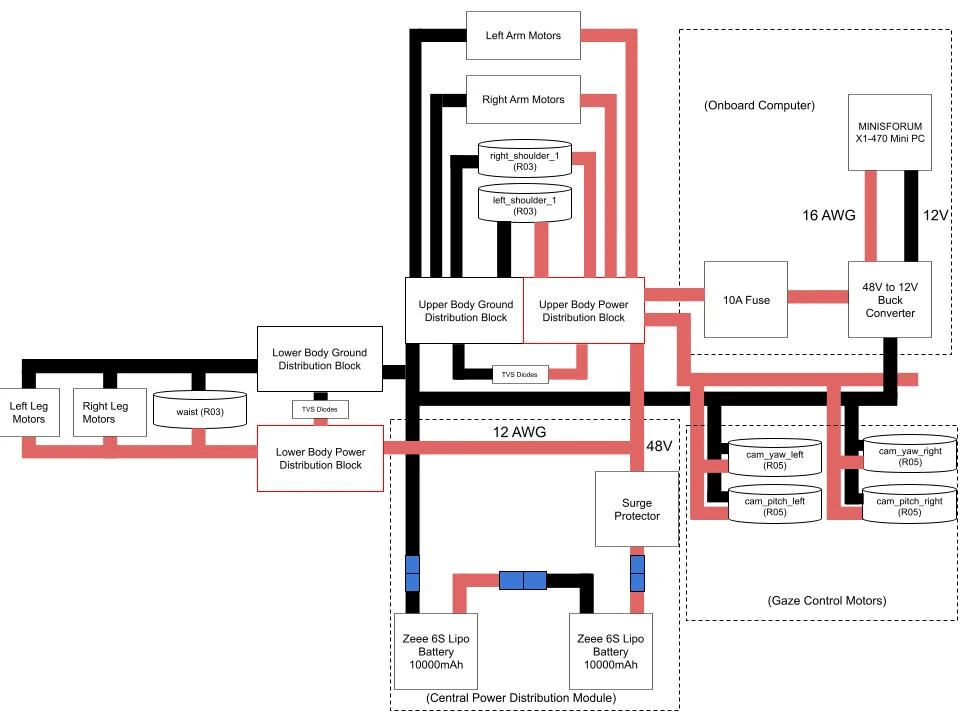

# Safety

This is the one page on this site that can prevent an injury. Read it completely
before you order parts, and read it again before the first power-on.

It covers the hazards this particular machine creates: two 6S lithium-polymer
packs, a 36 kg body that is back-drivable at every joint and therefore falls when
power is removed, and a bring-up procedure that puts people within arm's reach of
a biped that is learning to stand.

!!! missing "This page is incomplete, and the gaps are the dangerous part"
    The V2 software release carries an unusually thorough safety contract for the
    *controller* — hundreds of numbered mechanisms, each with the incident that
    produced it. There is currently **no validated document for human safety
    around the machine**: no e-stop doctrine, no power-down order, no bystander
    distance, no battery procedure, no lifting specification.

    Every red **MISSING** or **UNVERIFIED** box below is a gap that you must close
    for yourself, with your own institution's safety office, before you proceed.
    Do not read an empty box as "probably fine".

!!! warning "This is not a risk assessment"
    What follows is an example of the points a builder should be thinking about.
    It is not a substitute for a risk assessment carried out for your own space,
    your own people and your own build. Robots are made safe by sincere
    assessment and continuous improvement, not by a page on a website.

## The four hazards this design creates

### 1. Power loss means collapse

Every joint is quasi-direct-drive: a low-ratio transmission with no self-locking
gearbox. That is what makes the machine back-drivable and controllable, and it is
also what makes it fall. **Cutting power does not hold the robot up.** A 36 kg
body drops, and anything the arms are holding drops with it.

Plan for this as the *expected* consequence of pressing the emergency stop, not
as a failure case. An e-stop on this machine converts a controlled hazard into an
uncontrolled one; it is still the right action, but it is not a safe state.

!!! missing "MISSING — SAFETY — Measured collapse behaviour and standoff on power loss"
    - Measured collapse behaviour. Does the machine fold at the knees, topple, or
      both? From a standing pose, into what footprint, and how fast?
    - Whether any joint has a mechanical brake, a hard stop or a spring that
      changes this answer. If none do, say so explicitly.
    - The minimum standoff distance that follows from that footprint.
    - Whether the arms should be commanded to a safe pose before any planned
      power-down, and what that pose is.

    *Owner: hardware lead, from an instrumented drop test with the robot
    suspended. Blocks [First power-on](../bringup/first-power-on.md).*

### 2. Lithium-polymer energy storage

Two Zeee 6S 10000 mAh LiPo packs are connected in series (one pack's + to the other's −) and feed a bus labelled 48V through a surge protector. Computed, not stated in the diagram: 2 × 22.2 V = 44.4 V nominal and 2 × 25.2 V = 50.4 V at full charge.
*Source: team power wiring diagram (V2).*

<figure markdown>
  { loading=lazy }
  <figcaption>Team power wiring diagram (V2): two 6S packs in series, surge protector, 48V bus to upper- and lower-body distribution blocks, TVS diodes, 10 A fuse and 48V-to-12V buck converter to the onboard computer.</figcaption>
</figure>

The full-charge figure is above 50 V, so read everything in this section for a
series bus, not for a single 22.2 V pack. Each pack stores roughly 222 Wh
**UNVERIFIED**{ .dh-unverified } (nominal capacity times nominal voltage,
computed, not measured).

The RobStride 02, 03 and 04 manuals give a rated voltage of 48 VDC and an operating range of 24–60 VDC. The RS00, RS05 and RS06 manuals are not in the team records, so their range is **UNVERIFIED**{ .dh-unverified }.
*Source: RobStride 02, 03 and 04 product manuals.*

The only fuse drawn is a 10 A fuse on the onboard-computer branch: upper-body power distribution block → 10 A fuse → 48V-to-12V buck converter → MINISFORUM X1-470 mini PC. No pack-path fuse, e-stop, main disconnect, pre-charge circuit or pack monitoring is drawn, and the surge protector's part number is not identified. Neither the 10 A fuse nor the surge protector is in the BOM.
*Source: team power wiring diagram (V2); this site's BOM.*

Power is distributed on XT30 connectors, which a dropped hex key will short
without any difficulty at all.

A LiPo pack is a fire hazard when over-discharged, over-charged, punctured,
crushed, charged unattended, or shorted. A pack fire is not extinguished by a
standard office extinguisher and cannot be put out by removing the power source,
because the pack *is* the power source.

!!! unverified "UNVERIFIED — Which battery packs the finished robot carries"
    A March 2025 single-leg-phase photo shows two packs of different brands, one labelled 5200 mAh. **UNVERIFIED**{ .dh-unverified } which packs the finished robot carries; the power diagram and the BOM both name the Zeee 6S 10000 mAh.

    *Owner: electrical lead. See [Single-leg phase](../design/single-leg-phase.md).*

!!! missing "MISSING — SAFETY — Battery charging, storage, fire response, disposal and protection"
    Every one of these must be written down before a pack is charged for the
    first time:

    - **Charger and charging procedure**: the exact charger used, charge rate,
      balance-charging requirement, and where charging happens. Charging is
      never unattended. The team log links a charger listing whose title reads
      "ISDT ... DC600Wx2"; the exact model is not stated, so the charger's
      identity is **UNVERIFIED**{ .dh-unverified }.
    - **Voltage floor**: the per-cell and pack voltage at which the robot must be
      powered down, and the voltage below which a pack is retired rather than
      recharged.
    - **Storage and transport**: LiPo bag or ammo can, storage charge state, and
      where packs live when not in the robot.
    - **Fire response**: extinguisher class, what to do with a puffing pack, and
      who to call. Post this where the packs are charged, not only on a website.
    - **Disposal** route for a puffed, dropped or damaged pack.
    - **Protection**: the team power diagram draws no fuse, breaker or
      contactor between the packs and the motor bus (see above). Decide whether
      one is required, and write the decision down.

    *Owner: hardware lead with the local EHS office. Blocks
    [Power system](../electrical/power-system.md).*

### 3. Thirty-one actuators with nothing between the rotor and your hand

Quasi-direct-drive gives high back-drivability, and also high peak torque
delivered through a stiff transmission with no compliance and no clutch. A limb
that closes on a finger closes with the full commanded torque of that joint. This
is a crush injury, not a bruise.

Joints are actuated at: shoulder pitch, roll and yaw; elbow; wrist roll, pitch
and yaw; waist; hip pitch, roll and yaw; knee; ankle pitch and roll — mirrored
left and right — plus yaw and pitch on each camera gimbal, and one axis per
gripper.

The actuators protect themselves against heat. The RobStride manuals give a
motor over-temperature **fault at 80 °C** and a **warning at 75 °C** by default,
and rate the driver control board to 80 °C. The manuals warn not to change the
torque limit, the protection temperature or the over-temperature time. Leave
these protection settings at their defaults.
*Source: RobStride 02, 03 and 04 product manuals.* The team's RS04 bench unit
read `motorOverTemp` = 1450 in the vendor tool, which is 145.0 °C at the
manual's ×10 scale (computed), not the 80 °C reference
**UNVERIFIED**{ .dh-unverified }. Check the value on your own units.

The team's mechanical design checklist called for an end-stop on every DOF ("DOF
should have an end-stop to prevent the motor from going crazy"). Whether any
joint on the finished robot has one is **UNVERIFIED**{ .dh-unverified }.
*Source: team design log, "mechanical design checklist".*

!!! missing "MISSING — SAFETY — Configured per-joint torque limits and a pinch-point diagram"
    - Per-joint peak torque **as configured**, not as printed on the actuator
      datasheet. What matters for a crush injury is the current limit the
      firmware actually enforces.
    - A labelled pinch-point diagram derived from the link geometry, covering at
      minimum: the knee fold, the elbow fold, the hip-roll/thigh gap, the waist
      shear plane between torso and pelvis, the gripper jaws, and the camera
      gimbals, which sit at head height and move fast and quietly.
    - Whether any joint can be commanded into a self-collision that traps a hand
      against the frame.

    *Owner: controls lead for the torques, hardware lead for the geometry.*

### 4. It is a biped, so it can fall over on its own

Unlike a fixed-base arm, this machine's failure mode includes the whole machine
leaving the spot where you left it. A fall is not only a loss of the robot; it is
36 kg arriving somewhere at floor level, possibly onto a foot.

!!! missing "MISSING — SAFETY — Conditions for letting the robot stand free"
    The conditions under which the robot is permitted to stand free — which
    acceptance tests must have passed, what is on the floor, who is present, and
    what the recovery plan is when it starts to go over. Until that is written,
    the robot stays on the gantry.

    *Owner: hardware lead + controls lead. See
    [Acceptance tests](../bringup/acceptance-tests.md).*

## Safe-use requirements

These are the rules a build follows from the first power-on onward. They are
written as rules, not suggestions, and each one has a gap that must be filled
before it is actually usable.

### 1. Set up the space before the robot arrives in it

Work over a clear floor, away from walkways, with no flammables near the charging
station and nothing fragile inside the machine's reach. Restrict access with
barriers or floor marking so that nobody walks into the working envelope while
the robot is powered.

### 2. Suspend the robot for every early test

The onboard control stack's own runbook assumes the robot is hanging. Nothing on
this site should be attempted with the machine free-standing until the acceptance
tests have passed.

One hard-won detail is already on record in the deploy repository's operator
runbook: when the robot is hung, **the legs must hang straight**. Bent legs tilt
the torso, which corrupts the geometry the perception stack assumes; the runbook
notes that three sessions were lost to this before it was written down.

!!! missing "MISSING — SAFETY — Lifting specification: gantry, lifting points, slings, clearance"
    The lifting specification, which today exists only as an assumption inside an
    operations document:

    - Gantry or hoist rating, with a safety factor over 36 kg, and whether it
      must be rated for a dynamic load rather than a static one.
    - The lifting points on the robot, their location and their rated load.
      A sling around the torso is not the same thing as a designed lifting eye.
    - Sling, strap or harness specification, and inspection interval.
    - Clearance envelope under the suspended robot, and the rule about who may
      stand in it (nobody).
    - Whether the gantry is in [Tools](../assembly/tools.md) as a purchasable
      item. It must be: today it exists in one sentence of one operations
      document and in no parts list anywhere.

    *Owner: hardware lead.*

### 3. Keep out of the working envelope

No part of anyone's body and no object enters the robot's range of motion while
it is powered. When you need to approach it — to adjust something, to reseat a
connector, to reposition a target — the power is off first, and somebody who
cannot accidentally turn it back on is the one standing at the switch.

!!! missing "MISSING — SAFETY — Bystander distances: suspended, standing and walking"
    Three separate distances, because they are three different hazards:

    - Minimum bystander distance while the robot is **powered and suspended**.
    - Minimum distance while it is **standing** under its own control.
    - Minimum distance while it is **walking**, which must account for a fall
      radius, not just the reach envelope.

    Each number needs the assumption behind it stated, so a later builder with a
    different room can re-derive it.

    *Owner: hardware lead + local EHS office.*

### 4. Wear the right protective equipment

Safety glasses whenever the robot is powered — this is not negotiable around
back-drivable joints under load and lithium packs under charge.

!!! missing "MISSING — SAFETY — PPE beyond safety glasses, and the clothing rule"
    - Confirm the rest of the PPE list: safety shoes for a 36 kg machine that can
      come down, and whether gloves are **required or forbidden**. Both answers
      are defensible and they are opposite: gloves protect against edges and
      pinches, and gloves are exactly what gets drawn into a moving joint. Pick
      one, write down why.
    - Clothing rule: no loose sleeves, no lanyards, no untied hair near a robot
      that is powered. Long lanyards and camera gimbals at head height are a bad
      combination.

    *Owner: hardware lead + local EHS office.*

### 5. Have an emergency stop, and know what it does not do

An emergency stop must be reachable by somebody standing **outside** the working
envelope, without having to step toward the robot to reach it.

Re-read hazard 1 before relying on it: on this machine, pressing the e-stop makes
the robot fall. That is often still the right thing to do. It is never a way to
make the robot safe to approach.

!!! missing "MISSING — SAFETY — The e-stop: hardware, mounting, what it cuts, and restart"
    - **The e-stop itself.** No e-stop appears in the parts list or in the
      team power wiring diagram, and neither does a pack-path fuse, breaker,
      main disconnect or pre-charge circuit, although the control stack's own
      runbooks (`humanoid_nav_step_test.py`, `humanoid_joint_monkey_hw.py`)
      assume a physical e-stop exists. See
      [Power system](../electrical/power-system.md).
    - Where the e-stop is physically mounted, and how a bystander reaches it
      without entering the robot's reach envelope.
    - **What it cuts**: the motor bus only, or compute as well? Cutting compute
      mid-motion and cutting motor power mid-motion have different consequences
      and both need to be stated.
    - Whether a second, remote e-stop is required for a two-person bring-up, and
      whether a dead-man switch is required for walking tests.
    - How the system is restored after an e-stop, and what must be re-checked
      before power is reapplied.

    *Owner: electrical lead. Blocks [First power-on](../bringup/first-power-on.md).*

### 6. Follow the power-on and power-off order

Powering subsystems in the wrong order is how actuators end up energised before
anything is ready to command them, and how a bus ends up live while a connector
is half-seated.

!!! missing "MISSING — SAFETY — Power-on and power-off sequence"
    The ordered sequence, both directions, covering: onboard computer, the six
    USB-CAN adapters, the motor bus, the camera servos and the gripper service.
    Write it as a numbered list with a verification at each step, and make each
    step's failure mode explicit.

    *Owner: electrical lead. Blocks
    [Pre-power checks](../electrical/pre-power-checks.md).*

### 7. De-energise and isolate before touching anything

Work on the robot happens with the packs disconnected and physically separated
from the machine, not merely with a switch off. On a build where several people
share a robot, that needs a lock-out/tag-out convention.

!!! missing "MISSING — SAFETY — Isolation and lock-out/tag-out procedure"
    The isolation procedure: what gets disconnected, where the packs go while
    work is in progress, who owns the tag, and how residual bus charge in the
    converters is confirmed to have bled off before a connector is touched.

    *Owner: electrical lead.*

### 8. Two people

The machine is 36 kg. Every lift, every transfer to and from the gantry, and
several assembly operations are two-person jobs. During powered testing, the
second person's job is the e-stop and nothing else.

!!! missing "MISSING — SAFETY — Which steps need a second person, and which need a hoist"
    Which specific assembly and bring-up steps require a second person, and which
    require a hoist rather than a second person. Mark them on the individual step
    pages too, not only here.

    *Owner: hardware lead.*

### 9. Reassess, and write it down

Record hazards and near-misses as you meet them, and revise these procedures.
The control-stack side of this project already works this way, and it works.

## Periodic inspection

Check these before each session with the robot, and log anything that changes.
The intervals and the pass/fail criteria are the part that is missing.

| What to check | Why it matters on this machine |
| --- | --- |
| Fastener looseness, especially at the hips, shoulders and gantry attachment | Repeated motion and vibration loosen screws; a loose joint on a 36 kg biped is a structural failure, not a rattle |
| Mechanical limits and hard stops | Impacts deform them, and a deformed limit stops limiting |
| Unusual noise or catching in a joint | Deformed frame, damaged bearing, or a cable being pulled into a joint |
| Cable and connector damage | Repeated bending at a joint is exactly where a conductor breaks; a chafed motor-bus wire near a LiPo pack is a fire |
| Pack condition — swelling, dents, connector damage, cell balance | A puffed pack is retired, not recharged |
| Gantry, sling and lifting points | Rated equipment that has been shock-loaded is no longer rated |

!!! missing "MISSING — SAFETY — Inspection intervals, pass/fail criteria and owners"
    Turn the table above into a real checklist: an interval for each row (per
    session, weekly, per 10 hours of operation), a pass/fail criterion, and a
    named person. A checklist without criteria gets ticked without being read.

    *Owner: hardware lead.*

## Incident log

The deploy repository keeps a numbered incident register for the control stack,
where each entry names the failure and the "simplification" that would bring it
back. That pattern is the best safety practice this project already has, and it
currently covers only software.

!!! missing "MISSING — SAFETY — Mechanical and electrical incident register"
    Open a mechanical and electrical incident register, number its entries the
    same way, and link it from this page. Seed it with what is already known —
    starting with the three lost sessions behind the "legs hang straight" rule,
    which today exists as one line in an operations document rather than as an
    incident anyone can learn from.

    *Owner: hardware lead, continuously.*
