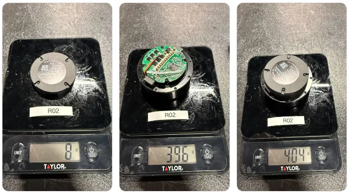
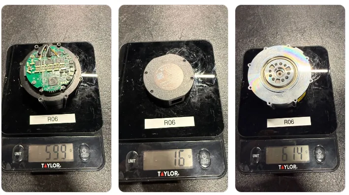
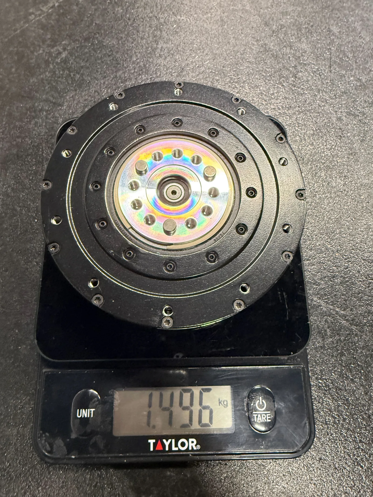
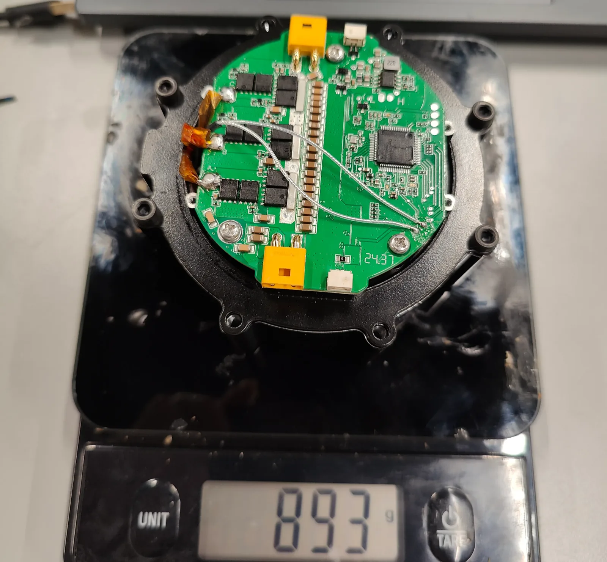
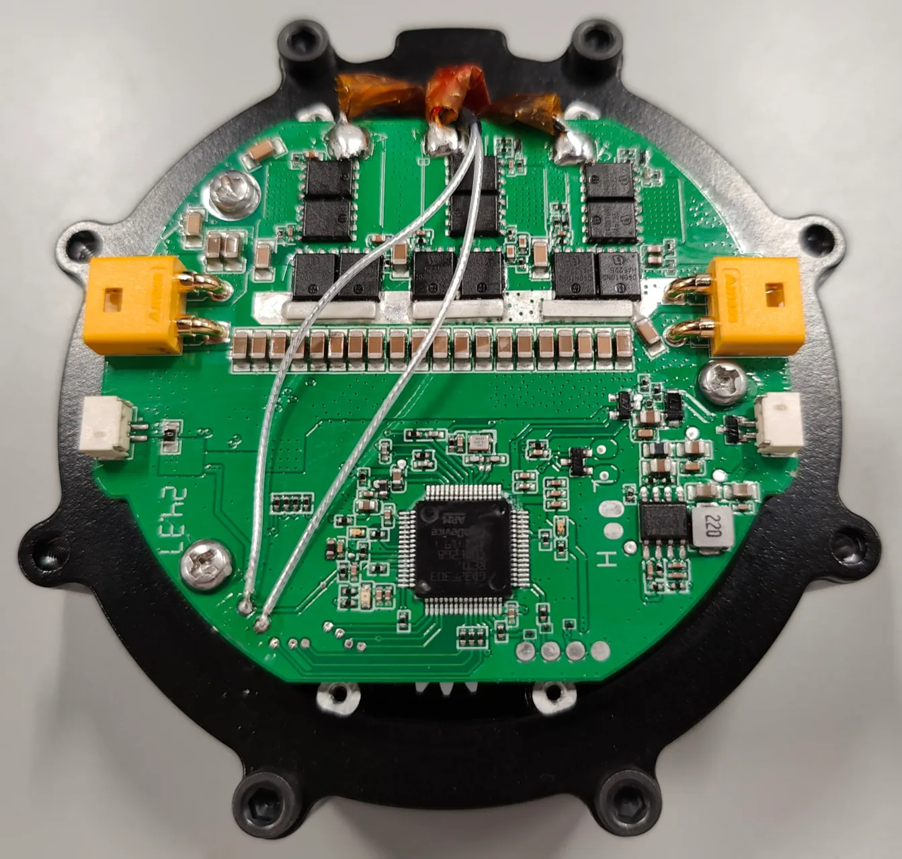
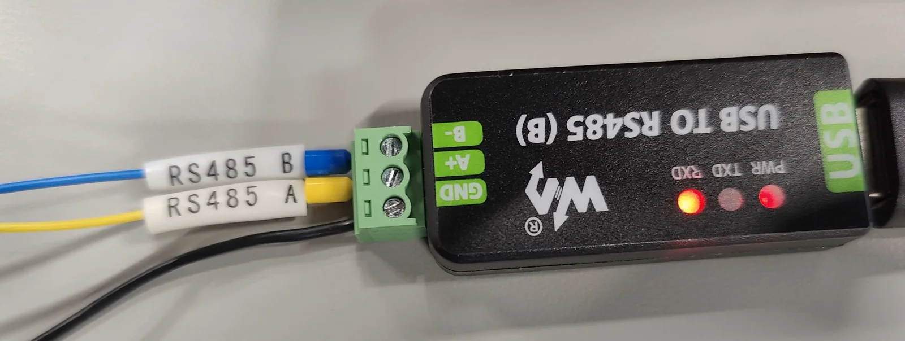

# Actuator selection

How the team chose RobStride quasi-direct-drive actuators, what it measured on the bench, and the alternatives it considered.

Nothing on this page is a build instruction. Quantities, prices and part IDs for
the build are on [Actuators](../bom/actuators.md).

## The six models on the robot

**AS-BUILT.** Every joint uses a RobStride actuator, in six models.

> As-built joint-to-model map (deploy/control/humanoid_config.py): waist R03; hip_1, hip_2, hip_3 R03; knee R04; ankle_1 R03; ankle_2 R06; shoulder_1 R03; shoulder_2 R06; shoulder_3 R02; elbow R02; wrist_1 R02; wrist_2 R00; wrist_3 R05; cam_yaw/cam_pitch (4) R05 — 31 actuators.

The team's "Motor spec" table covers exactly these six models.

| Model | Rated torque (N·m) | Max torque (N·m) | 10 s overload (N·m) | Mass (kg) | Rated torque / mass (N·m/kg) | Rated power (W) | Torque constant (N·m/Arms) |
| --- | ---: | ---: | ---: | ---: | ---: | ---: | ---: |
| RS04 | 40 | 120 | 120 | 1.42 | 28 | 700 | 2.1 |
| RS03 | 20 | 60 | 55 | 0.88 | 23 | 380 | 2.36 |
| RS06 | 11 | 36 | 27 | 0.63 | 17 | 680 | 1.1 |
| RS02 | 6 | 17 | 17 | 0.41 | 14 | 170 | 1.22 |
| RS00 | 5 | 14 | 12 | 0.31 | 16 | N/A | 1.48 |
| RS05 | 1.6 | 5.5 | 4.1 | 0.192 | 8.3 | N/A | 0.94 |

*Source: team "Motor spec (robostride & more)" table.*

The max-torque and torque-constant columns equal `MAX_TORQUE` and
`MOTOR_TORQUE_CONSTANTS` in `deploy/control/hardware_bindings/motor/py_motor.py`.
The design log's joint table quotes the 10 s overload column instead
(RS03 55, RS04 120, RS06 27, RS02 17, RS00 12 N·m); the two are different
ratings, not a conflict. Always say which rating is meant.

The RobStride 02, 03 and 04 manuals give a rated voltage of 48 VDC and an operating range of 24–60 VDC. The RS00, RS05 and RS06 manuals are not in the team records, so their range is **UNVERIFIED**{ .dh-unverified }.

!!! unverified "UNVERIFIED — three different unit prices for the same six models"
    The team's two tables and this site's parts list give three sets of prices
    (US$), none of them dated. None is confirmed.

    | Model | Motor spec table | Motor selection sheet | Site `actuators.csv` |
    | --- | ---: | ---: | ---: |
    | RS00 | 135 | 125 | 125 |
    | RS02 | 160 | 145 | 145 |
    | RS03 | 250 | 265 | 225 |
    | RS04 | 280 | 303 | 255 |
    | RS05 | 120 | 110 | 110 |
    | RS06 | 230 | not listed | 210 |

    The RS05 costs less than the RS00 and RS02 despite its model number because
    it is the smallest and lowest-torque RobStride in both team tables.

    *Owner: BOM owner.*

## Trade study: 19 candidates

**CONSIDERED — NOT USED**, except the RobStride models above. The team's
"motor selection" sheet compares 19 actuators and sorts them by torque density
per dollar, where torque density is maximum torque divided by mass. The sheet
stars two rows: **RobStride 04** and **RobStride 03**, which became the knee and
the hip, waist, shoulder_1 and ankle_1 actuators. RS04 has the highest torque
density in the sheet, 84.51 N·m/kg (120 N·m / 1.42 kg); RS03 has 68.18 N·m/kg.

| Candidate | Mass (kg) | Rated torque (N·m) | Max torque (N·m) | Bus | Unit price (sheet) | Torque density (N·m/kg) | Torque density per US$ |
| --- | ---: | ---: | ---: | --- | ---: | ---: | ---: |
| Steadywin GIM8108-8 | 0.4 | 7.5 | 20 | CAN | US$114.00 | 50.00 | 0.4386 |
| RobStride 00 | 0.31 | 5 | 14 | CAN | US$125.00 | 45.16 | 0.3613 |
| RobStride EduLite 05 | 0.242 | 1.8 | 6 | CAN | US$80.00 | 24.79 | 0.3099 |
| RobStride 02 | 0.405 | 6 | 17 | CAN | US$145.00 | 41.98 | 0.2895 |
| RobStride 01 | 0.4 | 6 | 17 | CAN | US$150.00 | 42.50 | 0.2833 |
| **RobStride 04 (starred)** | 1.42 | 40 | 120 | CAN | US$303.00 | 84.51 | 0.2789 |
| RobStride 05 | 0.191 | 1.6 | 5.5 | CAN | US$110.00 | 28.80 | 0.2618 |
| **RobStride 03 (starred)** | 0.88 | 20 | 60 | CAN | US$265.00 | 68.18 | 0.2573 |
| DM-J4310P-2EC (48V) | 0.33 | 3.5 | 12.5 | CAN | US$155.00 | 37.88 | 0.2444 |
| MyActuator X6-P20-60-C | 0.85 | 20 | 60 | CAN, EtherCAT | US$650.00 (estimated; new product) | 70.59 | 0.1086 |
| Steadywin GIM10015-10-DE | 1.21 | 25 | 45 | CAN | US$390.00 | 37.19 | 0.0954 |
| CubeMars AK80-8 | 0.57 | 10 | 25 | CAN | US$570.00 | 43.86 | 0.0769 |
| CubeMars RI115-PH (frameless motor only) | 1.1 | 5.5 | 16 | CAN | US$200.00 | 14.55 | 0.0727 |
| CubeMars AK10-9 V2.0 KV60 | 0.96 | 18 | 48 | CAN | US$800.00 | 50.00 | 0.0625 |
| MyActuator X8-20 | 0.78 | 10 | 20 | CAN | US$460.00 | 25.64 | 0.0557 |
| MyActuator X10-P7-40-C | 1.15 | 15 | 40 | CAN | US$645.00 | 34.78 | 0.0539 |
| ZeroErr eRob 70 I | 0.88 | 7 | 46 | CAN, EtherCAT | US$1,200.00 | 52.27 | 0.0436 |
| Mosrac U16025 (mass is rotor only) | 1.1 | 9 | 18 | EtherCAT | US$888.00 | 16.36 | 0.0184 |
| DYNAMIXEL YM080-230-R051-RH | 1.2 | 16 | 32 | RS485 | US$2,670.00 | 26.67 | 0.0100 |

*Source: team "motor selection" sheet. Torque density and torque density per dollar are the sheet's own columns, rounded here to 2 and 4 decimal places.*

The sheet also lists size, rated speed, reduction and encoder for each row. Those
columns are left out here because several RobStride entries disagree with the
vendor manuals (see the speed box below, and the RS04 encoder, which the sheet
gives as "14 bit, dual" and the RS04 manual as a single AS5047P).

### Vendors investigated

**CONSIDERED — NOT USED.** Besides RobStride, the design log records looking at
T-motor/CubeMars (including the RI115-PH frameless motor), an Elmo "Platinum
Twitter" drive, ODrive (noted "may have encoder compatibility issue" and "support
regenerative braking"), Mosrac, MyActuator, Juxiedrive, ZeroErr eRob rotary
actuators and Steadywin. For MyActuator the log notes, as written: "with
reduction, 48v": X8-20 6:1, 10→20 N·m, 190 rpm, 0.78 kg; X10-40 10:1, 15→40 N·m,
156 rpm, 1.15 kg; X12-150 12:1, 50→150 N·m, 100 rpm, 1.3 kg; "direct drive,
24V": L-9025; "with reduction, 24v": CEM-30.
*Source: team design log, "actuator selection".*

!!! unverified "UNVERIFIED — MyActuator figures disagree within the team records"
    The log text gives the X8-20 as 6:1, while the selection sheet gives it a
    reduction of 9. The log gives the X10-40 as 10:1 at 156 rpm, while the
    sheet's X10-P7-40-C row gives reduction 7 at 160 rpm (possibly a different
    variant). Neither was used on V2.

    *Owner: hardware lead.*

### Early shortlist notes

**CONSIDERED — NOT USED** (superseded notes on as-built models). The log's early
shortlist reads, as written: "RobStride 03 9:1, 20 Nm→60Nm (7s), 160 rpm,
0.9 kg" and "RobStride04 9:1, 40 Nm →120Nm (10s), 100 rpm, 1.42 kg". The RS03's
"60 N·m for 7 s" and the Motor spec table's "55 N·m for 10 s" are different
durations, not a contradiction.

!!! unverified "UNVERIFIED — rated speeds for RS02, RS03 and RS04 disagree across sources"
    RS04: 100 rpm (design log) vs 150 rpm (selection sheet) vs 167 rpm ±10% at
    rated load and 200 rpm no-load (RobStride 04 manual). RS03: 160 rpm (log and
    sheet) vs 180 rpm at rated load and 200 rpm no-load (RobStride 03 manual).
    RS02: 100 rpm and reduction 7.76 (sheet) vs 360 rpm and 7.75:1 (RobStride 02
    manual). Use the vendor manual for any speed figure, and confirm which one.

    *Owner: hardware lead.*

## Teardown and weighing

**AS-BUILT** models (RS01 is **CONSIDERED — NOT USED**). In October and November
2024 the team weighed each actuator with and without its rear cover and opened
several to look at the driver.

| Model | With rear cover | Without rear cover | Rear cover alone | Vendor figure |
| --- | ---: | ---: | ---: | --- |
| RS01 (not on the robot) | 384 g | 373 g | 6 g | – |
| RS02 | 404 g | 396 g | 8 g | 380 ±3 g (manual) |
| RS03 | 909 g | 893 g | 14 g | 880 ±20 g (manual) |
| RS04 | 1.496 kg | 1439 g | 56.94 g | 1420 ±20 g (manual) |
| RS06 | 614 g | 599 g | 16 g | 0.63 kg (team Motor spec table) |

*Source: team design log, "Robstride 01" to "Robstride 06" (scale photos, dated 2024-10-26 and 2024-11-04 by EXIF); RobStride 02, 03 and 04 product manuals.*

Every measured unit is heavier than its vendor figure. Whether the scale readings
include cable pigtails is not recorded.

!!! warning "Do not repeat this teardown"
    The vendor manual says not to disassemble the motor. These photos are design
    history; opening an actuator is not an incoming check.

<figure markdown>
  { loading=lazy }
  <figcaption>Team teardown: RobStride 02: rear cover 8 g, actuator without cover 396 g, with cover 404 g (manual: 380 ±3 g).</figcaption>
</figure>

<figure markdown>
  { loading=lazy }
  <figcaption>Team teardown: RobStride 06: without cover 599 g, rear cover 16 g, whole actuator 614 g.</figcaption>
</figure>

<figure markdown>
  { loading=lazy width="400" }
  <figcaption>Team teardown: RobStride 04 (knee) at 1.496 kg with cover (manual: 1420 ±20 g).</figcaption>
</figure>

<figure markdown>
  { loading=lazy }
  <figcaption>Team teardown: RobStride 03 with the rear cover off, 893 g: driver PCB with two XT30 power connectors and two small 2-pin sockets. The vendor manual says not to disassemble the motor; do not repeat this as an incoming check.</figcaption>
</figure>

<figure markdown>
  { loading=lazy }
  <figcaption>Team teardown: RobStride 03 driver PCB: XT30 power connectors, 2-pin CAN sockets, MCU, MOSFET row, phase leads in Kapton.</figcaption>
</figure>

## Bench tests in the vendor tool

All three tests ran in RobStride's own PC tool, not in the robot's control stack.
Each unit appeared at the factory CAN ID 127.
*Source: team bench videos (on-screen logs); team design log, "initial testing".*

**RS03 back-drive, 2024-11-06 (AS-BUILT model).** 16.6 s. The tool is in MIT
control mode with torque, position, velocity, Kp and Kd all 0, and the scope
samples at 50 Hz. The RS03 output flange, with two pins fitted, is turned by
hand; the scope trace shows large excursions while it turns and a small noise
floor at rest. The scope channel is not labelled in view.

**RS01 stiffness sweep, 2024-11-06 (CONSIDERED — NOT USED).** 160 s. The log
labels this unit "robstride 01 (single encoder)". In MIT mode: feed-forward torque
0.1 N·m, then 0.5 N·m (free spin), then torque 0 with Kp stepped 0.1 → 0.4
(Kd 0.1) → 0.9 (Kd 0.2) → 2.0 (Kd 0.2) while the output is pushed by hand. The
RS01 is not on the robot.

**RS04 jog, 2024-11-04 (AS-BUILT model).** 95 s. The tool's JOG Move, with MIT
motion control off, at a maximum speed of 1.0, then 4.0, then 10.0 rad/s.

<figure markdown>
  <video class="dh-clip" autoplay loop muted playsinline preload="metadata" width="960" height="540"
    poster="../../assets/video/rs04-bench-jog-poster.webp" aria-label="RobStride 04 bench jog test in the vendor tool"><source src="../../assets/video/rs04-bench-jog.mp4" type="video/mp4"><a href="../../assets/video/rs04-bench-jog.mp4">RobStride 04 bench jog test in the vendor tool</a></video>
  <figcaption>Bench test, November 2024: a RobStride 04 (the knee actuator) jogged from the vendor tool at factory CAN ID 127. Vendor tool, not the robot's control stack.</figcaption>
</figure>

## Torque-sensor bench

**CONSIDERED — NOT USED** on the robot. This is a test fixture for measuring
actuator output torque; no torque sensor is fitted to V2.

The team compared seven rotary torque sensors:

| Sensor | Range (N·m) | Precision (N·m) | Price | Interface |
| --- | ---: | ---: | ---: | --- |
| ATO-TQS-D03, 200 N·m | 200 | 0.2 | US$1,123.99 | 4–20 mA, RS485 |
| ATO-TQS-D03, 100 N·m | 100 | 0.1 | US$938.99 | 4–20 mA, RS485 |
| FUTEK TRS300 FSH01990 | 100 | 0.1 | US$2,730.00 | mV/V |
| FUTEK TRS300 FSH01991 | 200 | 0.2 | US$3,289.00 | mV/V |
| FUTEK TRS605 FSH02059 | 200 | 0.2 | US$4,198.00 | TTL |
| Transducer Techniques RSS-100 | 135 | 0.2 | US$2,599.00 | mV/V |
| Omega TQ514-1K | 113 | 0.1 | US$5,275.00 | mV/V |

*Source: team "torque sensor selection" table.*

The team chose the ATO-TQS-D03 in its 200 N·m option. The order list adds a
USB-to-RS485 adapter, a 24 V supply, an extra wire and a Grainger quick-detachable
bushing (41D914). Wiring: sensor RS485 A to adapter A, B to B, sensor 0V to the
supply ground, 24V+ to the supply's 24 V. The log strikes out a sensor-0V-to-adapter-GND
link with "NO NEED TO DO THIS". The sensor was set to ASCII mode (mode 2) at
115200 baud, T_ratio raised to 10 times its original value and Tdecimal from 1
to 2. The mechanical arrangement refers to arXiv 2104.09025 and is otherwise
blank in the log.
*Source: team design log, "torque sensor".*

The team's reader survives in the published repo as
`deploy/control/torque_sensor_test.py`. It opens the port at 115200 8N1, reads
8-byte ASCII readings and publishes them as `{"torque": float}` over UDP to the
telemetry port.

<figure markdown>
  { loading=lazy }
  <figcaption>Bench fixture, not on the robot: USB-to-RS485 adapter reading the rotary torque sensor used for actuator testing.</figcaption>
</figure>

!!! unverified "UNVERIFIED — which USB-to-RS485 adapter the torque bench used"
    The order list names a "CH343G USB to RS485" adapter; the team photo shows a
    Waveshare-branded "USB TO RS485 (B)". They may be the same device.

    *Owner: hardware lead.*

## Other options in the record

**CONSIDERED — NOT USED.** The design log's "motor estimation" heading cites one
reference and records no team result: "Cycloidal Quasi-Direct Drive Actuator
Designs with Learning-based Torque Estimation for Legged Robotics", arXiv
2410.16591.

**CONSIDERED — NOT USED.** Two small servos sit at the bottom of the Motor spec
table: Hiwonder HX-35HM (0–360°, 12 V; rated 2.4, max 2.9 N·m; 0.075 kg;
32 N·m/kg; $40) and the Lynxmotion SES-V2 smart servo (12 V, 1:320; rated 0.58,
max 2.8 N·m; 0.080 kg; 7.25 N·m/kg; $121).

**CONSIDERED — NOT USED** (considered, not used on V2; the grippers use Feetech
HL-3915-C001). The log also holds a pasted, unsourced Waveshare serial-bus servo
comparison of the ST3215, ST3215-HS, ST3235, CF35-12 and ST3020, with approximate
undated prices and a decision guide that recommends mixing ST3215 and ST3215-HS
and notes that the ST3020 is not interchangeable with the others. Its hip and
knee advice does not fit V2, which uses RobStride actuators there.

## Motor table used for the simulation study

**CONSIDERED — NOT USED** as a specification. The table the team used for the
[simulation sizing study](actuator-sizing-simulation.md). These values were
recorded by the team, not copied from datasheets
(**UNVERIFIED**{ .dh-unverified } against the RobStride datasheets).

| Model | Rated (N·m) | Max (N·m) | 10 s overload (N·m) | Mass (kg) | Torque / mass | 10 s torque / mass (N·m/kg) | Rated power (W) | Cost ($) |
| --- | ---: | ---: | ---: | ---: | ---: | ---: | ---: | ---: |
| 04 | 40 | 120 | 120 | 1.42 | 28 | 84.5 | 700 | 280 |
| 03 | 20 | 60 | 55 | 0.88 | 23 | 62.5 | 380 | 250 |
| 02 | 6 | 17 | 17 | 0.41 | 14 | 41.46 | 170 | 160 |
| 00 | 5 | 14 | 12 | 0.31 | 16 | 38.7 | N/A | 135 |

*Source: team design log, "simulation verification".*
