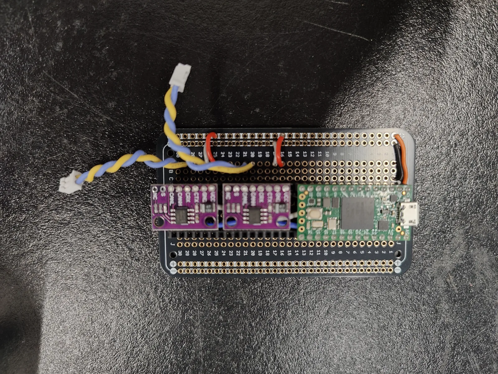

# Electronics and sensing

Which sensors, interfaces and software bindings made it onto the robot, and the CAN, power and sensing options the team tried and dropped.

Nothing on this page is a build instruction. For the wiring the robot actually
uses, see [Power system](../electrical/power-system.md) and
[CAN bus](../electrical/can-bus.md).

## Electronics design checklist

**DESIGN GOAL (not as-built).** The team's electronics checklist: load verified;
moving components considered; strain relief considered; protection for short
circuit; routing option; EMI protection; proper grounding; motor spike handling.
The boxes are unticked in the exported log, so it records intent, not completed
checks.
*Source: team design log, "electronics design checklist".*

## IMU: SYD Dynamics TransducerM TM171

**AS-BUILT.** A TransducerM TM171 9-axis AHRS (40 × 34 × 12.6 mm, USB-C), bought
from RobotShop. It sits on USB hub #1 in the team data wiring diagram and is read
directly on the onboard computer: the repo's `deploy/control/hardware_bindings/imu/imu.hpp`
opens the port at 4000000 baud and parses only the EasyProfile combined packet.

The configuration the team used, from its ImuAssistant screenshot:

| Setting | Value |
| --- | --- |
| Sensors | gyro, accelerometer and magnetometer enabled |
| Boot mode | Auto |
| GyroErrFilter | on |
| Accelerometer gain | 2.08 |
| Magnetometer gain | 1.00 |
| Self-adapt filter | on |
| Output data | Status and Composite only (raw, quaternion, Euler, RPY and gravity off) |
| Port | USB 2.0 (UART off) |
| Output data rate | 800 Hz |

*Source: team design log, "IMU" (ImuAssistant V3-9-23 screenshot, "select composite only"); `imu.hpp` in the published repo.*

**Why the accelerometer gain matters.** The vendor's guide explains that raising
the fusion gains makes the filter trust the accelerometer and magnetometer more.
With the gyro error filter on, it recommends an accelerometer gain of at least
2.0, and at least 2.5 where vibration is strong and continuous. The team's 2.08
meets the first figure but not the second (computed comparison). The same guide
notes that a unit on its own USB port is not limited by the UART baud setting.
*Source: SYD Dynamics, "TransducerM TM3xx User Guide" V1.35, pp. 20–22 (vendor download centre).*

The design log gives the mounting holes as M3, but the vendor drawing dimensions
the flange holes at Ø2.10 on 30 × 31 mm centres, too small for M3 clearance
(**UNVERIFIED**{ .dh-unverified } which fastener the team used).

## Depth cameras: RealSense D436

**AS-BUILT.** The team data wiring diagram labels both cameras "RealSense Depth
Camera D436". The design log installs librealsense 2.58.1, the version that adds
D436 support, from RealSense's current apt repository in place of the old,
frozen Intel repository, and the published repo pins `pyrealsense2` 2.58.1.
Host setup is on [Software](../software.md).
*Source: team data wiring diagram (V2); team design log, "Camera"; `deploy/requirements.txt` in the published repo.*

## Control software bindings

**AS-BUILT.** The control stack is built with CMake and vcpkg (Ninja,
build-essential) and exposes its C++ layer to Python through nanobind. The design
log's rationale quotes nanobind's own published benchmarks, which claim up to
about 4× faster compiles, about 5× smaller binaries and about 10× lower runtime
overhead than pybind11. These are nanobind's figures, not team measurements
([nanobind benchmarks](https://nanobind.readthedocs.io/en/latest/benchmark.html)).
*Source: team design log, "Control"; `deploy/control/CMakeLists.txt` and `CMakePresets.json` in the published repo.*

**AS-BUILT.** The mink library is used in the published repo for inverse
kinematics (`mj_envs.utils.ik_mink`).

!!! unverified "UNVERIFIED — mink as a collision-avoidance or safety layer"
    The design log lists mink under "collision avoidance/safety layer". The
    published repo uses it for inverse kinematics only, and no mink-based safety
    layer was found. Whether one runs on the robot is not recorded.

    *Owner: controls lead.*

## Teensy CAN and IMU bridge

**CONSIDERED — NOT USED.** In November 2024 the team built a two-channel USB-to-CAN
bridge on a Teensy 4.x: the board on a perma-proto board with two CAN transceiver
breakouts (the log lists TJA1051 and SN65HVD230 modules) and the FlexCAN_T4
library. The log also looks at reading the TM171 through the Teensy with the
vendor's Arduino-compatible library. The robot instead uses six CANable PRO V2.0
USB adapters (gs_usb) for the motor buses and reads the IMU over USB directly.
Why the Teensy path was dropped is not recorded.
*Source: team design log, "teensy setup (hardware)", CAN and IMU sections; team data wiring diagram (V2).*

<figure markdown>
  { loading=lazy }
  <figcaption>Considered, not used: a Teensy 4.x two-channel CAN prototype (November 2024). The robot uses CANable PRO V2.0 USB adapters.</figcaption>
</figure>

## Isolated DC/DC bricks

**CONSIDERED — NOT USED** (as far as the records show). The design log proposes
Delta Electronics isolated through-hole 1/16-brick converters:
V48SC12007NRFA (12 V out, 7 A) and V36SE05010NRFA (5 V out, 10 A). The team drew
an 85.00 × 33.20 mm carrier holding one 5 V brick and two 12 V bricks side by
side, fed from a shared input, with screw terminals for Vin, GND and 5 V on one
edge and two separate 12 V outputs on the other.
*Source: team design log, "Power" (team carrier drawing).*

**UNVERIFIED**{ .dh-unverified } — converter conflict: the team power diagram draws one 48V-to-12V buck converter (computer branch only) and no 5 V rail; the BOM lists 2 × generic 48 V-to-12 V buck converters plus 1 × DC 20–60 V to 12 V encased buck converter; the design log proposed Delta isolated bricks (2 × V48SC12007NRFA, 12 V 7 A, and 1 × V36SE05010NRFA, 5 V 10 A), which appear only in Design as considered.

## Relay

**CONSIDERED — NOT USED** (as far as the records show). The log's Power section
links a relay from an online marketplace with no stated function. No relay
appears in the team power diagram or the BOM. It is not an e-stop or a
disconnect; for the robot's actual protection, see
[Power system](../electrical/power-system.md).
*Source: team design log, "Power"; team power wiring diagram (V2).*

## Foot and contact sensing

**CONSIDERED — NOT USED.** The team looked at a TE Connectivity FX293X-100A-0100-L
load cell (US$41.67 from Newark; the listing title gives 100 lb and 5–25 V) and at
force-sensitive resistors, and bought one round FSR. The published robot has no
foot force sensors (`deploy/README.md`: "no foot force sensors").
*Source: team design log, "force sensor"; `deploy/README.md` in the published repo.*

## Other depth cameras

**CONSIDERED — NOT USED.** Orbbec cameras the log compared before the D436:

| Camera | Principle | Range | Mass | Accuracy | Connector | Note |
| --- | --- | --- | --- | --- | --- | --- |
| Femto Bolt | iToF | 0.25–5.46 m | 335 g | < 11 mm + 0.1% distance | USB-C | struck through in the log |
| Gemini 336 | active and passive stereo | 0.10–20 m+ | 99 g | ≤ 1.5% | custom | noted as used on the TienKung humanoid |
| Astra Embedded S | structured light | 0.25–1.5 m | 27 ± 5 g | ± 5 mm @ 1 m | USB-C | $170 |
| Astra Stereo S U3 | active stereo IR | 0.25–2.5 m | 30 ± 5 g | ± 5 mm @ 1 m | USB-C | $170 |

*Source: team design log, "Camera".*
