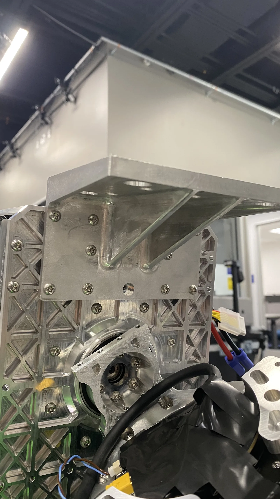
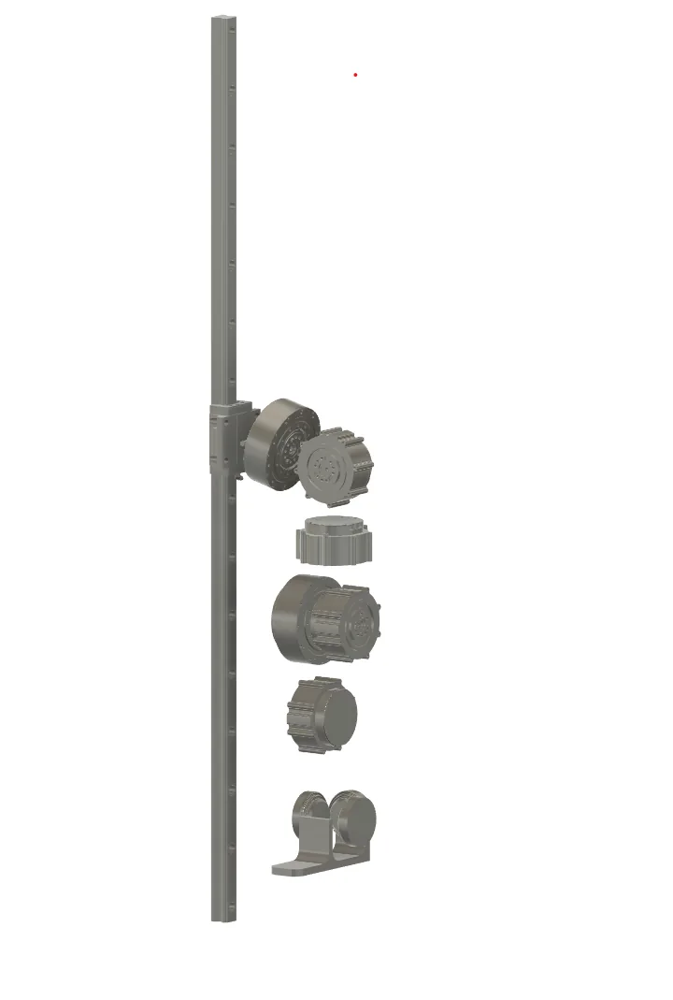
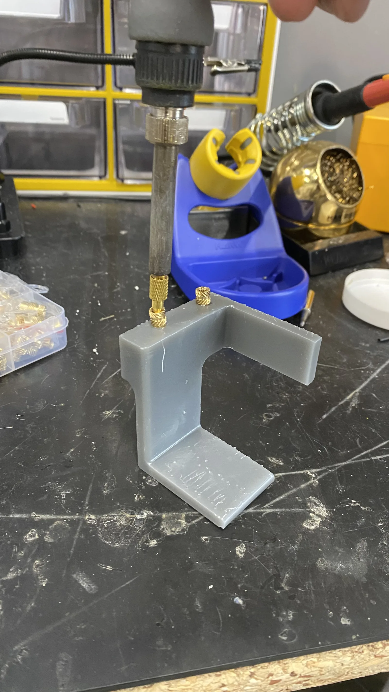

# Single-leg phase

The intermediate build of early 2025: a body box and one leg on a test rig, used to check the leg before the full humanoid was assembled.

Nothing on this page is a build instruction. Parts, IDs and layouts here were
changed for the finished robot. For the as-built versions, see
[CAN bus](../electrical/can-bus.md), [Power system](../electrical/power-system.md)
and [Torso and waist](../assembly/torso-and-waist.md).

## Test plan

**DESIGN GOAL (not as-built).** The team's plan for the single leg was to verify
performance and reliability:

- verify the range of motion for walking, running and jumping;
- verify the leg can stand and squat under load;
- find out how high the single leg can jump;
- identify weak parts and suboptimal design choices.

No results are recorded in the design log.
*Source: team design log, "task", "Performance", "Reliability".*

## Test-rig options

**CONSIDERED — NOT USED** as a record of a decision: the log compares two rigs
and does not say which was chosen.

| | (1) 28 mm linear rail and slider | (2) Tethered and hanged, as on Humanoid V1 |
| --- | --- | --- |
| How | The hip is constrained to slide along a vertical axis. | The leg floats, stands on the ground, or hangs, as on V1. |
| For | Easy to attach to the frame or a wall; the constrained leg is safer to test; the leg can use the rig to balance, stand and squat on one leg. | No limit on range of motion; tests on the ground or in the air; about $0 using the current frame plus printed mounts. |
| Against | Limits hip abduction/adduction; expensive (~$700). | The leg must balance on its own on the ground; unconstrained, so potentially dangerous; hard to test repeatedly if control is unstable. |
| Parts | McMaster-Carr 6709K17 and 6709K63/6709K632, "rated row, pitch, yaw moments, which are 580NM. 650NM, and 580NM respectively" | Current frame plus 3D-printed mounts |

*Source: team design log, "slider", options (1) and (2).*

What was built: a March 2025 photo shows a machined "slider mount" on top of the
body frame, and a team CAD image shows the leg actuator stack on a vertical rail.
This site's parts list also carries a `B6_single_leg_tester_plate` fixture
([CNC parts](../bom/cnc-parts.md)).

!!! unverified "UNVERIFIED — which single-leg rig was used: slider or tether"
    The design log compares a linear-rail slider and a tether and records no
    final choice. The slider-mount photo and the rail CAD suggest a slider was
    at least made; whether it was used for the tests is not recorded.

    *Owner: hardware lead.*

<figure markdown>
  { loading=lazy width="400" }
  <figcaption>Single-leg phase build, March 2025: the "slider mount", a machined angle bracket on top of the body frame.</figcaption>
</figure>

<figure markdown>
  { loading=lazy width="300" }
  <figcaption>Team CAD: the single-leg slider-rig concept, leg actuator stack along a vertical linear rail.</figcaption>
</figure>

## CAN IDs: the single-leg scheme and the robot today

**SUPERSEDED.** The single-leg phase numbered the motors in hexadecimal and
labelled them physically: the waist actuator in a March 2025 photo carries
"0X1A", and a leg actuator in the February 2025 fit-check deck carries "0X1D".
Do not use these IDs for bring-up.

**SUPERSEDED — single-leg table, as written**

| Motor | Decimal | Hex |
| --- | ---: | --- |
| waist motor | 26 | 0x1A |
| L hip rotation | 27 | 0x1B |
| L hip abd/adduction | 28 | 0x1C |
| L hip inv/eversion | 29 | 0x1D |
| L knee | 30 | 0x1E |
| L ankle | 31 | 0x1F |
| L toe | 32 | 0x20 |
| R hip rotation | 43 | 0x2B |
| R hip abd/adduction | 44 | 0x2C |
| R hip inv/eversion | 45 | 0x2D |
| R knee | 46 | 0x2E |
| R ankle | 47 | 0x2F |
| R knee | 48 | 30 |

*Source: team design log, "hexadecimal labeling of motors for the single leg".*

**AS-BUILT — `deploy/control/humanoid_config.py`**

| Joint | ID | Bus |
| --- | ---: | --- |
| waist | 1 | can22 |
| left_hip_1, left_hip_2, left_hip_3 | 31, 32, 33 | can24 |
| left_knee | 34 | can24 |
| left_ankle_1, left_ankle_2 | 35, 36 | can24 |
| right_hip_1, right_hip_2, right_hip_3 | 41, 42, 43 | can23 |
| right_knee | 44 | can23 |
| right_ankle_1, right_ankle_2 | 45, 46 | can23 |

*Source: published repo. Full map on [CAN bus](../electrical/can-bus.md).*

The single-leg table has internal errors: its last row repeats "R knee", and it
writes 48 as "30" in the hex column (48 decimal is 0x30, computed). It also has
one ankle and a toe on the left side, while the robot has two ankle joints per
leg and no toe. The single-leg joint names are not mapped to the as-built joint
names anywhere in the records.

## Body build, March 2025

**SUPERSEDED.** On 2025-03-01 the team assembled the body for the single-leg
phase: a box of pocketed aluminium plates with the waist actuator vertical at the
centre, printed battery holders with heat-set inserts, a printed IMU bracket and
a printed mount for the computer. Whether these holders and brackets survive in
the finished robot is **UNVERIFIED**{ .dh-unverified }.
*Source: team design log, "Assembling the body" (photos dated 2025-03-01).*

<figure markdown>
  { loading=lazy }
  <figcaption>Single-leg phase build, March 2025: body box of pocketed aluminium plates, waist actuator vertical at the centre, printed battery holders either side.</figcaption>
</figure>

<figure markdown>
  { loading=lazy }
  <figcaption>Single-leg phase build, March 2025: two packs either side of the waist actuator, EC5-style connectors. One pack is labelled 5200 mAh; the BOM lists Zeee 6S 10000 mAh x2. <strong class="dh-unverified">UNVERIFIED</strong> which the finished robot carries. Actuator label blurred.</figcaption>
</figure>

**AS-BUILT** pack arrangement, for comparison: Two Zeee 6S 10000 mAh LiPo packs are connected in series (one pack's + to the other's −) and feed a bus labelled 48V through a surge protector. Computed, not stated in the diagram: 2 × 22.2 V = 44.4 V nominal and 2 × 25.2 V = 50.4 V at full charge. *Source: team power wiring diagram (V2).*

A March 2025 single-leg-phase photo shows two packs of different brands, one labelled 5200 mAh. **UNVERIFIED**{ .dh-unverified } which packs the finished robot carries; the power diagram and the BOM both name the Zeee 6S 10000 mAh.

<figure markdown>
  { loading=lazy }
  <figcaption>Single-leg phase build, March 2025: the TransducerM IMU on a printed X-shaped bracket, screwed to a pocketed aluminium plate. Orientation on the robot is not recorded; whether this mount is in the final robot is <strong class="dh-unverified">UNVERIFIED</strong>.</figcaption>
</figure>

<figure markdown>
  { loading=lazy }
  <figcaption>Single-leg phase build, March 2025: a computer module in printed T-brackets on a crossbar above the waist actuator (the team log calls it the "jetson"; the BOM computer is a MINISFORUM X1-470, <strong class="dh-unverified">UNVERIFIED</strong>).</figcaption>
</figure>

<figure markdown>
  { loading=lazy width="400" }
  <figcaption>Single-leg phase build, March 2025: heat-set inserts melted into a printed battery holder with a soldering iron.</figcaption>
</figure>

!!! unverified "UNVERIFIED — onboard computer: Jetson in the single-leg phase, MINISFORUM X1-470 as built"
    The design log captions the computer in the single-leg body "jetson", its
    mass budget carries a 0.75 kg Jetson, and its index links a forum thread
    about drivers for a Jetson Orin NX 16GB, so a Jetson Orin NX was used at some
    stage. The BOM and the team power diagram name a MINISFORUM X1-470 mini PC.
    Which computer the photo shows, and when the change was made, is not
    recorded.

    *Owner: hardware lead.*
