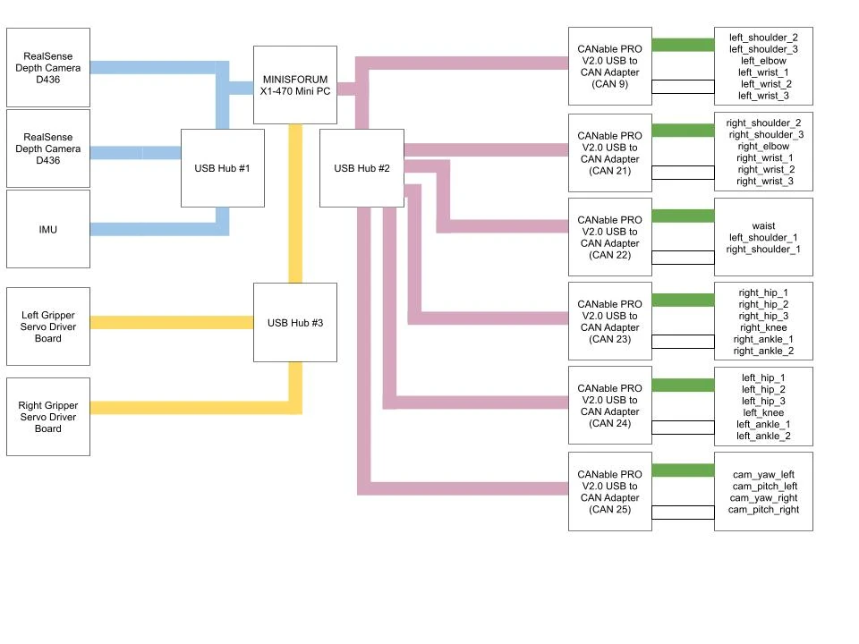

# CAN bus

The motor loop runs at 200 Hz over CAN. This page gives the bus topology, the ID
assignment for all 31 actuators, and what is still missing about how the buses
are physically built.

## Topology

Six USB-CAN adapters, six independent buses, all at **1 Mbit/s**. The split is by
limb, which is why a fault usually takes out a whole limb rather than a random
joint.

| Interface | Carries | Actuators |
| --- | --- | --- |
| `can9` | Left arm, shoulder roll outward | 6 |
| `can21` | Right arm, shoulder roll outward | 6 |
| `can22` | Waist and both shoulder pitch joints | 3 |
| `can23` | Right leg | 6 |
| `can24` | Left leg | 6 |
| `can25` | Both camera gimbals | 4 |

Source:
[`control/humanoid_config.py`](https://github.com/generalroboticslab/duke_humanoid_v2_deploy/blob/main/control/humanoid_config.py)
and
[`control/docs/SETUP.md`](https://github.com/generalroboticslab/duke_humanoid_v2_deploy/blob/main/control/docs/SETUP.md)
§3. The adapters are `gs_usb` / candlelight class devices; the parts list carries
six CANable PRO V2.0 units.

The three joints on `can22` are the ones that move the whole upper body — the
waist and both shoulder pitch axes. They are deliberately not on the arm buses.

The bit rate matches the vendor: the RobStride 02, 03 and 04 manuals give a CAN
bit rate of 1 Mbps. *Source: RobStride RS02, RS03 and RS04 manuals, driver
specifications.*

### The team data wiring diagram

<figure markdown>
  { loading=lazy }
  <figcaption>Team data wiring diagram (V2): onboard computer, three USB hubs, six CANable PRO V2.0 adapters (can9, can21-can25), two D436 cameras, IMU and two gripper servo boards.</figcaption>
</figure>

Open the diagram at [full size](../assets/wiring/data-wiring-v2.png) to read the
joint names.

Six CANable PRO V2.0 USB-to-CAN adapters, all at 1 Mbit/s: can9 = left arm (left_shoulder_2, left_shoulder_3, left_elbow, left_wrist_1, left_wrist_2, left_wrist_3); can21 = right arm (right_shoulder_2 to right_wrist_3); can22 = waist, left_shoulder_1, right_shoulder_1; can23 = right leg (right_hip_1–3, right_knee, right_ankle_1–2); can24 = left leg (left_hip_1–3, left_knee, left_ankle_1–2); can25 = cam_yaw_left, cam_pitch_left, cam_yaw_right, cam_pitch_right. The team data wiring diagram, deploy/control/humanoid_config.py and the CAN bus page agree.

*Source: team data wiring diagram (V2); `control/humanoid_config.py`.*

!!! note "The CAN split is not the power split"
    The waist is on `can22` with both `shoulder_1` joints, but it is powered
    from the lower-body distribution block, while the two `shoulder_1` joints
    are powered from the upper-body block (see
    [Power system](power-system.md#the-team-power-diagram)). A power fault on
    one block can therefore silence part of `can22` and leave the rest
    answering.

The diagram lists the four camera joints in the configuration file's written
order, so it does not settle the index-order question below.

## The actuator map

Joint name, CAN ID, bus and actuator model for all 31 actuators, in URDF joint
order. This is the table the whole build has to agree with: the ID a motor is
programmed with in [Motor ID and config](../bringup/motor-id-and-config.md), the
bus its cable must land on, and the part that must be fitted at that joint.

| # | Joint | CAN ID | Bus | Model |
| --- | --- | --- | --- | --- |
| 0 | `waist` | 1 | `can22` | RS03 |
| 1 | `left_hip_1` | 31 | `can24` | RS03 |
| 2 | `left_hip_2` | 32 | `can24` | RS03 |
| 3 | `left_hip_3` | 33 | `can24` | RS03 |
| 4 | `left_knee` | 34 | `can24` | RS04 |
| 5 | `left_ankle_1` | 35 | `can24` | RS03 |
| 6 | `left_ankle_2` | 36 | `can24` | RS06 |
| 7 | `right_hip_1` | 41 | `can23` | RS03 |
| 8 | `right_hip_2` | 42 | `can23` | RS03 |
| 9 | `right_hip_3` | 43 | `can23` | RS03 |
| 10 | `right_knee` | 44 | `can23` | RS04 |
| 11 | `right_ankle_1` | 45 | `can23` | RS03 |
| 12 | `right_ankle_2` | 46 | `can23` | RS06 |
| 13 | `left_shoulder_1` | 10 | `can22` | RS03 |
| 14 | `left_shoulder_2` | 11 | `can9` | RS06 |
| 15 | `left_shoulder_3` | 12 | `can9` | RS02 |
| 16 | `left_elbow` | 13 | `can9` | RS02 |
| 17 | `left_wrist_1` | 14 | `can9` | RS02 |
| 18 | `left_wrist_2` | 15 | `can9` | RS00 |
| 19 | `left_wrist_3` | 16 | `can9` | RS05 |
| 20 | `right_shoulder_1` | 20 | `can22` | RS03 |
| 21 | `right_shoulder_2` | 21 | `can21` | RS06 |
| 22 | `right_shoulder_3` | 22 | `can21` | RS02 |
| 23 | `right_elbow` | 23 | `can21` | RS02 |
| 24 | `right_wrist_1` | 24 | `can21` | RS02 |
| 25 | `right_wrist_2` | 25 | `can21` | RS00 |
| 26 | `right_wrist_3` | 26 | `can21` | RS05 |
| 27 **UNVERIFIED**{ .dh-unverified } | `cam_yaw_right` | 5 | `can25` | RS05 |
| 28 **UNVERIFIED**{ .dh-unverified } | `cam_pitch_right` | 6 | `can25` | RS05 |
| 29 **UNVERIFIED**{ .dh-unverified } | `cam_yaw_left` | 7 | `can25` | RS05 |
| 30 **UNVERIFIED**{ .dh-unverified } | `cam_pitch_left` | 8 | `can25` | RS05 |

The numbering convention is a decade per limb — `1` waist, `5`–`8` cameras,
`10`–`16` left arm, `20`–`26` right arm, `31`–`36` left leg, `41`–`46` right leg
— and **every ID is unique across the whole robot**, not merely within its bus.
Keep that property if you renumber anything: it means a motor can be moved to a
different bus without colliding with an ID already there.

!!! unverified "UNVERIFIED — the index order of the four camera joints"
    In the source table the four camera joints are written in the order
    `cam_yaw_left`, `cam_pitch_left`, `cam_yaw_right`, `cam_pitch_right`, but
    they carry trailing comments numbering them `29, 30, 27, 28`. The file's own
    docstring says index equals URDF joint index by insertion order, which would
    make them `27, 28, 29, 30` in written order. The two cannot both be right.
    This table follows the **comments**, because the gimbal forward kinematics
    indexes the telemetry joint vector positionally and a swap there points the
    wrong gimbal. Check the MJCF joint order in
    [`simulation/asset/duke_v2/`](https://github.com/generalroboticslab/duke_humanoid_v2_simulation/tree/main/asset/duke_v2)
    before you trust either, and see
    [Camera calibration](../bringup/camera-calibration.md).

    *Owner: controls lead.*

## Interface naming

The six names are not arbitrary and the software does not discover them. Without
a udev rule the adapters enumerate as `can0`, `can1`, … in plug order, which
nothing in the stack uses. Each adapter is bound to its name by USB serial:

```text
# /etc/udev/rules.d/99-candlelight.rules
SUBSYSTEM=="net", ACTION=="add", ATTRS{serial}=="<adapter-serial>", NAME="can21"
```

One line per adapter. The team also uses a form that additionally matches the
candleLight USB ID, and a rule that gives every CAN interface a group:

```text
SUBSYSTEM=="net", ACTION=="add", ATTRS{idVendor}=="1d50", ATTRS{idProduct}=="606f", ATTRS{serial}=="<adapter-serial>", NAME="can21"
SUBSYSTEM=="net", KERNEL=="can[0-9]*", GROUP="can", MODE="0660"
```

Find a serial with any of

```bash
udevadm info --attribute-walk --path=/sys/class/net/can0 | grep 'ATTRS{serial}'
sudo dmesg          # after plugging the adapter in
lsusb -v
usb-devices
```

then reload and replug every adapter:

```bash
sudo udevadm control --reload-rules && sudo systemctl restart systemd-udevd && sudo udevadm trigger
```

*Source: team design log, "CAN bus"; the rule forms are the ones
`humanoid_setup_can.py` parses.*

!!! danger "Exactly one rule per interface name"
    `humanoid_setup_can.py` reads this file to find the adapter it should
    USB-reset, and when two lines carry the same `NAME` it uses the **last**
    one (computed from `get_serial_map()` in the script; only lines that start
    with `#` are skipped). A rules file that still carries a line for a retired
    or damaged adapter under a live name sends the recovery to the wrong
    device. Delete old lines, or comment them out with `#` at the start of the
    line.

The team design log also carries an older rules block and bring-up list that
name the V2 adapters `can10`–`can15`; that naming is **SUPERSEDED** by `can9`
and `can21`–`can25` above and must not be used.

Record which physical adapter got which name **on the adapter itself**, with a
label, as you build. The bring-up script reads this same rules file to find and
USB-reset an adapter that refuses to come up, so a stale rule costs you that
recovery path.

## Bringing the buses up

Required after **every** robot power cycle:

```bash
cd <deploy-repo>/control
python humanoid_setup_can.py
# verify: all six ERROR-ACTIVE
for c in can9 can21 can22 can23 can24 can25; do
  echo -n "$c: "; ip -details link show $c | grep -o "can state [A-Z-]*" | head -1
done
```

The script takes each interface down, brings it up with
`type can bitrate 1000000 restart-ms 100` (falling back to no `restart-ms` for
adapters that reject it), sets `txqueuelen 50`, USB-resets anything that fails,
and ends with a `Replug:` list of whatever is still down. It needs `iproute2`
and `usbreset` from `usbutils`, and it calls `sudo`.

Kernel modules, if `ip link` cannot see the interfaces at all:

```bash
sudo modprobe can can_raw gs_usb
modinfo gs_usb        # the driver is present
lsmod | grep can      # and loaded
```

The host packages and group memberships the team sets up first are listed on
[First power-on](../bringup/first-power-on.md#host-prerequisites).

### Adapter firmware

The adapters must run **candleLight** (`gs_usb`) firmware. The team reflashes
them with the ElmueSoft
[CANable Firmware Update](https://netcult.ch/elmue/CANable%20Firmware%20Update/)
tool; the older canable.io web updater is marked deprecated in the team log.
The log says to press the button on the adapter to enter flash mode and to
connect the adapter directly to the computer.
*Source: team design log, "CAN bus".*

!!! unverified "UNVERIFIED — candleLight firmware version on the reference adapters"
    The firmware version the six reference adapters run is not recorded.
    Publish it, and how to read it back from an adapter.

    *Owner: electrical lead.*

!!! danger "One owner per bus"
    Only one process may drive a CAN bus at a time. Every read-only diagnostic
    on this site assumes `humanoid_real_env.py` is stopped. Running two motor
    clients against one bus produces symptoms that look exactly like a harness
    fault.

## Termination

The team follows the standard CAN wiring rules, which it recorded from a maxon
support article
([CAN bus topology and bus termination](https://support.maxongroup.com/hc/en-us/articles/360009241840-CAN-bus-topology-and-bus-termination)):

- a 120 Ω terminator at each of the two physical end points of the bus;
- nodes connected one to the next, with no ring and no stub lines;
- at least one device with a fixed bit rate, and every fixed bit rate the same;
- every node ID unique on the network.

The team's CAN soldering checklist ends with **"Measure ~60 Ω across bus
(terminated)"**: two 120 Ω terminators in parallel. That is the team's expected
reading for a finished bus, measured across CAN_H and CAN_L with the bus
unpowered. *Source: team design log, "CAN bus soldering checklist".*

!!! missing "MISSING — CAN terminator placement on each bus, and the adapter termination setting"
    **No termination resistor appears anywhere in the parts list.** Publish,
    per bus:

    - **where** the two terminators physically sit, and what they are (a
      discrete resistor, the adapter's on-board termination, or a motor's),
    - whether the CANable PRO V2.0 units are configured with their termination
      on or off, and which end of the segment each adapter sits at,
    - the value actually measured on each of the six reference buses.

    *Owner: electrical lead. Blocks [Pre-power checks](pre-power-checks.md).*

## Physical construction

The connector at the actuator depends on the model. Per the RobStride manuals:

| Model | Power | CAN |
| --- | --- | --- |
| RS02 | One XT30(2+2) shell: pin 1 power +, pin 2 power −, pin 3 CAN_L, pin 4 CAN_H | In the same shell |
| RS03, RS04 | XT30 (board side XT30APW-M, cable side XT30UW-F) | Separate GH1.25 2-pin (board side GH1.25-2PWT, cable side GH1.25-T) |

*Source: RobStride RS02, RS03 and RS04 manuals, driver interface sections.*
Team photos of an opened RS03 show two XT30 and two small 2-pin sockets on the
driver board, an in and an out for daisy-chaining. The RS04 manual gives lead
colours blue CAN_H and brown CAN_L; team photos show a blue/yellow CAN pair.
Whether the robot's trunk harness uses XT30(2+2) throughout is
**UNVERIFIED**{ .dh-unverified }; see
[Harness fabrication](harness-fabrication.md#connector-pinouts).

!!! missing "MISSING — how each bus is physically built"
    Everything about how a bus is actually built:

    - **Daisy-chain order** on each bus, as a sequence of joints, and the
      physical cable path between them.
    - Which segments must be pre-threaded through a limb **before** the limb is
      closed. This has to be called out in the matching
      [Assembly](../assembly/index.md) step or it will be found out the hard way.
    - Conductor gauge, shielding and where a shield is grounded. The team
      keeps the CAN pair twisted to within 10–15 mm of every solder joint (see
      [Harness fabrication](harness-fabrication.md#the-teams-soldering-methods)),
      but no gauge is recorded.
    - Which connector the trunk uses between actuators, and whether the team's
      Ethernet-cable CAN lead is used on this robot and where
      **UNVERIFIED**{ .dh-unverified }.
    - Stub length limits at each drop.
    - How each adapter's USB end is secured. A USB-CAN adapter that unplugs
      itself silently takes a limb off the bus.

    *Owner: electrical lead, from a photographed build. See
    [Harness fabrication](harness-fabrication.md) and [Routing](routing.md).*

## Bus health and fault diagnosis

The harness is the known weak point of this machine, and the deploy repository
carries tools that exist because of specific hardware failures. Use them; they
are more sensitive than your eyes.

| Tool | What it is for |
| --- | --- |
| `humanoid_setup_can.py` | Bring the six buses up; report what refused |
| `humanoid_motor_temps.py` | Read-only: every motor's temperature and bus voltage, nothing enabled |
| `humanoid_profile_motor_latency.py` | Per-motor CAN round-trip latency, per bus, at a 1 % torque ceiling |
| `humanoid_wiggle_watch.py` | Live dropout alarm — press a connector, hear which joints go silent |
| `humanoid_dropout_probe.py` | After an event: read motor RAM without disturbing it, to separate a link break from an MCU reboot |

### Inspecting a bus by hand

The team's own inspection commands, from `can-utils` and `iproute2`. Run them
with `humanoid_real_env.py` stopped; `candump` only listens, but the one-owner
rule above still applies to anything that transmits.

```bash
ip -details -statistic link show can22   # state and error counters
candump any,0:0,#FFFFFFFF -extA          # every frame on every interface, error frames included, decoded
canbusload can22@1000000 -cbr            # bus load, in a second terminal
```

*Source: team design log, "CAN bus". Background: Pengutronix,
[First steps using the candleLight](https://pengutronix.de/en/blog/2022-02-17-first-steps-using-the-candlelight.html);
the Linux kernel [SocketCAN documentation](https://docs.kernel.org/networking/can.html).*
No reference bus-load figure is recorded yet.

### The dropout probe

The dropout probe distinguishes the two failures that look identical from the
outside. The host writes `5000` into the motors' CAN-timeout parameter at every
startup, so probing after an event and **before** any restart or power cycle:

| Reading | Meaning |
| --- | --- |
| `0x7028 == 5000` | Motor RAM intact — the silence was a pure **link break**: harness or solder joint |
| `0x7028` other | The motor **MCU rebooted** — a power dip or firmware crash, a different repair entirely |
| No answer | The motor is off-bus right now — the break is still open; wiggle the harness while the probe loops |

An error frame in the runtime log, or a bus stuck in ERROR-WARNING, means power
cycle and try again; if it recurs, stop and inspect the harness before running
anything.

!!! unverified "UNVERIFIED — how long a CAN timeout of 5000 is on each model"
    In every RobStride manual, 0 disables the CAN timeout; when it is enabled,
    a motor that receives no CAN command within the timeout enters reset mode.
    The manuals disagree on the scale: the RS02 manual gives 20000 = 1 s, the
    RS04 manual 12000 = 1 s. The deploy code writes 5000 and comments it as
    about 0.25 s, which is the RS02 scale; at the RS04 scale 5000 is about
    0.42 s (computed). The real timeout on the RS04 knees, and on the models
    whose manuals are not in the team records, is not confirmed.

    *Owner: controls lead.*

## Loose ends in the sources

Recorded so a builder is not confused by them:

- The team design log carries a hexadecimal ID table from the single-leg phase
  (waist `0x1A` and so on). It is **SUPERSEDED** by the actuator map above and
  is not a bring-up instruction; see
  [Single-leg phase](../design/single-leg-phase.md).

- `humanoid_config.py` defines interface names `can12` and `can19` that no
  actuator uses. They are leftovers, not a seventh and eighth bus.
- The bring-up script's `--interfaces` flag exists to drive other buses, for
  example a single-motor bench at `can26`. That is a test fixture, not part of
  the robot.

{{ checkpoint("All six buses come up ERROR-ACTIVE from a cold power cycle, every one of the 31 actuators answers at the ID and on the bus this table gives, and the per-adapter labels on the physical hardware match the udev rules file.") }}
