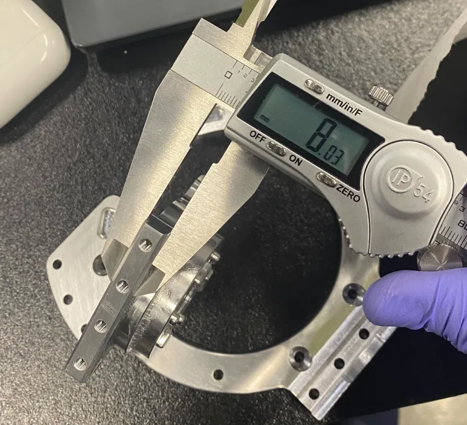

# Incoming inspection

What to check when the boxes arrive, before anything is assembled.

A bad bore found on the bench costs a phone call. The same bore found after the
leg is closed up costs a full disassembly, and often a second one when the
replacement is also wrong. Every part class in this build fails differently, so
each gets its own check.

!!! missing "The pass criteria do not exist yet"
    Most checks below need a number to compare against, and those numbers come
    from tolerances and print profiles that have not been written. See
    [CNC guide](cnc-guide.md) and [Printing guide](printing-guide.md).

    The **procedure** on this page is usable now. The **acceptance values** are
    marked **TODO**{ .dh-missing } in the tables below, itemised in the MISSING
    boxes, and must be filled before a second robot is built by anyone outside
    the lab.

## The rule

Nothing enters assembly until it has been counted, measured and recorded. This
sounds bureaucratic for a one-off machine and is not: the parts arrive over
several weeks from several vendors, a missing part discovered at week six is a
multi-week stall, and a part measured only when it refuses to fit is measured
with the robot half built around it.

## Step 1 — count in against the BOM

{{ step(1, "Reconcile every box against the parts list") }}

Open every box on arrival, even the ones you do not need yet. Tick each line of
the BOM against what is physically present, and record the quantity received,
not the quantity ordered.

What this catches, in order of how often it happens:

- Short shipments the vendor did not flag.
- A part substituted for an "equivalent" without notice — common with fasteners
  and connectors, and occasionally with actuators.
- The wrong variant of the right part number.
- Parts from a batch you did not order, mixed into one you did.

Two known traps specific to this build:

- **Quantity conflicts.** 25 of the 63 machined rows have a quantity embedded in
  the part name that disagrees with the quantity column
  **UNVERIFIED**{ .dh-unverified }. Count what arrived and trust the count, not
  either field, until the BOM migration lands.
- **The test fixture.** `B6_single_leg_tester_plate` is a development fixture,
  not a robot part. If it arrives, set it aside; do not look for a place to bolt
  it on.

{{ step(2, "Store by subassembly, not by delivery") }}

Re-bag parts into one container per subassembly — leg, arm, body, head, gripper —
labelled with the part IDs it holds. Assembly steps call parts by ID, and a box
sorted by vendor invoice is unusable at the bench.

## Step 2 — machined parts

{{ step(3, "Measure the fit-critical features") }}

35 of the 63 machined rows are shafts, couplers, bearing housings and retainers
**UNVERIFIED**{ .dh-unverified } — a count inferred from part names; see
[CNC guide](cnc-guide.md#grouped-by-what-they-are). These are the ones that decide
whether the robot assembles at all. Measure every piece, not a sample — the batch
sizes here are 2 to 7 **UNVERIFIED**{ .dh-unverified }, so a sample is
meaningless. That range has not been checked against the per-row quantities on
[CNC parts](../bom/cnc-parts.md), which do not all fall inside it.

| Feature | What to check | Instrument | Accept if |
| --- | --- | --- | --- |
| Bearing bores | Diameter in two directions, roundness | Bore gauge or pin gauges | **TODO**{ .dh-missing } |
| Shaft journals | Diameter at each bearing seat | Micrometer | **TODO**{ .dh-missing } |
| Dowel holes | Diameter and centre-to-centre spacing | Pin gauges + calipers | **TODO**{ .dh-missing } |
| Mating faces | Flatness, no burrs, no raised edges around holes | Surface plate + indicator, or a known-flat straightedge | **TODO**{ .dh-missing } |
| Tapped holes | Thread engages full depth, by hand, with the real screw | The screw that will be used | Full depth, no binding; at least 4 mm of usable thread, 6 mm preferred (team CNC rule) |
| Overall | Correct part, correct revision, no transit damage | Eye + drawing | — |

The team's general tolerance rule is 0.03 mm on radius and length and 0.06 mm
on diameter, and the tapped-hole rule above comes from the same checklist.
*Source: team design log, CNC checklist.* Neither gives a nominal for any
feature, so neither is a pass criterion on its own; see
[CNC guide → The team's design rules](cnc-guide.md#the-teams-design-rules).

!!! missing "MISSING — acceptance tolerances: nominal dimensions for the fit-critical features"
    Every cell marked **TODO** needs a nominal and a tolerance from the
    drawing. The reference build's own check (below) recorded readings with no
    nominal, so no pass criterion exists for any feature, and whether the team's
    0.03 / 0.06 mm tolerances are ± or a total band is not stated. **Record the
    values anyway** — a measured batch with no acceptance limit is still far
    more useful than an unmeasured one, and it becomes the dataset the first
    tolerance table is written from.
    *Owner: hardware lead, once the CNC drawings exist.*

### What the reference build found

The team ran a first-article fit check on the V2 machined parts, recorded in a
deck titled "Tolerance Check V2 CNC" and dated 2/27/2025. It has 11 caliper
photos and one CAD render, and it is the only record of how the reference
robot's machined parts were checked on arrival. *Source: team first-article fit
check, "Tolerance Check V2 CNC".*

| # | Part | What the team recorded | Caliper reading |
| --- | --- | --- | --- |
| 1 | Waist motor shaft; knee motor shaft | "Had to file this one down, waist motor shaft"; "Same with the knee motor shaft" | 8.03 mm (both photos) |
| 2 | Motor04 shaft | "Needed bigger hole for fit" | 6.02 mm, 6.03 mm |
| 3 | Motor04 shaft | "Had to file smaller" | 50.02 mm |
| 4 | 03 motor shaft bearing retainer, above the knee | "Had to enlarge", marked "Design error" | 57.88 mm |
| 5 | Motor04 shaft; knee motor | "NEEDS m5 holes, but the cad has m4 holes" | none (CAD render) |

Two more slides carry readings with no text: 7.99, 8.00, 7.91, 35.01 and
35.09 mm. For every reading, the feature measured and its nominal are not
recorded, so none of these numbers is an acceptance value. Whether the released
CAD fixes items 4 and 5 is **UNVERIFIED**{ .dh-unverified }; see
[CAD downloads](cad-downloads.md#known-cad-errors-from-the-reference-build).

The instrument in every photo is a hand-held digital caliper reading to
0.01 mm, marked IP54. None of the photos shows a micrometer, bore gauge or pin
gauge.

<figure markdown>
  { loading=lazy }
  <figcaption>First-article fit check, Feb 2025: "Had to file this one down, waist motor shaft" (same for the knee motor shaft). Reading 8.03 mm; feature and nominal not recorded.</figcaption>
</figure>

<figure markdown>
  { loading=lazy }
  <figcaption>"Needed bigger hole for fit, motor04 shaft." Reading 6.02 mm; feature and nominal not recorded.</figcaption>
</figure>

<figure markdown>
  { loading=lazy }
  <figcaption>"Had to file smaller, Motor04 shaft." Reading 50.02 mm; feature and nominal not recorded.</figcaption>
</figure>

<figure markdown>
  { loading=lazy }
  <figcaption>"Had to enlarge, 03 motor shaft bearing retainer, above the knee", recorded as a design error. Reading 57.88 mm. Whether the CAD was corrected is <strong class="dh-unverified">UNVERIFIED</strong>.</figcaption>
</figure>

On a new build, measure these features first, together with the fit-critical
interfaces the team's design review named on
[CNC guide](cnc-guide.md#fit-critical-interfaces-named-in-the-team-review).

Deburr before measuring, not after. A burr around a bore reads as an
out-of-tolerance diameter and sends you back to the shop for nothing.

{{ checkpoint("Every bearing bore and shaft journal on the robot has a recorded measured value before any bearing is pressed. A press fit is not reversible without damage.") }}

## Step 3 — printed parts

{{ step(4, "Check printed parts for the four things that go wrong") }}

| Check | Why | Accept if |
| --- | --- | --- |
| Warp / lift | A part that lifted off the plate is no longer flat where it bolts down | **TODO**{ .dh-missing } |
| First-layer spread on mating faces | Elephant foot on a face that seats against a machined part produces a gap and a rocking joint | **TODO**{ .dh-missing } |
| Hole diameter after shrinkage | FDM holes come out undersize, by an amount that varies per printer | **TODO**{ .dh-missing } — state which holes are ream-to-size |
| Heat-set inserts | Seated flush, square, and not spinning under a screwdriver | Flush and square, no rotation |

Also check layer adhesion on structural parts by flexing a sacrificial region
gently. A part that delaminates in the hand will delaminate in the robot.

!!! missing "MISSING — pass criteria for printed parts, and which printed parts are structural"
    The pass criteria above, plus which printed parts are structural. A cosmetic
    cover with a 0.3 mm warp is fine; the same warp on a load path is not, and
    right now this site cannot tell you which is which.
    *Owner: hardware lead.*

## Step 4 — actuators

{{ step(5, "Check every actuator before it is bolted into a limb") }}

31 actuators arrive across six models. They are the most expensive line in the
build **UNVERIFIED**{ .dh-unverified } (see
[Which category costs the most](../bom/index.md#which-category-costs-the-most))
and the hardest to replace once a limb is closed. See
[Actuators](../bom/actuators.md).

- **Correct model per position.** Six different models with similar housings —
  confirm each against the BOM before it goes anywhere near a joint.
- **Free rotation by hand,** unpowered, through a full turn, with no notch,
  grinding or dead spot.
- **Transit damage** on connectors, output flange and housing.
- **CAN ID as shipped.** Fresh actuators share a default ID. The team's RS03
  and RS04 bench units, and a third RobStride model tested during
  [selection](../design/actuator-selection.md), all appeared at factory CAN
  ID 127 in the vendor tool; the RS04 parameter table reads `CAN_ID` 127, range
  0–127. The RS00, RS02, RS05 and RS06 were not observed. Discover the ID on
  the bench, not on a live bus. *Source: team bench-test videos; team design
  log, RS04 parameters.*
- **Firmware version,** recorded per actuator, before assembly.
- **Encoder continuity** over a full turn.
- **Mass.** The team's units weighed
  more than the vendor figures (RS02 404 g, RS03 909 g, RS04 1496 g, RS06
  614 g with the rear cover); see
  [Actuators → Measured masses](../bom/actuators.md#measured-masses). No
  accept window is set.

!!! danger "Do not open an actuator to inspect it"
    The RobStride manuals warn against disassembling the motor, and they warn
    that the magnetic encoder must be recalibrated if the driver board is
    re-mounted or the three phase leads are reconnected in a different order.
    The team's teardown photos on
    [Design → Actuator selection](../design/actuator-selection.md) were a
    selection study, not an incoming check. The manuals also say not to switch
    control mode while a joint is running: send a stop command first.
    *Source: RobStride 02, 03 and 04 product manuals, cautions and §3.3.2.*

### The vendor tool

RobStride's PC tool, downloaded from
[robstride.com/download](https://www.robstride.com/download), reads a unit's
parameters, changes its CAN ID, calibrates the encoder, sets the mechanical
zero and upgrades firmware. Per the manuals it talks through the
vendor-recommended serial USB-CAN module (CH340 driver, AT mode), not through
the CANable PRO V2.0 adapters the robot uses, and the deploy repository has no
RobStride ID-setting code. So a builder needs the vendor's module to set IDs:
that is inferred, not documented **UNVERIFIED**{ .dh-unverified }. The
parameter table can be edited only while the motor is in standby, a zero set
from the tool is lost at power-off, and the manuals warn against changing the
torque limit, protection temperature and over-temperature time. Whether a motor
must be alone on the bus while its ID is changed is not stated in the RS02,
RS03 or RS04 manual **UNVERIFIED**{ .dh-unverified }. *Source: team design log,
"Robstride setup"; RobStride 03 and 04 manuals, §3.*

### One RS04 read-out, which is not a baseline

The team read one RS04 on the bench (from a bench supply at 29.26 V) and pasted
its parameters into the design log. It is one unit's state, **not** the
robot's configuration or firmware baseline, and several values disagree with
the manual or the code.

| Parameter | Bench RS04 | Compare with |
| --- | --- | --- |
| Firmware | app 0.1.0.5, built Aug 23 2024; boot built Mar 26 2024 | No per-model baseline is published |
| `CAN_ID` | 127 | Factory default, as above |
| `GearRatio` | 9 | Manual 9:1 |
| `Kt_Nm/Amp` | 1.5 | Manual and team motor spec 2.1 N·m/Arms; 2.1/√2 ≈ 1.48 (computed), so the firmware value may be per Apk **UNVERIFIED**{ .dh-unverified } |
| `rated_i` | 19 | Manual 27 Apk; 27/√2 ≈ 19.1 (computed) |
| `limit_cur` | 90 | Manual `0x7018` range 0–90 A |
| `cur_kp`, `cur_ki` | 0.17, 0.012 | Same as the R04 values in `py_motor.py`; the RS04 manual lists defaults of 0.05 and 0.05 **UNVERIFIED**{ .dh-unverified } |
| `motorOverTemp` | 1450 | 145.0 °C if the value is temperature × 10, as the RS03 manual says (computed); the manuals give an 80 °C over-temperature fault default **UNVERIFIED**{ .dh-unverified } |

*Source: team design log, RS04 "parameters (from upper computer software)";
RobStride 04 manual; `py_motor.py`.*

Configuring IDs is a bring-up task, not an inspection task, but knowing what
each unit shipped with is an inspection task — do it now while the actuators are
still accessible. The procedure is in
[Motor ID and config](../bringup/motor-id-and-config.md).

!!! missing "MISSING — actuator firmware baseline, a confirmed bench setup and a free-rotation reference"
    - Confirm the bench setup used to talk to a single actuator before the
      robot exists: the power supply, whether the vendor's USB-CAN module is
      required, and the command to read ID and firmware.
    - The firmware version the reference robot runs, per model. Mixed firmware
      across a CAN bus is a real failure mode and there is currently no
      published baseline to match.
    - What "free rotation" feels like for a quasi-direct-drive actuator with
      this gear ratio, so a builder can tell a normal cogging torque from a
      damaged bearing.
    *Owner: hardware lead.*

## Step 5 — electronics and battery

{{ step(6, "Check electronics on arrival, before they are powered") }}

- Correct variant received, especially the compute module and the cameras.
- Visible damage: bent pins, cracked connectors, loose heatsinks.
- Count the small parts now — connectors, converters and adapters are the items
  most often short-shipped and least often noticed.

!!! danger "Batteries"
    The build uses large lithium polymer packs. Inspect them on arrival for
    swelling, damaged cells, damaged leads and damaged connectors, and check pack
    voltage and per-cell balance before storing them. A damaged pack is a fire,
    not a defect.

    Read [Safety](../before-you-start/safety.md) before handling the packs, and
    do not proceed to any powered check until
    [Pre-power checks](../electrical/pre-power-checks.md) is complete.

!!! missing "MISSING — SAFETY — battery acceptance values, storage charge and charging procedure"
    Acceptance values for pack voltage and cell balance on arrival, the storage
    state of charge, and the charger and balance procedure used in the lab.
    The design log links a charger listing whose slug says ISDT; the model is
    **UNVERIFIED**{ .dh-unverified } and it is not in the BOM.
    *Owner: hardware lead.* This is a safety item, not a convenience item.

## Recording it

One row per part, kept with the build log. The point is not the paperwork; the
point is that when a joint binds in week five you can look up what that shaft
measured in week one instead of disassembling to find out.

| Column | Contents |
| --- | --- |
| `part_id` | Matches the BOM and the CAD filename |
| `release_tag` | The hardware release the part was made from |
| `qty_received` | Counted, not copied from the invoice |
| `date_received` | — |
| `vendor` / `batch` | Whatever identifies the batch for a warranty claim |
| `measured` | The actual values for fit-critical features |
| `result` | `pass` / `rework` / `reject` |
| `notes` | What was wrong, and what was done about it |

### When a part fails

1. **Do not fit it.** A marginal part fitted "for now" is never replaced.
2. Quarantine it physically, in a separate box, labelled. A rejected part sitting
   next to good ones will be installed by someone.
3. Report it to the vendor immediately, with the measured value and the drawing.
   Machining lead times mean the replacement clock starts the day you call.
4. Record it. A part that failed once is worth checking twice on the next build,
   and this record is what turns the second build into a better one.

## Instruments you need

The reference build's fit check used a hand-held digital caliper reading to
0.01 mm, marked IP54, and nothing else that the photos show. *Source: team
first-article fit check.*

!!! missing "MISSING — measuring instruments beyond a caliper, with ranges and resolutions"
    The measuring equipment list, with ranges and resolutions matched to the
    features being checked — micrometers, bore or pin gauges, a dial indicator
    and reference surface, thread gauges, a multimeter and a battery cell
    checker. Ranges cannot be specified until the tolerances exist.

    Price them in `tools.csv` as a separate tier, so a builder can see what the
    robot costs and what the *ability to build the robot* costs. See
    [Tools](../assembly/tools.md).
    *Owner: hardware lead.*

{{ checkpoint("Do not begin assembly until every part on the BOM is physically present, inspected, and recorded. A part ordered mid-assembly is a multi-week stall, and a part measured mid-assembly is measured too late.") }}
