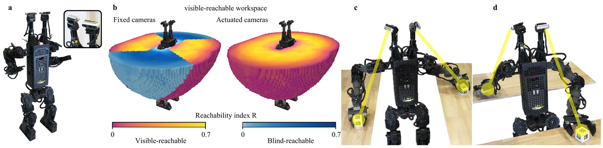
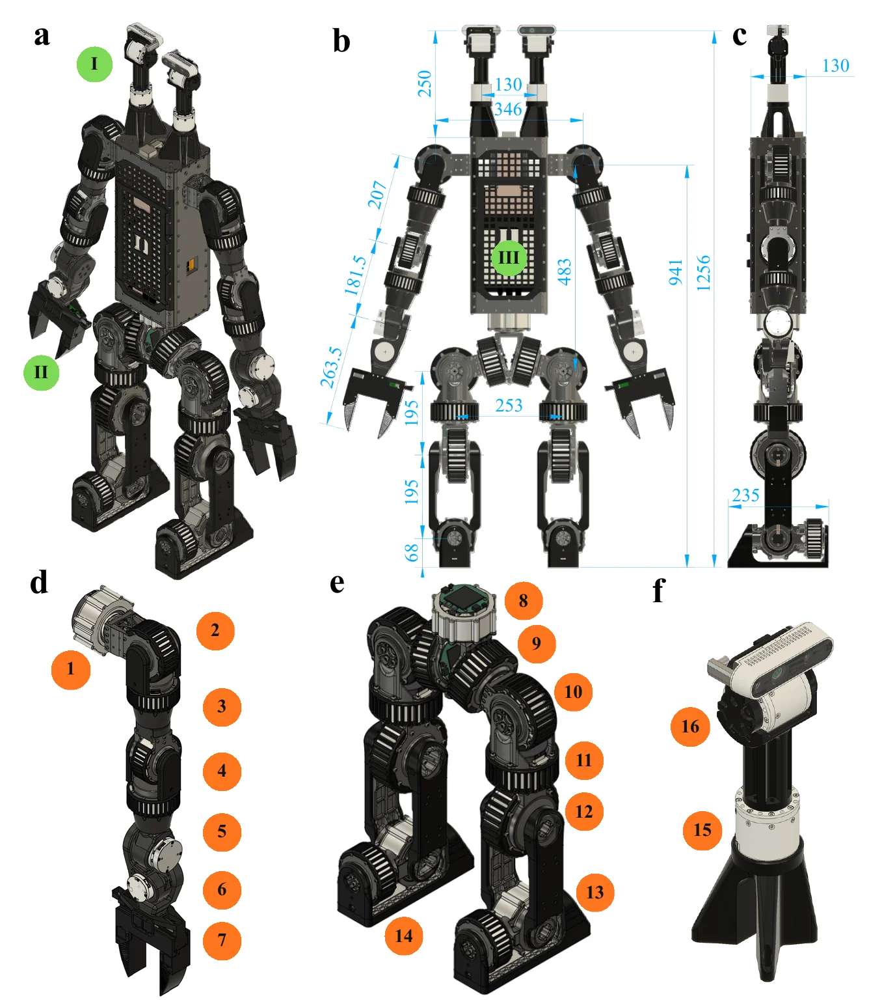

# Duke Humanoid V2 — Hardware

<figure markdown>
  
  <figcaption>
    Duke Humanoid V2 — 31 degrees of freedom, 36&nbsp;kg, 1.2&nbsp;m, with two RGB-D
    camera modules that aim independently of each other and of the torso.
  </figcaption>
</figure>

This site is the hardware release for **Duke Humanoid V2**. Its only job is to let
someone who is not us build an identical machine: what to buy, what to have
machined and printed, how it goes together, how it is wired, and how to bring it
up without hurting anyone.

The software is already open and is **not** duplicated here. This site
[points at it](software.md) and stops there.

## Can you build this robot today?

!!! missing "Not yet. This banner stays until it is false."
    The software release is complete **UNVERIFIED**{ .dh-unverified } (the
    hardware/software contract a builder needs from it is still missing — see
    [Software](software.md)); the hardware release is not. These are the
    artefacts a second builder needs and cannot get yet. Each one is tracked on
    the page named beside it, and this banner comes down when the last row does.

    | Blocker | Tracked on |
    | --- | --- |
    | No robot CAD is published. The only `.step` files in the repositories are perception test fixtures. | [CAD downloads](fabrication/cad-downloads.md) |
    | No fastener schedule. Every screw, nut, washer and bearing in the machine is one placeholder row — neither counted nor priced. | [Fasteners and hardware](bom/fasteners-and-hardware.md) |
    | No torque values. (The threadlocker half of this row is answered: Loctite 222, a removable threadlocker — *source: team design log, "Hardware Choice"*.) | [Assembly](assembly/index.md) |
    | No hardware licence and no documentation licence. Apache-2.0 covers the code only, so nobody has stated permission to make these parts. | [Citation and licence](reference/citation-and-license.md) |
    | No human-safety procedure: no e-stop doctrine, no power-down order, no bystander distance. | [Safety](before-you-start/safety.md) |
    | No emergency stop, fuse, breaker or main disconnect in the parts list, although the control stack's own runbooks assume a physical e-stop exists. | [Power system](electrical/power-system.md) |
    | Printed parts are uncosted too, so every cost figure on this site is a floor rather than a price. | [Bill of materials](bom/index.md) |

    Read on anyway. Knowing which parts of a build are undefined is worth more
    than a confident document that turns out to be wrong at the mill. The full
    list — every open item on this site, who can close it, and whether it blocks
    the release — is on [Open items](reference/todo.md).

## In thirty seconds

| | |
| --- | --- |
| **What it is** | A 31-DoF bipedal humanoid: 27-DoF body plus two 2-DoF camera gimbals. Quasi-direct-drive at every joint. 36 kg, 1.2 m tall. |
| **Why it is shaped this way** | The design question was the *visible-reachable workspace* — the part of the workspace the robot can see and reach at the same time. Actuating the cameras is what the study produced, so the two independently aimed camera modules are the contribution, not an accessory. |
| **What it costs** | {{ bom_total() }} of parts, computed from this site's own data — and that is a **floor**, not a price. **TODO**{ .dh-missing }: every fastener and every printed part in the machine is still uncosted, and tools, shipping and machining setup fees are not in it. See [Cost and time](before-you-start/cost-and-time.md). |
| **How long it takes** | **TODO**{ .dh-missing }: not measured. No build-time figure exists for this machine, and none is estimated here. Machining lead time is expected to be the long pole **UNVERIFIED**{ .dh-unverified } — no lead time has been quoted. |
| **What you need to own or reach** | A 3-axis mill or a machining vendor, FDM printing, SLS printing or a service bureau, soldering and crimping, CAN bus work, Linux administration, and a hoist rated well over 36 kg (**TODO**{ .dh-missing }: the rating is not specified — see [Safety](before-you-start/safety.md)). Whether a 3-axis mill is enough is itself **UNVERIFIED**{ .dh-unverified }. See [Skills and shop access](before-you-start/skills-and-shop.md). |
| **How many people** | At least two. The machine is 36 kg and several operations are lifts. |
| **Where to start** | [Safety](before-you-start/safety.md), then [Before you start](before-you-start/index.md). Do not order parts first. |

## What the two camera modules buy you

<figure markdown>
  <video class="dh-clip" autoplay loop muted playsinline preload="metadata" width="800" height="450" poster="assets/images/hardware_tracking-poster.webp" aria-label="The reference robot tracking two separated moving targets, each camera module aiming independently">
    <source src="assets/images/hardware_tracking.mp4" type="video/mp4">
    <a href="assets/images/hardware_tracking.mp4">The reference robot tracking two separated moving targets, each camera module aiming independently</a>
  </video>
  <figcaption markdown="span">
    The reference robot, on hardware: two targets moving independently, each
    camera module following its own. A fixed head has to choose. This is the one
    capability the whole mechanical design exists to support, and it is why the
    [head and camera gimbal](assembly/head-and-camera-gimbal.md) is the
    subassembly documented in the most detail on this site.
  </figcaption>
</figure>

<figure markdown>
  <video class="dh-clip" autoplay loop muted playsinline preload="metadata" width="800" height="400" poster="assets/images/vrw_fixed_vs_actuated-poster.webp" aria-label="Visible-reachable workspace with fixed cameras versus actuated camera modules">
    <source src="assets/images/vrw_fixed_vs_actuated.mp4" type="video/mp4">
    <a href="assets/images/vrw_fixed_vs_actuated.mp4">Visible-reachable workspace with fixed cameras versus actuated camera modules</a>
  </video>
  <figcaption>
    The measurement behind the design: visible-reachable workspace — the volume
    the robot can see and reach at the same time — with a fixed head versus with
    the two actuated modules. Build the gimbals and this is what you get; leave
    them out and you have built a different robot.
  </figcaption>
</figure>

## Headline specifications

Quoted from the project README, which is authoritative for these rows.

| | |
| --- | --- |
| DoF | 31: 27-DoF body (waist ×1, legs 2×6, arms 2×7) + two 2-DoF camera gimbals, +1 per gripper |
| Mass / height | 36 kg / 1.2 m |
| Arm reach / leg length | 0.46 m / 0.39 m |
| Cameras | 2 × Intel RealSense D436, 90°×65° RGB FoV, 0.1–3.0 m, each on its own yaw-pitch gimbal |
| End effectors | parallel grippers, 350 g each, one mimic-coupled jaw slide |
| Actuation | quasi-direct-drive throughout |
| Control | 50 Hz learned whole-body policy onboard, 200 Hz CAN motor loop |

Everything else a rebuilder needs — joint ranges, per-joint torque, mass
breakdown, runtime, payload — is in [Full specifications](reference/full-specifications.md),
where the rows that do not exist yet are listed as plainly as the rows that do.

<figure markdown>
  { loading=lazy }
  <figcaption>
    Orange numbers are actuated joints: (1&ndash;7) shoulder pitch/roll/yaw, elbow,
    wrist roll/pitch/yaw, (8) waist, (9&ndash;14) hip pitch/roll/yaw, knee, ankle
    pitch/roll, (15&ndash;16) camera yaw/pitch. Green labels are modules:
    (I) camera, (II) gripper, (III) onboard computer. Dimensions in mm.
  </figcaption>
</figure>

## This is a 36 kg machine

Read [Safety](before-you-start/safety.md) before you order anything, and again
before the first power-on. Three properties of this design decide how it must be
handled:

- Every joint is **quasi-direct-drive with no self-locking gearbox**. Removing
  power — including an emergency stop — does not hold the robot up. It comes
  down, and whatever the arms are holding comes down with it.
- It carries **two 6S lithium-polymer packs in series** on a bus labelled 48V —
  50.4 V at full charge (computed: 2 × 25.2 V). LiPo packs are a fire hazard
  when over-discharged, punctured, or shorted by a dropped tool.
  *Source: team power wiring diagram (V2); see [Safety](before-you-start/safety.md).*
- Its own operator runbook opens by saying the stack drives a 36 kg humanoid
  with people beside it. That is the operating condition this documentation has
  to be good enough for.

## Start here

-   :material-flag-checkered: **[Before you start](before-you-start/index.md)**

    Safety first, then what the release actually hands you, the skills and shop
    access it assumes, and what it costs in money and time.

-   :material-cart: **[Bill of materials](bom/index.md)**

    What to buy, what to have made, and an unflinching list of what is wrong
    with the parts list today.

-   :material-hammer-screwdriver: **[Fabrication](fabrication/index.md)**

    CAD downloads, machining data, print profiles, and how to inspect a part
    when it arrives.

-   :material-wrench: **[Assembly](assembly/index.md)**

    Subassembly by subassembly, with a parts list at the top of each step and a
    checkpoint at the bottom.

-   :material-flash: **[Electrical](electrical/index.md)**

    Power system, six CAN buses, harness fabrication, routing, and the checks
    that come before the first time power is applied.

-   :material-power: **[Bring-up](bringup/index.md)**

    Motor IDs, joint zeroing, camera calibration, and the acceptance tests that
    say whether the machine you built is the machine this site describes.

-   :material-notebook-outline: **[Design](design/index.md)**

    The engineering record behind the build: torque targets, actuator
    selection, the simulation sizing study and the single-leg phase, with the
    team's own photos and videos. Options that were tried and dropped are
    labelled as such.

## How to read this site

**The red marks are the point.** Anything missing or unconfirmed is shown in
**red, bold** type, in one of two forms:

- a red box titled **MISSING**{ .dh-missing } — the fact does not exist yet in a form anyone can use;
- a red box titled **UNVERIFIED**{ .dh-unverified } — something is stated, but nobody has confirmed it.

Inside tables and sentences the same two words appear as inline red marks. Every
red box whose title starts MISSING or UNVERIFIED is also collected on
[Open items](reference/todo.md), with its owner, so the gaps can be worked
through as a list instead of found by reading; the inline marks are not listed
there one by one. Nothing here is estimated, inferred or
rounded up to fill a gap: if a torque, a clearance, a wire gauge or a print
temperature is not stated, it is because nobody has measured it yet. Treat a
missing number as a blocker, not as licence to improvise — a guess at a clamping
torque on a 36 kg biped is not a small mistake.

**Every cost figure on this site is computed, never typed.** Subtotals come from
the CSVs in `docs/data/` through the site's macros, so a re-sourced part changes
every page at once. Where you see *not yet published* in place of a figure, the
underlying data has not landed yet. No page will ever show a plausible-looking
number that is not backed by a row in those files.

**This documents exactly one hardware revision.** Which one, and what happens
when the hardware changes, is in [Revisions](reference/revisions.md).
