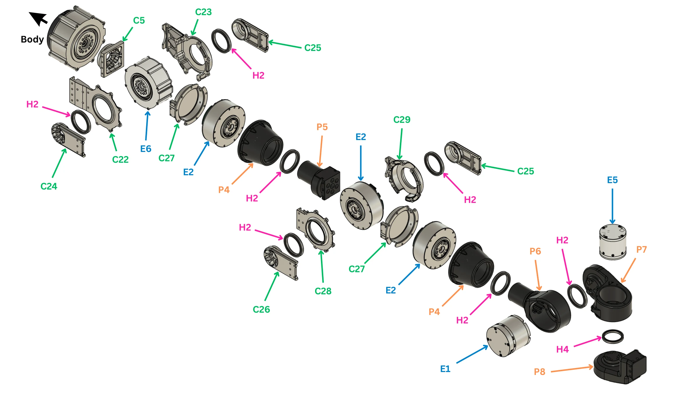
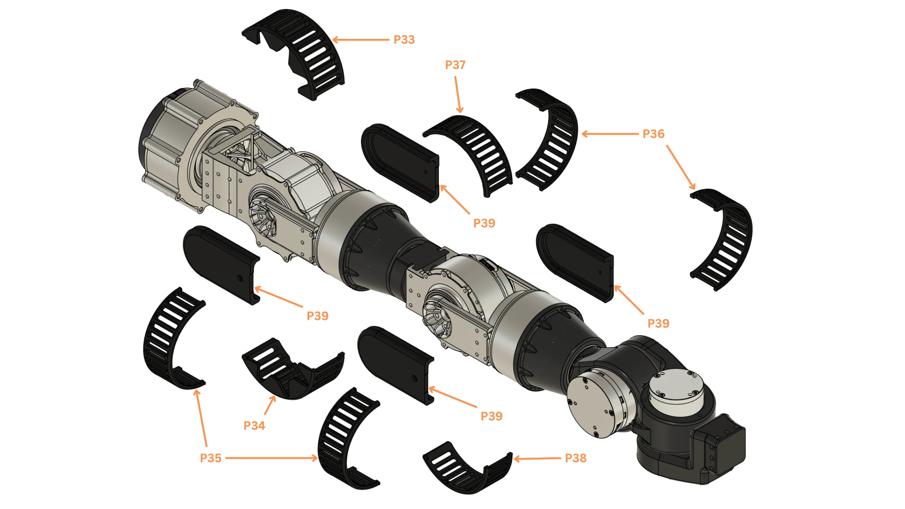
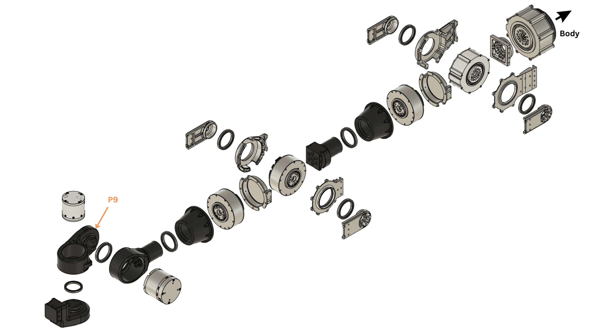

# Arm

One seven-joint arm, shoulder to wrist. Build two; the second is the mirror of the first. Grippers go on in [Final integration](#final-integration).

!!! abstract "At a glance"
    - **You will:** set seven IDs, build shoulder, elbow and wrist, then fit the covers.
    - **Before this:** [Leg](#leg).

{{ step(1, "Set the seven actuator IDs") }}

Set and label each ID on the bench, one actuator at a time. `shoulder_1` is on the torso bus `can22`, not the arm's own bus.

| Joint | Actuator | ID left / right | Bus left / right |
| --- | --- | --- | --- |
| `shoulder_1` (pitch) | RobStride 03 | 10 / 20 | `can22` / `can22` |
| `shoulder_2` (roll) | RobStride 06 | 11 / 21 | `can9` / `can21` |
| `shoulder_3` (yaw) | RobStride 02 | 12 / 22 | `can9` / `can21` |
| `elbow` | RobStride 02 | 13 / 23 | `can9` / `can21` |
| `wrist_1` (roll) | RobStride 02 | 14 / 24 | `can9` / `can21` |
| `wrist_2` (pitch) | RobStride 00 | 15 / 25 | `can9` / `can21` |
| `wrist_3` (yaw) | RobStride 05 | 16 / 26 | `can9` / `can21` |

✅ **Check:** each actuator answers alone at its ID and carries its label.
{ .dh-check }

## Shoulder, elbow and wrist

<figure markdown>
  { loading=lazy }
  <figcaption>The right arm, body outward to the wrist: machined parts C5 and C22–C29, printed parts P4–P8, actuators E1, E2, E5 and E6, bearings H2 and H4. The unlabelled actuator at the top left, marked <em>Body</em>, is the shoulder-pitch actuator (E3), seated in the torso side plate.</figcaption>
</figure>

{{ booklet_parts("p.9") }}

<figure markdown>
  <video class="dh-clip" autoplay loop muted playsinline preload="metadata" width="1280" height="720"
    poster="../assets/exploded/arm-poster.webp" aria-label="Exploded view of one arm, shoulder-pitch actuator to wrist"><source src="../assets/exploded/arm.mp4" type="video/mp4"><a href="../assets/exploded/arm.mp4">MP4</a></video>
  <figcaption>Shoulder pitch to wrist. Shoulder roll and elbow each sit in a two-plate yoke, one bearing per plate. Click to pause; drag the bar to scrub.</figcaption>
</figure>

{{ step(2, "Build the shoulder-pitch joint") }}

The actuator (E3) sits in the torso side plate, output outward. Fit the output shaft (C5) on the output and the coupler (C27) over it: the arm hangs from this coupler.

✅ **Check:** turns freely, no axial play.
{ .dh-check }

{{ step(3, "Build the shoulder-roll joint") }}

Bolt the actuator (E6) into the bracket (C22). Fit the shoulder shaft (C24) on the output and the support shaft (C25) over the bearing (H2) in the retainer (C23). Make both sides concentric before tightening.

✅ **Check:** turns end to end, equal drag both ways, no axial play.
{ .dh-check }

{{ step(4, "Build the shoulder-yaw joint") }}

Fit the actuator (E2) with its shaft cover (P4) and bearing (H2).

✅ **Check:** the three shoulder joints move independently, nothing touches.
{ .dh-check }

{{ step(5, "Build the elbow joint") }}

Bolt the actuator (E2) into the bracket (C28). Fit the elbow shaft (C26) on the output through the coupler (P5) and cover (C27); fit the support shaft (C25) over the bearing (H2) in the retainer (C29).

✅ **Check:** no axial play; clears the upper arm at both ends of travel.
{ .dh-check }

{{ step(6, "Build the wrist-roll joint") }}

Fit the actuator (E2) with its shaft cover (P4); bolt the wrist shaft (P6) to the output.

✅ **Check:** turns freely, no axial play.
{ .dh-check }

{{ step(7, "Build the wrist-pitch joint") }}

Seat the actuator (E1) in the wrist housing (P7 on the right arm, P9 on the left) with its bearing (H4).

✅ **Check:** no binding; clears the wrist-roll body at both ends of travel.
{ .dh-check }

{{ step(8, "Build the wrist-yaw joint") }}

Fit the actuator (E5) and bolt the wrist output (P8) to it. The gripper bolts to this output.

✅ **Check:** the three wrist axes move together without contact.
{ .dh-check }

## Covers

<figure markdown>
  { loading=lazy }
  <figcaption>Printed TPU covers P33–P39, shoulder to wrist.</figcaption>
</figure>

{{ booklet_parts("p.10") }}

{{ step(9, "Route the harness and fit the covers") }}

Run three cable groups down the arm — `can22` to `shoulder_1`, the arm bus to the other six joints, and the gripper servo cable to the wrist — leaving the tails free at the shoulder for [Final integration](#final-integration); then fit the covers.

✅ **Check:** all seven joints move through their travel with no cable stretched or pinched; nothing rattles.
{ .dh-check }

## Build the second arm

<figure markdown>
  { loading=lazy }
  <figcaption>The left arm: the same chain with the left wrist housing P9 in place of P7.</figcaption>
</figure>

{{ booklet_parts("p.11") }}

Repeat steps 2–9 with the left IDs, the left wrist housing (P9) and every A cover swapped with its B cover (P33/P34, P37/P38).
