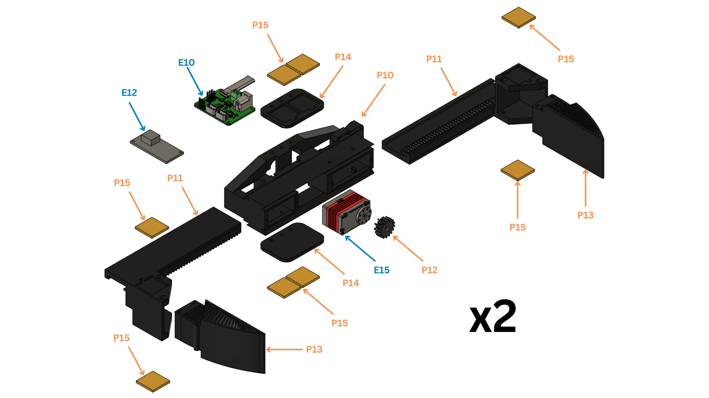

# Gripper

A rack-and-pinion parallel gripper: one serial-bus servo drives both jaws through a pinion. Build two.

!!! abstract "At a glance"
    - **You will:** set the servo IDs, build the housing, racks and fingers, fit the tags, wire the servo.
    - **Before this:** [Head and camera gimbal](#head-and-camera-gimbal).

{{ step(1, "Set the two servo IDs") }}

Set each servo (E15) ID on its driver board (E10), one at a time; mark ID and hand on the servo, and record each board's USB serial against its hand.

| | Left | Right |
| --- | ---: | ---: |
| Servo ID | 5 | 19 |

✅ **Check:** each servo answers at its ID; hands and board serials recorded.
{ .dh-check }

<figure markdown>
  { loading=lazy }
  <figcaption>One gripper (build two): housing P10, racks P11, pinion P12, fingers P13, AprilTag holders P14, tags P15, servo E15, driver board E10, buck converter E12.</figcaption>
</figure>

{{ booklet_parts("p.13") }}

{{ step(2, "Fit the servo and pinion into the housing") }}

Bolt the servo (E15) into the housing (P10) and the pinion (P12) onto its output.

✅ **Check:** the servo is fixed and turns the pinion with no lost motion.
{ .dh-check }

{{ step(3, "Fit both racks") }}

Slide the two racks (P11) into the housing from opposite sides, both engaged on the pinion, jaws symmetric about the centreline.

✅ **Check:** the jaws move together, parallel and symmetric, without binding.
{ .dh-check }

{{ step(4, "Fit the fingers") }}

Fit one finger (P13) to each rack.

✅ **Check:** the fingers meet flat when the jaws close.
{ .dh-check }

{{ step(5, "Fit the AprilTags") }}

Fit the two tag holders (P14) to the housing and seat the eight tag tiles (P15) square in their pockets, each with the tag ID the perception configuration assigns to that slot and hand.

✅ **Check:** all eight tags sit square and carry the right IDs.
{ .dh-check }

{{ step(6, "Wire the servo") }}

Wire the servo to its driver board (E10), fed 12 V by its buck converter (E12); the board plugs into a torso USB hub ([CAN bus](../electrical/index.md#can-bus)).

{{ step(7, "Mount the gripper on the wrist") }}

Bolt the housing to the wrist output (P8) with the jaws opening front-to-back at encoder zero; the control software checks this on every model rebuild.

✅ **Check:** the gripper is square to the wrist; the jaws open front-to-back.
{ .dh-check }

Open and closed positions are set at [Bring-up](../bringup/index.md).
