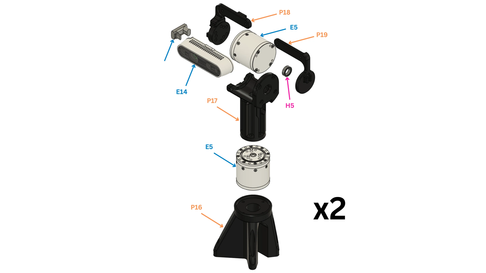

# Head and camera gimbal

Two identical camera columns: a RealSense D436 on a yaw–pitch gimbal of two RobStride 05.

!!! abstract "At a glance"
    - **You will:** build one column, repeat it, then bolt both to the top plate.
    - **Before this:** [Torso and waist](#torso-and-waist).

<figure markdown>
  { loading=lazy }
  <figcaption>One column (build two). Base P16, yaw actuator E5, neck P17, pitch actuator E5, arms P18 and P19, bearing H5, camera E14, USB-C adapter E21.</figcaption>
</figure>

{{ booklet_parts("p.14") }}

<figure markdown>
  <video class="dh-clip" autoplay loop muted playsinline preload="metadata" width="1280" height="720"
    poster="../assets/exploded/twincities-poster.webp" aria-label="Exploded view of one camera gimbal column"><source src="../assets/exploded/twincities.mp4" type="video/mp4"><a href="../assets/exploded/twincities.mp4">MP4</a></video>
  <figcaption>How the column comes together. Click to pause; drag the bar to scrub.</figcaption>
</figure>

{{ step(1, "Set the actuator IDs") }}

Set and label the four IDs on the bench, before anything is assembled.

| Joint | ID | Bus |
| --- | ---: | --- |
| `cam_yaw_left` | 7 | `can25` |
| `cam_pitch_left` | 8 | `can25` |
| `cam_yaw_right` | 5 | `can25` |
| `cam_pitch_right` | 6 | `can25` |

✅ **Check:** IDs 5 to 8 answer on `can25`.
{ .dh-check }

{{ step(2, "Fit the yaw actuator into the base") }}

Seat the yaw actuator (E5) in the base (P16), body on the yaw axis.

✅ **Check:** the output turns freely, no axial play.
{ .dh-check }

{{ step(3, "Fit the neck to the yaw output") }}

Bolt the neck (P17) to the yaw actuator output.

✅ **Check:** the neck turns square to the yaw axis, no wobble.
{ .dh-check }

{{ step(4, "Fit the pitch actuator into the neck") }}

Seat the pitch actuator (E5) in the neck (P17), its axis horizontal and crossing the yaw axis.

{{ step(5, "Fit the two arms") }}

Bolt the arm (P18) to the pitch actuator output. On the other side, press the bearing (H5) into the support arm (P19) and fit it over the neck's idler pin.

✅ **Check:** both arms swing together through the full pitch travel without binding.
{ .dh-check }

{{ step(6, "Mount the camera") }}

Fit the camera (E14) between the two arms and plug the right-angle USB-C adapter (E21) into it. Hold the camera by its body; leave the lens film on until the build is done.

✅ **Check:** the camera does not move under hand pressure.
{ .dh-check }

{{ step(7, "Route the camera cable") }}

Run the USB-A to USB-C cable (E9) from the adapter (E21) down the column and into the torso, with slack across the pitch and yaw axes and no tight bends: a flexed USB 3 cable drops the camera to USB 2. Fix it to the neck so it cannot snag anywhere in the yaw travel.

✅ **Check:** the camera streams USB 3 at every extreme of hand-turned travel.
{ .dh-check }

{{ step(8, "Build the second column") }}

Repeat steps 2–7 with the other side's IDs.

{{ step(9, "Mount both columns on the top plate") }}

Bolt each base flush on the top plate (`CNC_body03_top_plate`), through the concentric holes, yaw axes 130 mm apart. The right column is the left rotated 180°. `cam_yaw_left` (IDs 7/8) is the column on the robot's left.

✅ **Check:** yaw axes 130 mm apart; the columns never touch through full travel.
{ .dh-check }

{{ step(10, "Zero the joints") }}

Zero each joint with the camera looking straight out and level; the control code assumes encoder zero is that pose. Record the camera serial per side for [Camera calibration](../bringup/index.md#camera-calibration).
