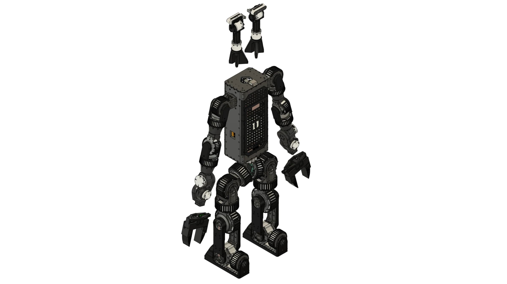

# Assembly

Build the robot as bench subassemblies, in this order, then join them:

1. [Leg](#leg) ×2.
2. [Arm](#arm) ×2.
3. [Torso and waist](#torso-and-waist).
4. [Head and camera gimbal](#head-and-camera-gimbal): two camera columns.
5. [Gripper](#gripper) ×2.
6. [Final integration](#final-integration).

Then [Electrical](../electrical/index.md) and [Bring-up](../bringup/index.md).

<figure markdown>
  { loading=lazy }
  <figcaption>Torso, legs and arms assembled; the two camera columns and two grippers lifted off.</figcaption>
</figure>

## Find a part on the robot

Every exploded view below is followed by its parts table. **Label** is the number drawn on the figure and the Team ref of the [Bill of materials](../bom/index.md); **Part ID** is the file name on [CAD downloads](../fabrication/index.md#cad-downloads). Click **Preview** in a row to see the part on the robot.

<model-viewer id="dh-viewer" data-base="../" src="../assets/viewer/robot.glb" camera-controls
  camera-orbit="35deg 75deg auto" min-camera-orbit="auto auto 0.3m" max-camera-orbit="auto auto 6m"
  interaction-prompt="none" shadow-intensity="0.6" exposure="1.1" loading="eager"
  alt="Duke Humanoid V2, every component in its Fusion 360 appearance">
  <button slot="hotspot-x" class="dh-axis dh-axis-x" type="button" tabindex="-1" data-position="0m 0m 0m" aria-label="X axis">X</button>
  <button slot="hotspot-y" class="dh-axis dh-axis-y" type="button" tabindex="-1" data-position="0m 0m 0m" aria-label="Y axis">Y</button>
  <button slot="hotspot-z" class="dh-axis dh-axis-z" type="button" tabindex="-1" data-position="0m 0m 0m" aria-label="Z axis">Z</button>
</model-viewer>

  <button id="dh-viewer-reset" class="md-button" type="button">Show all</button>
  Colours are the Fusion appearances<i class="dh-sw-amber"></i>hovered row<i class="dh-sw-red"></i>selected on the model<i class="dh-sw-blue"></i>selected row
  

Axes are the STEP file axes (right-handed, Z up).

{{ step_ns("leg") }}


{{ step_ns("arm") }}


{{ step_ns("torso-and-waist") }}


{{ step_ns("head-and-camera-gimbal") }}


{{ step_ns("gripper") }}


{{ step_ns("final-integration") }}

