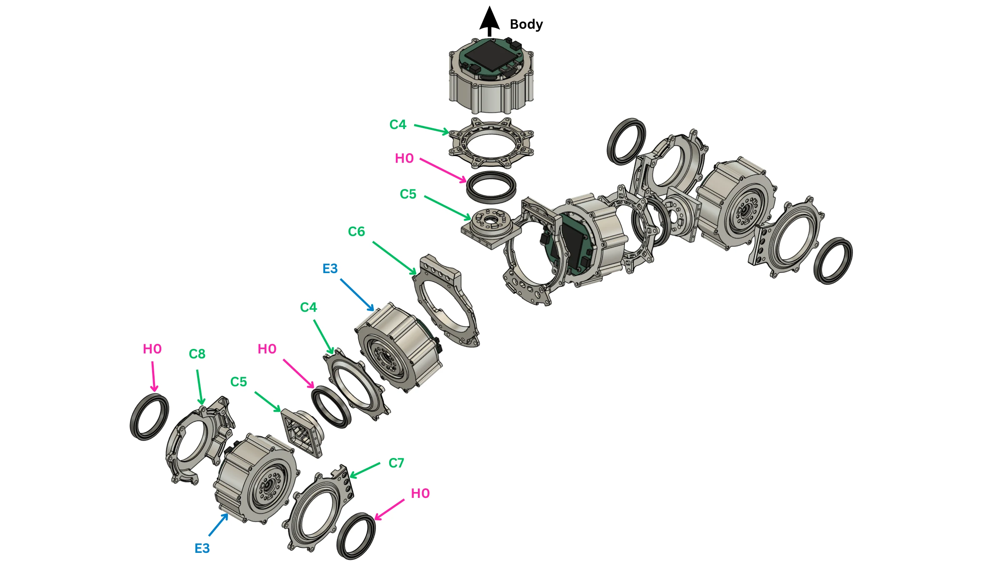
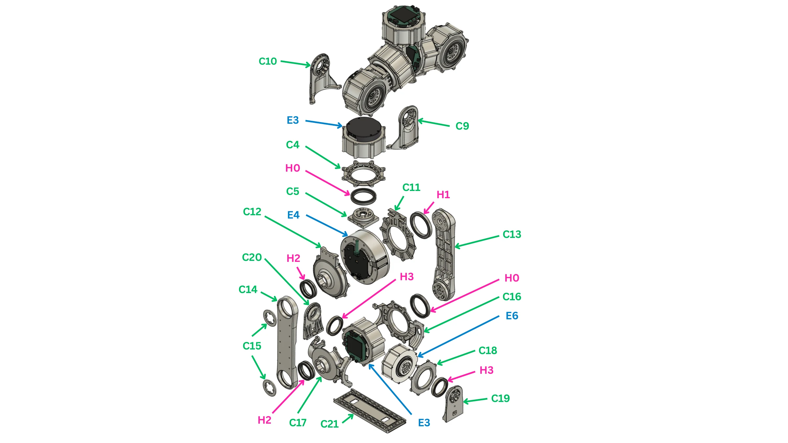
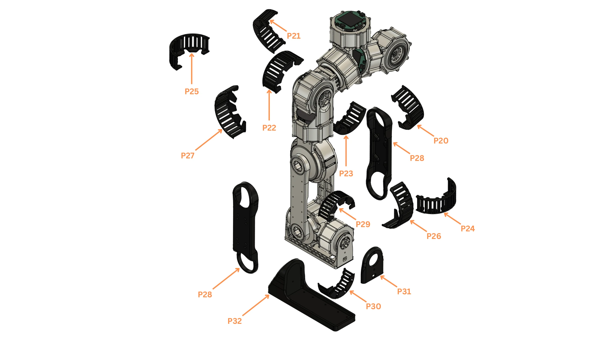

# Leg

One leg, hip to foot: six RobStride joints in a chain of machined brackets and shafts. Build two; the second is the mirror of the first.

!!! abstract "At a glance"
    - **You will:** set six IDs, build the hip (three joints), then the knee, shank, ankle and foot, then fit the covers.
    - **Before this:** nothing; the leg is the first subassembly.

{{ step(1, "Set the six actuator IDs") }}

Set and label each ID on the bench, one actuator at a time. All six joints of a leg share one CAN bus.

| Joint | Actuator | ID left / right | Bus left / right |
| --- | --- | --- | --- |
| `hip_1` (pitch) | RobStride 03 | 31 / 41 | `can24` / `can23` |
| `hip_2` (roll) | RobStride 03 | 32 / 42 | `can24` / `can23` |
| `hip_3` (yaw) | RobStride 03 | 33 / 43 | `can24` / `can23` |
| `knee` | RobStride 04 | 34 / 44 | `can24` / `can23` |
| `ankle_1` (pitch) | RobStride 03 | 35 / 45 | `can24` / `can23` |
| `ankle_2` (roll) | RobStride 06 | 36 / 46 | `can24` / `can23` |

✅ **Check:** each actuator answers alone at its ID and carries its label.
{ .dh-check }

## Hip

<figure markdown>
  { loading=lazy }
  <figcaption>Hip pitch and hip roll, body outward: brackets and retainers C4–C8, actuators E3, bearings H0. The unlabelled actuator at the top, marked <em>Body</em>, is the waist actuator (E3) of the torso.</figcaption>
</figure>

{{ booklet_parts("p.4") }}

<figure markdown>
  <video class="dh-clip" autoplay loop muted playsinline preload="metadata" width="1280" height="720"
    poster="../assets/exploded/hip-assembly-poster.webp" aria-label="Exploded view of the pelvis block with the waist and four hip actuators"><source src="../assets/exploded/hip-assembly.mp4" type="video/mp4"><a href="../assets/exploded/hip-assembly.mp4">MP4</a></video>
  <figcaption>The pelvis block: waist actuator in the middle, hip pitch and hip roll on each side. Click to pause; drag the bar to scrub.</figcaption>
</figure>

{{ step(2, "Build the hip-pitch joint") }}

Bolt the actuator (E3) into the bracket (C6). Fit the output shaft (C5) on the output and the bearing (H0) in its retainer (C4) on the far side.

✅ **Check:** turns freely, even drag, no axial play.
{ .dh-check }

{{ step(3, "Build the hip-roll joint") }}

Bolt the actuator (E3) into the front bracket (C7). Fit the output shaft (C5) on the output; seat the bearing (H0) in the back retainer (C8). Make both retainers concentric before tightening.

✅ **Check:** turns end to end without binding, equal drag both ways, no axial play.
{ .dh-check }

## Knee, shank, ankle and foot

<figure markdown>
  { loading=lazy }
  <figcaption>Hip yaw down to the foot: machined parts C4, C5 and C9–C21, actuators E3, E4 and E6, bearings H0–H3.</figcaption>
</figure>

{{ booklet_parts("p.5") }}

<figure markdown>
  <video class="dh-clip" autoplay loop muted playsinline preload="metadata" width="1280" height="720"
    poster="../assets/exploded/leg-poster.webp" aria-label="Exploded view of one leg hanging from the pelvis block"><source src="../assets/exploded/leg.mp4" type="video/mp4"><a href="../assets/exploded/leg.mp4">MP4</a></video>
  <figcaption>The leg below the pelvis: hip yaw, knee, the two shank links, ankle pitch, ankle roll, foot. Click to pause; drag the bar to scrub.</figcaption>
</figure>

{{ step(4, "Build the hip-yaw joint") }}

Fit the output shaft (C9) on the actuator (E3) output and the support shaft (C10) over the bearing on the other side; the output shaft (C5) and retainer (C4) sit on the actuator as in step 2.

✅ **Check:** the three hip joints move independently, nothing touches.
{ .dh-check }

{{ step(5, "Build the knee joint") }}

Bolt the actuator (E4) into the bracket (C11); fit the bearing retainer (C12) with its bearing on the back.

✅ **Check:** turns freely, no axial play; the retainer sits without a gap.
{ .dh-check }

{{ step(6, "Join the shank to the knee") }}

Bolt the shank shaft (C13) to the knee output and the shank support (C14) to the far side; close each shank joint with a cap (C15).

✅ **Check:** the knee still turns freely.
{ .dh-check }

{{ step(7, "Build the ankle-pitch joint") }}

Bolt the actuator (E3) into the bracket (C16); fit the output shaft (C5), the retainer (C4) with its bearing, and the back retainer (C17).

✅ **Check:** no axial play; clears the shank at both ends of travel.
{ .dh-check }

{{ step(8, "Build the ankle-roll joint") }}

Bolt the actuator (E6) with its retainer (C18); fit the foot shaft (C19) on the output and the foot support (C20) over the bearing on the other side. Make both shaft ends concentric before tightening.

✅ **Check:** no axial play; pitch and roll never collide.
{ .dh-check }

{{ step(9, "Fit the foot") }}

Bolt the foot (C21) to the foot shaft and support.

✅ **Check:** at ankle zero the foot sits flat.
{ .dh-check }

## Covers

<figure markdown>
  { loading=lazy }
  <figcaption>Printed TPU covers P20–P32, hip to sole.</figcaption>
</figure>

{{ booklet_parts("p.6") }}

{{ step(10, "Route the harness and fit the covers") }}

Run the leg's CAN chain and power branch from the foot up to the hip, leaving the tail free at the hip for [Final integration](#final-integration); then fit the covers, sole (P32) and foot front (P31).

✅ **Check:** all six joints move through their travel with no cable stretched or pinched; nothing rattles.
{ .dh-check }

## Build the second leg

Repeat steps 2–10. The legs are mirrors: every A cover swaps with its B cover (P20/P21, P22/P23, P24/P25, P26/P27, P29/P30).
