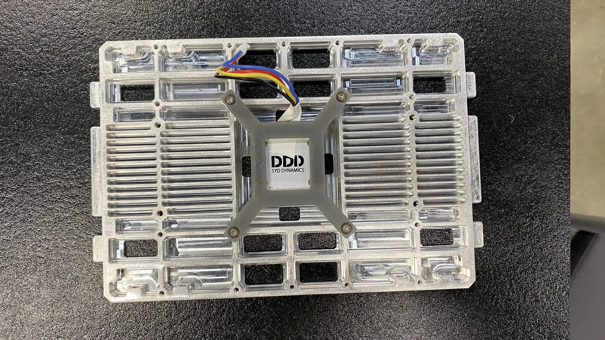

# Torso and waist

Build the torso that limbs and camera columns bolt to.

!!! abstract "At a glance"
    - **You will:** build frame and waist; mount electronics, packs and covers.
    - **Parts:** RobStride 03 ×1 ([Actuators](../bom/index.md#actuators)); `CNC_body01`–`CNC_body04` ([machined parts](../bom/index.md#cnc-parts)); electronics in steps 5–8 ([Electronics](../bom/index.md#electronics)).
    - **Before this:** [Arm](#arm).

!!! note "Read off the model — torso fasteners, mounts and retention"
    Take it from the published model — see [CAD downloads](../fabrication/index.md#cad-downloads).
    - Per step: screws, torque, Loctite 222 use, plate join order and location,
      squareness tolerance.
    - No electronics item has a mount in any parts list.
    - Computer thermal clearance and port orientation are unrecorded.

    *Owner: hardware lead, from the computer-aided design (CAD) and a photographed build.*

<figure markdown>
  <video class="dh-clip" autoplay loop muted playsinline preload="metadata" width="1280" height="720"
    poster="../assets/exploded/body-frame-poster.webp" aria-label="Exploded view of the torso plate frame"><source src="../assets/exploded/body-frame.mp4" type="video/mp4"><a href="../assets/exploded/body-frame.mp4">MP4</a></video>
  <figcaption>Frame: plates, four ribbed rails, internal spine, both shoulder-pitch actuators, waist actuator.</figcaption>
</figure>

{{ step(1, "Configure and label the waist actuator") }}

Set the RobStride 03 to Controller Area Network (CAN) ID 1 on the bench. Label it `waist`.

| Joint | Actuator | CAN ID | Bus | Model limit |
| --- | --- | --- | --- | --- |
| `waist` | RobStride 03 | 1 | `can22` (shared with both `shoulder_1`) | ±90° |

✅ **Check:** Answers at ID 1; labelled.

<figure markdown>
  { loading=lazy }
  <figcaption>Steps 2–4: plates C0–C3, interior plate (spine) P0, actuators E3, bearings H0. Labels are the team BOM ids (Team ref column of the parts lists).</figcaption>
</figure>

{{ step(2, "Assemble the plate frame") }}

| | |
| --- | --- |
| `CNC_body01_x1_bottom_plate` | **TODO**{ .dh-missing } |
| `CNC_body02_x2_side_plate` | **TODO**{ .dh-missing } |
| `CNC_body04_x4_front_plate` — probably the four ribbed rails **UNVERIFIED**{ .dh-unverified } | **TODO**{ .dh-missing } |

Square the frame before anything goes in: every limb and camera references it.

!!! note "Build to the model — the machined-part sheet also lists `B1`–`B3` and `B5_body_shelf`"
    The published model is what you build to; the team's spreadsheet is a working document and differs here.
    Probably duplicates of the `CNC_body` plates: do not order both. The CAD's
    internal spine has no `CNC_body` ID. *Owner: hardware lead.*

✅ **Check:** Flat on a surface plate, square, no racking when pushed.

{{ step(3, "Install the waist actuator") }}

Seat it in the bottom plate's round opening, driver board up, output down into
the pelvis through a flange, a ring and a coupler.

<figure markdown>
  { loading=lazy }
  <figcaption>Waist actuator at the centre of the bottom plate.</figcaption>
</figure>

!!! note "Read off the model — waist flange, ring and coupler"
    Take it from the published model — see [CAD downloads](../fabrication/index.md#cad-downloads).
    *Owner: hardware lead.*

✅ **Check:** Turns freely, no axial play; square to the pelvis at zero.

{{ step(4, "Fit the top plate") }}

| | |
| --- | --- |
| `CNC_body03_x1_top_plate` | **TODO**{ .dh-missing } |

It is the datum for both camera columns: yaw axes at y = ±65 mm, z = 0.52 m in
the base frame ([Head and camera gimbal](#head-and-camera-gimbal)).

✅ **Check:** Flat and square to the frame.

<figure markdown>
  <video class="dh-clip" autoplay loop muted playsinline preload="metadata" width="1280" height="720"
    poster="../assets/exploded/body-front-poster.webp" aria-label="Exploded view of the torso front electronics bay"><source src="../assets/exploded/body-front.mp4" type="video/mp4"><a href="../assets/exploded/body-front.mp4">MP4</a></video>
  <figcaption>Front bay, identifications <strong class="dh-unverified">UNVERIFIED</strong>: six CAN adapters, mini PC on the spine, two distribution bars, inertial measurement unit (IMU) on the top plate.</figcaption>
</figure>

<figure markdown>
  { loading=lazy }
  <figcaption>Steps 5–8, both sides of the torso: computer E0, packs E7, CAN adapters E13, hubs E16, IMU E17, surge protector E18, distribution blocks E19, voltage checkers E20. Labels are the team BOM ids (Team ref column of the parts lists).</figcaption>
</figure>

{{ step(5, "Mount the computer") }}

| | |
| --- | --- |
| MINISFORUM X1-470 mini PC | 1 |

Retain it against walking shock, with intake, exhaust and ports clear.

<figure markdown>
  { loading=lazy }
  <figcaption>Computer in printed T-brackets on a crossbar above the waist. Same mount on the finished robot: <strong class="dh-unverified">UNVERIFIED</strong>.</figcaption>
</figure>

✅ **Check:** Does not move when shaken; vents and ports clear.

<figure markdown>
  <video class="dh-clip" autoplay loop muted playsinline preload="metadata" width="1280" height="720"
    poster="../assets/exploded/body-back-poster.webp" aria-label="Exploded view of the torso rear bay with two upright packs"><source src="../assets/exploded/body-back.mp4" type="video/mp4"><a href="../assets/exploded/body-back.mp4">MP4</a></video>
  <figcaption>Rear bay: two packs upright behind the spine, terminal strip below. No pack retention is drawn.</figcaption>
</figure>

{{ step(6, "Mount the battery packs") }}

| | |
| --- | --- |
| Zeee 6S 22.2 V 10000 mAh LiPo | 2 |

!!! danger "Keep both packs disconnected"
    Until [Pre-power checks](../electrical/index.md#pre-power-checks) pass. See
    [Safety](../before-you-start/index.md#safety).

Stand the packs upright, side by side, in the rear bay. They run **in series**
(one pack's + to the other's −) through a surge protector to the 48 V bus:
44.4 V nominal, 50.4 V full (computed). *Source: team power wiring diagram.*

!!! note "Pack retention is tracked on [Power system](../electrical/index.md#power-system)"
    *Owner: hardware lead + electrical.*

✅ **Check:** Packs cannot shift, no lead is taut or on an edge, each pack comes out.

{{ step(7, "Mount the CAN adapters, hubs and power parts") }}

| | |
| --- | --- |
| CANable PRO V2.0 — `can9`, `can21`–`can25` | 6 |
| Vention USB hub | 3 |
| Waveshare ST/SC bus servo driver board | 2 |
| Buck converters: DC 20–60 V to 12 V ×1, 48 V to 12 V ×2 | 3 **UNVERIFIED**{ .dh-unverified } |
| Distribution block pairs, upper and lower body | 2 |
| Surge protector (pack lead), 10 A fuse (computer branch) | 1 each |
| TVS diode M1.5KE62CA | 10 |

Label each CAN adapter with its bus first: a udev rule binds bus name to USB
serial. Wire per [Power system](../electrical/index.md#power-system) and
[CAN bus](../electrical/index.md#can-bus). The power diagram draws one buck converter
(computer only), the bill of materials (BOM) three.

✅ **Check:** Every adapter bus-labelled; no board hangs on its cable; no converter's heat path blocked.

{{ step(8, "Mount the IMU") }}

| | |
| --- | --- |
| SYD Dynamics TransducerM TM171, 40 × 34 × 12.6 mm, USB-C | 1 |

Mount it rigidly: the control stack treats its orientation as a constant.

<figure markdown>
  { loading=lazy }
  <figcaption>IMU on a printed X-bracket on a machined plate. Same mount on the finished robot: <strong class="dh-unverified">UNVERIFIED</strong>.</figcaption>
</figure>

!!! note "The IMU screw conflict is tracked on [Electronics](../bom/index.md#electronics)"
    *Owner: hardware lead.*

Deploy assumes the IMU axes match the robot base frame. It opens the IMU with
no mounting-rotation offset and writes the IMU orientation directly as the base
orientation (`deploy/control/humanoid_base.py`, lines 158 and 247); the model
places `imu_site` at the `base_link` origin with no rotation.

To watch the live IMU orientation, run `python hardware_bindings/imu/py_imu.py`
from `deploy/control/`: it serves a 3D frame view on port 8080.

**Mount it with its axes parallel to `base_link`, in any position.** The URDF
places `imu_site` at the `base_link` origin with zero rotation, and the control
stack writes the IMU orientation straight through as the base orientation with
no mounting offset — so rotation must be zero, while a position offset does not
enter the estimate. *Source: `humanoid_v21_full.urdf` (`imu_site_frame`);
`deploy/control/humanoid_base.py` lines 158 and 247.*

✅ **Check:** Rigid, with axes checked against the robot frame.

{{ step(9, "Fit the disconnect and emergency stop") }}

!!! note "The missing e-stop is tracked on [Safety](../before-you-start/index.md#rules)"
    The run scripts assume a physical e-stop. Specify device, what it cuts,
    rating and location.
    *Owner: hardware lead + electrical + Safety sign-off.*

<figure markdown>
  <video class="dh-clip" autoplay loop muted playsinline preload="metadata" width="1248" height="702"
    poster="../assets/exploded/body-cover-poster.webp" aria-label="Exploded view of the torso front and back covers"><source src="../assets/exploded/body-cover.mp4" type="video/mp4"><a href="../assets/exploded/body-cover.mp4">MP4</a></video>
  <figcaption>Front and back covers: each a perforated frame plus a perforated panel.</figcaption>
</figure>

<figure markdown>
  { loading=lazy }
  <figcaption>Printed torso plates: covers P1, front plate P2, back plate P3. Labels are the team BOM ids (Team ref column of the parts lists).</figcaption>
</figure>

{{ step(10, "Fit the front and back covers") }}

!!! note "Read off the model — torso cover geometry and fixings"
    Take it from the published model — see [CAD downloads](../fabrication/index.md#cad-downloads).
    *Owner: hardware lead.*

✅ **Check:** Nothing inside moves when the torso is tilted; the waist still turns.
