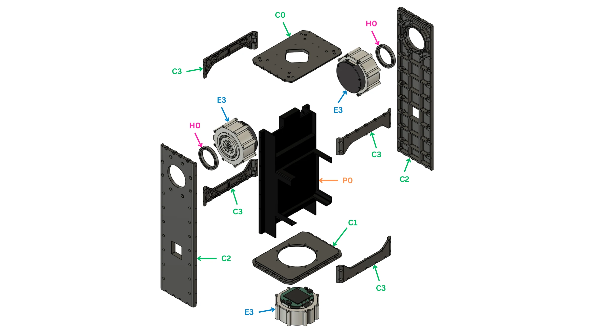
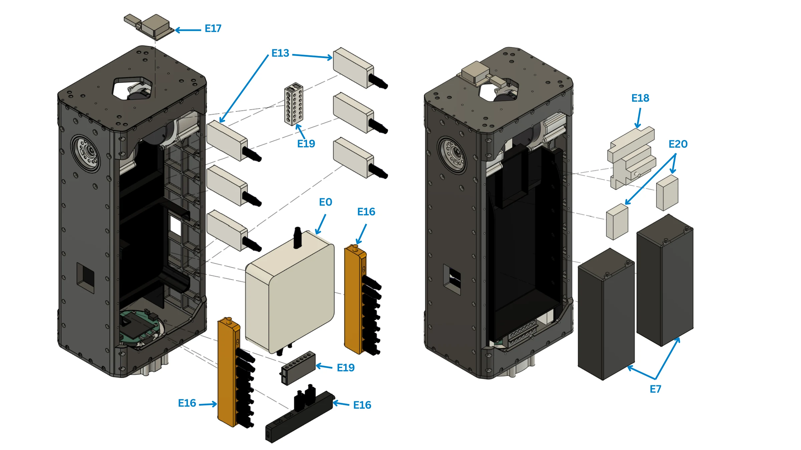
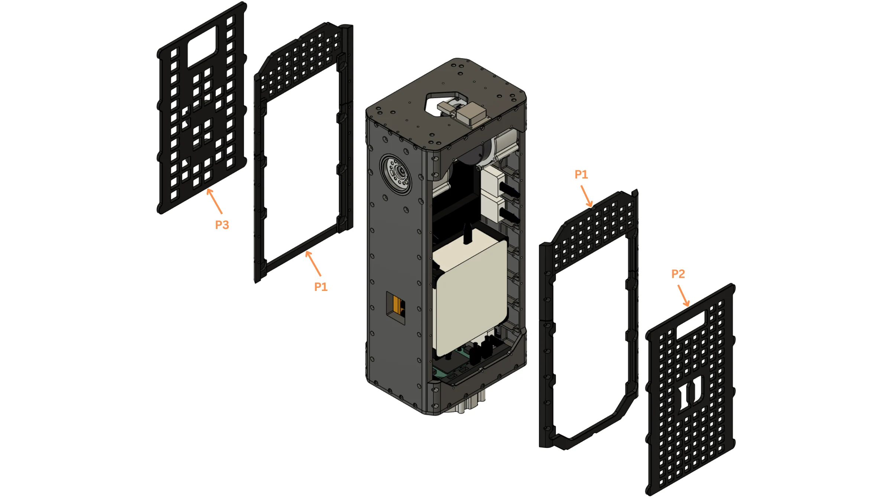

# Torso and waist

The torso: a machined plate frame carrying the waist actuator, both shoulder-pitch actuators, the electronics and the battery packs, closed by printed covers.

!!! abstract "At a glance"
    - **You will:** build the frame, seat the three actuators, mount the electronics and packs, fit the covers.
    - **Before this:** [Arm](#arm).

{{ step(1, "Set the waist actuator ID") }}

| Joint | Actuator | ID | Bus |
| --- | --- | ---: | --- |
| `waist` | RobStride 03 | 1 | `can22` (shared with both `shoulder_1`) |

✅ **Check:** answers at ID 1; labelled.
{ .dh-check }

## Frame

<figure markdown>
  { loading=lazy }
  <figcaption>The frame: plates C0–C3, interior plate P0, actuators E3, bearings H0.</figcaption>
</figure>

{{ booklet_parts("p.1") }}

<figure markdown>
  <video class="dh-clip" autoplay loop muted playsinline preload="metadata" width="1280" height="720"
    poster="../assets/exploded/body-frame-poster.webp" aria-label="Exploded view of the torso plate frame"><source src="../assets/exploded/body-frame.mp4" type="video/mp4"><a href="../assets/exploded/body-frame.mp4">MP4</a></video>
  <figcaption>Plates, interior plate, both shoulder-pitch actuators and the waist actuator. Click to pause; drag the bar to scrub.</figcaption>
</figure>

{{ step(2, "Assemble the plate frame") }}

Bolt the two side plates (C2) and the four front/back plates (C3) to the bottom plate (C1); fit the interior plate (P0). Square the frame before anything goes in: every limb and camera references it.

✅ **Check:** flat on a surface plate, square, no racking when pushed.
{ .dh-check }

{{ step(3, "Seat the waist actuator") }}

Seat the actuator (E3) in the bottom plate's round opening, driver board up, output down into the pelvis, with its output shaft (C5), retainer (C4) and bearing (H0) as on the hip joints.

✅ **Check:** turns freely, no axial play; square to the pelvis at zero.
{ .dh-check }

{{ step(4, "Seat the shoulder-pitch actuators and fit the top plate") }}

Seat one shoulder-pitch actuator (E3) in each side plate, output outward, with its bearing (H0). Bolt the top plate (C0) on last: it is the datum for both camera columns.

✅ **Check:** flat and square to the frame; both shoulder outputs turn freely.
{ .dh-check }

## Electronics and packs

<figure markdown>
  { loading=lazy }
  <figcaption>Computer E0 on the interior plate; packs E7; CAN adapters E13, hubs E16, IMU E17, surge protector E18, distribution blocks E19, voltage checkers E20.</figcaption>
</figure>

{{ booklet_parts("p.2") }}

<figure markdown>
  <video class="dh-clip" autoplay loop muted playsinline preload="metadata" width="1280" height="720"
    poster="../assets/exploded/body-front-poster.webp" aria-label="Exploded view of the torso front electronics bay"><source src="../assets/exploded/body-front.mp4" type="video/mp4"><a href="../assets/exploded/body-front.mp4">MP4</a></video>
  <figcaption>Front bay: CAN adapters, the computer on the interior plate, distribution blocks. Click to pause; drag the bar to scrub.</figcaption>
</figure>

<figure markdown>
  <video class="dh-clip" autoplay loop muted playsinline preload="metadata" width="1280" height="720"
    poster="../assets/exploded/body-back-poster.webp" aria-label="Exploded view of the torso rear bay with two upright packs"><source src="../assets/exploded/body-back.mp4" type="video/mp4"><a href="../assets/exploded/body-back.mp4">MP4</a></video>
  <figcaption>Rear bay: the two packs upright behind the interior plate. Click to pause; drag the bar to scrub.</figcaption>
</figure>

{{ step(5, "Mount the computer") }}

Bolt the computer (E0) to the interior plate above the waist, intake, exhaust and ports clear.

{{ step(6, "Mount the CAN adapters, hubs and power parts") }}

Mount the six CAN adapters (E13), three USB hubs (E16), surge protector (E18), four distribution blocks (E19) and two voltage checkers (E20) in the front bay. Label each CAN adapter with its bus before wiring; wire per [Power system](../electrical/index.md#power-system) and [CAN bus](../electrical/index.md#can-bus).

✅ **Check:** every adapter carries its bus label; no board hangs on its cable.
{ .dh-check }

{{ step(7, "Mount the IMU") }}

Bolt the IMU (E17) rigidly, its axes parallel to the robot base frame: the control software applies no mounting rotation.

✅ **Check:** rigid; axes checked against the frame.
{ .dh-check }

{{ step(8, "Fit the battery packs") }}

Stand the two packs (E7) upright, side by side, in the rear bay. Leave both disconnected until [Pre-power checks](../electrical/index.md#pre-power-checks) pass.

✅ **Check:** packs cannot shift; no lead is taut or on an edge; each pack comes out.
{ .dh-check }

## Covers

<figure markdown>
  { loading=lazy }
  <figcaption>Printed covers P1, front plate P2, back plate P3.</figcaption>
</figure>

{{ booklet_parts("p.3") }}

<figure markdown>
  <video class="dh-clip" autoplay loop muted playsinline preload="metadata" width="1248" height="702"
    poster="../assets/exploded/body-cover-poster.webp" aria-label="Exploded view of the torso front and back covers"><source src="../assets/exploded/body-cover.mp4" type="video/mp4"><a href="../assets/exploded/body-cover.mp4">MP4</a></video>
  <figcaption>Front and back covers: each a perforated frame plus a removable panel. Click to pause; drag the bar to scrub.</figcaption>
</figure>

{{ step(9, "Fit the covers") }}

Fit the two covers (P1) front and back, then the removable front plate (P2) and back plate (P3).

✅ **Check:** nothing inside moves when the torso is tilted; the waist still turns.
{ .dh-check }
