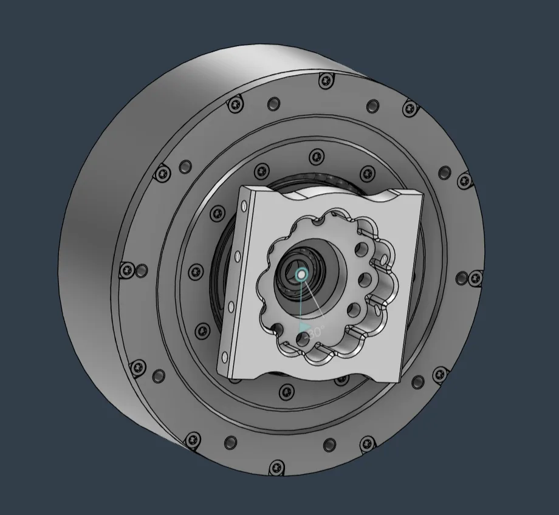

# CNC guide

Have the machined parts made and check a first article.

!!! abstract "At a glance"
    - **You will:** order the parts and measure a first article.
    - **Parts:** [CNC parts](../bom/index.md#cnc-parts).
    - **Before this:** [CAD downloads](#cad-downloads).

## Material and design rules

| Item | Value |
| --- | --- |
| Material | Aluminium 6061, the Fusion material on every `CNC_` component (repo comments suggest hard-anodized) |
| General tolerance | 0.03 mm on radius and length, 0.06 mm on diameter; ± or total band not stated **UNVERIFIED**{ .dh-unverified } |
| Walls | ≥ 1 mm; structural walls ≥ 4 mm |
| Blind holes | End in a standard cone |
| Tapped holes | ≥ 4 mm usable thread, 6 mm preferred |
| Edges | No sharp internal corners; chamfers, not fillets |

*Source: team design log, "Material Choice" and CNC checklist.*

!!! note "Read off the model — nominal geometry per part; alloy, tolerance and finish are the machinist's call"
    Take it from the published model — see [CAD downloads](#cad-downloads).
    *Owner: hardware lead, from the CAD and the machining quotations.*

## Known CAD errors

<figure markdown>
  { loading=lazy }
  <figcaption>"Motor04 Shaft NEEDS m5 holes, but the cad has m4 holes. Same in the knee motor."</figcaption>
</figure>

The reference build's first article found two, and **the published CAD still
carries both.** Fix them at the machinist, not on the robot.

**The M4 holes were not enlarged to M5.** Of the 23 machined parts that have
screw holes, exactly one — `CNC_leg10_knee_output_shank` — carries M5 clearance
(Ø5.3 mm × 14). Every other part, including every shaft and every other knee
part, is M4 clearance (Ø4.25 mm) throughout.

| Interface | Published CAD | What the first article needed |
| --- | --- | --- |
| Motor04 shaft | M4 clearance | M5 |
| Knee motor | M4 clearance, except `CNC_leg10` | M5 |

Open both parts before you send the archive, and enlarge the affected pattern
to Ø5.3 mm. Doing it at the machine costs nothing; doing it after anodising
means re-finishing the part.

**The RS03 shaft bearing retainer above the knee (`CNC_leg03`) was enlarged by
hand on the reference build.** Its bore is undersize as drawn. Expect to open
it on fitting; see [Incoming inspection](#measure-machined-parts)
for the measured values.

!!! note "Not recorded — which hole pattern on the Motor04 shaft the first article opened"
    The note names the part, not the pattern, and the shaft carries more than
    one M4 group. Dry-fit the shaft to the actuator before drilling.
    *Owner: hardware lead.*

## Fit-critical parts

Shafts, couplers, bearing housings, retainers; measure these reviewed
interfaces first:

| Part | Interface |
| --- | --- |
| `CNC_leg02` RS03 shaft coupler | Some diameters at 0.03 mm instead of 0.06 mm |
| `CNC_leg03` RS03 shaft bearing retainer | Mating feature with the motor |
| `CNC_leg08` knee front bearing retainer | Faces meeting the motor and RS03 shaft; bearing outer diameter |
| `CNC_leg09` knee back | Interface with the RS03 shaft |
| `CNC_leg10` knee output shank | Circular pattern on the RS04 side (missing at review) |
| `CNC_leg11` knee support shank | Top/bottom symmetry |
| `CNC_leg13`, `CNC_leg14` ankle pitch front and back | Clearance fit to the RS06; screw-hole size |

## Order the parts

1. **Freeze the revision:** make every part from one release tag.
2. **Send one archive:** STEP per part ([CAD downloads](#cad-downloads)), a parts table (ID,
   quantity, material, finish) and a cover sheet (general tolerance, default
   finish, deadline, contact). There are no per-part drawings in the CAD.

!!! note "Not recorded — whether the reference parts were ordered from STEP alone or with drawings that were not kept"
    *Owner: hardware lead.*

    !!! note "Yours to choose — a machine shop, what to send it, quote, lead time and setup cost (material was priced with JLCPCB CNC)"
        *Owner: hardware lead.*

3. **Ask for a first article:** one piece of each fit-critical part before the
   batch runs. Measure it yourself.
4. **Get the measurement report:** measured values on toleranced features, for
   [incoming inspection](#incoming-inspection).
5. **Order spares on the same setup.**

    !!! note "Yours to determine — which machined parts need spares, and how many"
        *Owner: hardware lead.*

✅ **Check:** each fit-critical first article is measured against the drawing
before the full batch is released.

!!! note "Yours to determine — decision on registering the machined parts with one service and publishing its part numbers"
    *Owner: hardware lead.*
