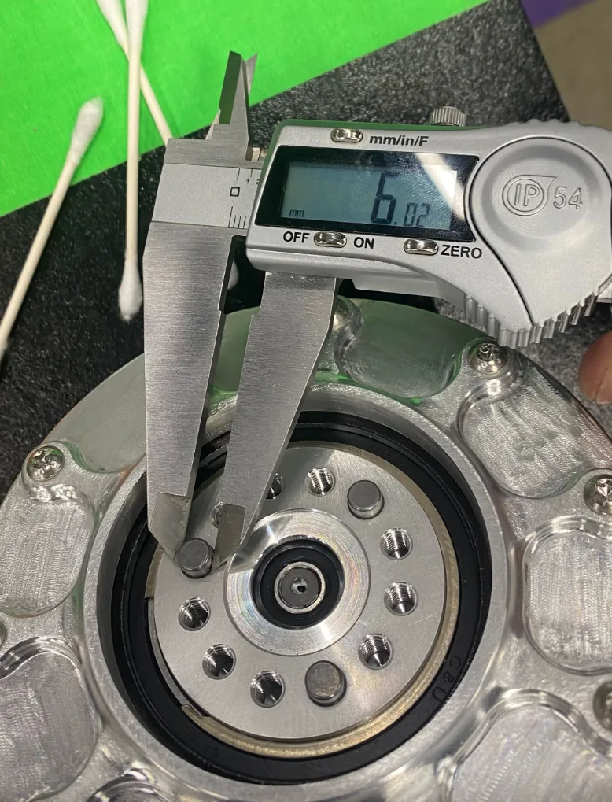
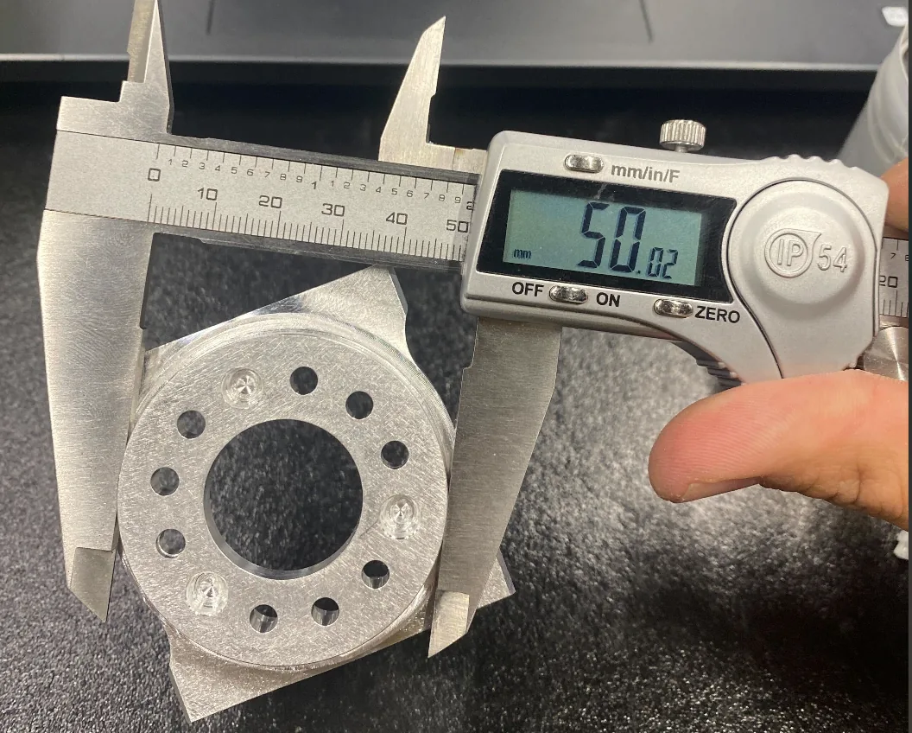
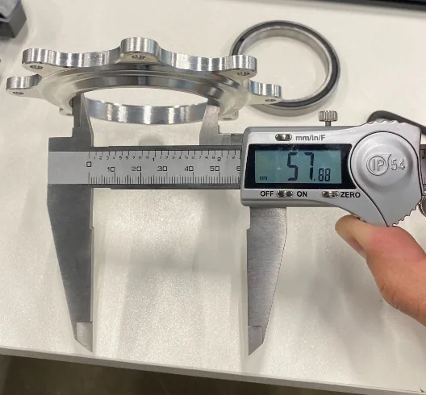

# Incoming inspection

Count, measure and record every part before assembly.

!!! abstract "At a glance"
    - **You will:** inspect and log every part.
    - **Parts:** the whole [bill of materials (BOM)](../bom/index.md).
    - **Tools:** caliper, micrometer, bore or pin gauges, surface plate.
    - **Before this:** [Printing guide](#printing-guide).

## Count and sort

1. Count every box against the BOM. Machined quantities are not confirmed
   against CAD **UNVERIFIED**{ .dh-unverified }: trust your count.
2. Look for short shipments, substitutes and wrong variants.
3. Store by subassembly, one labelled container each: leg, arm, body, head, gripper.

✅ **Check:** your log shows the quantity received, not ordered.

## Measure machined parts

1. Deburr each part.
2. Measure every shaft, coupler, bearing housing and retainer, not a sample:

    | Feature | Check | Instrument | Accept if |
    | --- | --- | --- | --- |
    | Bearing bores | Diameter in two directions, roundness | Bore gauge or pin gauges | **TODO**{ .dh-missing } |
    | Shaft journals | Diameter at each bearing seat | Micrometer | **TODO**{ .dh-missing } |
    | Dowel holes | Diameter, centre spacing | Pin gauges, caliper | **TODO**{ .dh-missing } |
    | Mating faces | Flatness, no burrs or raised edges | Surface plate and indicator | **TODO**{ .dh-missing } |
    | Tapped holes | Real screw runs full depth by hand | The screw | ≥ 4 mm usable thread, 6 mm preferred |

!!! note "Read off the model — nominal size of every fit-critical feature"
    Take it from the published model — see [CAD downloads](#cad-downloads).
    *Owner: hardware lead, once the CNC drawings exist.*

### What the reference build found

<figure markdown>
  { loading=lazy }
  <figcaption>Waist motor shaft, filed down: 8.03 mm.</figcaption>
</figure>

<figure markdown>
  { loading=lazy }
  <figcaption>Motor04 shaft, hole enlarged: 6.02 mm.</figcaption>
</figure>

<figure markdown>
  { loading=lazy }
  <figcaption>Motor04 shaft, filed smaller: 50.02 mm.</figcaption>
</figure>

<figure markdown>
  { loading=lazy }
  <figcaption>RS03 shaft bearing retainer above the knee, enlarged: 57.88 mm.</figcaption>
</figure>

Measure these first ([CNC guide](#fit-critical-parts) interfaces).
No nominal was recorded, so no reading is an acceptance value.

| Part | Rework | Caliper reading |
| --- | --- | --- |
| Waist motor shaft; knee motor shaft | Filed down | 8.03 mm |
| Motor04 shaft | Hole enlarged for fit | 6.02, 6.03 mm |
| Motor04 shaft | Filed smaller | 50.02 mm |
| RS03 shaft bearing retainer above the knee | Enlarged; CAD error | 57.88 mm |
| Motor04 shaft; knee motor | Needs M5 holes, CAD has M4 | — |

Other readings, no text: 7.99, 8.00, 7.91, 35.01, 35.09 mm.

✅ **Check:** every bearing bore and shaft journal has a recorded value before any
bearing is pressed. A press fit is not reversible without damage.

## Check printed parts

| Check | Accept if |
| --- | --- |
| Warp or lift where the part bolts down | **TODO**{ .dh-missing } |
| First-layer spread on faces that seat against machined parts | **TODO**{ .dh-missing } |
| Hole diameter (fused-deposition (FDM) holes print undersize) | **TODO**{ .dh-missing } |
| Heat-set inserts | Flush, square, no rotation under a screwdriver |
| Layer adhesion on structural parts (flex a sacrificial region) | No delamination |

!!! note "Yours to determine — pass criteria for printed parts"
    *Owner: hardware lead.*

## Check actuators

!!! danger "Do not open an actuator"
    - The manuals warn against disassembly. Re-mounting the driver board or reordering the phase leads requires encoder recalibration.
    - Do not change the torque limit, protection temperature or over-temperature time.
    - Send a stop command before switching control mode.

1. **Model** matches the joint ([Actuators](../bom/index.md#which-model-goes-in-which-joint)).
2. **Free rotation** by hand, unpowered, through a full turn: no notch or grinding.
3. **No damage** to connectors, output flange or housing.
4. **Controller Area Network (CAN) ID as shipped:** read it on the bench, not on
   a live bus. RS03 and RS04 units arrived at factory ID 127 (range 0–127);
   other models not observed.
5. **Firmware version**, recorded per unit.
6. **Encoder** reads continuously over a full turn.

✅ **Check:** a unit passes all six before it goes into a limb.

**Vendor PC tool** ([robstride.com/download](https://www.robstride.com/download);
see [Motor ID and config](../bringup/index.md#motor-id-and-config)):

- Reads parameters, sets CAN ID and zero, calibrates the encoder, updates firmware.
- Needs the vendor's serial USB-CAN module (CH340, AT mode), not a CANable **UNVERIFIED**{ .dh-unverified }.
- Edit parameters only in standby. A zero set from the tool is lost at power-off.

!!! note "Yours to determine — actuator acceptance criteria: firmware baseline per model, bench setup and read-out command, free-rotation feel, mass window, run-in"
    *Owner: hardware lead.*

## Check electronics

!!! danger "Lithium-polymer packs"
    A damaged pack is a fire. Read [Safety](#safety) first;
    power nothing before [Pre-power checks](../electrical/index.md#pre-power-checks).
    Charging: [Power system](../electrical/index.md#power-system).

1. Confirm variants; look for bent pins, cracked connectors, loose heatsinks.
2. Count the small parts.
3. Check each pack for swelling and damaged cells, leads and connectors.

✅ **Check:** each pack's voltage and cell balance are logged.

!!! note "Yours to determine — battery acceptance voltage and cell balance on arrival, and storage charge"
    *Owner: hardware lead.*

## Record and reject

1. Log per part: `part_id`, release tag, quantity received, date, vendor and
   batch, measured values, `pass` / `rework` / `reject`, notes.
2. Never fit a failed part: quarantine it, report it to the vendor with the
   measured value, log it.

Reference-build photos show only a hand-held digital caliper (0.01 mm, IP54).

!!! note "Yours to determine — measuring instruments and ranges beyond a caliper (micrometers, bore or pin gauges, indicator, thread gauges, multimeter, cell checker)"
    *Owner: hardware lead.*

✅ **Check:** every BOM part is present, inspected and recorded before assembly begins.
