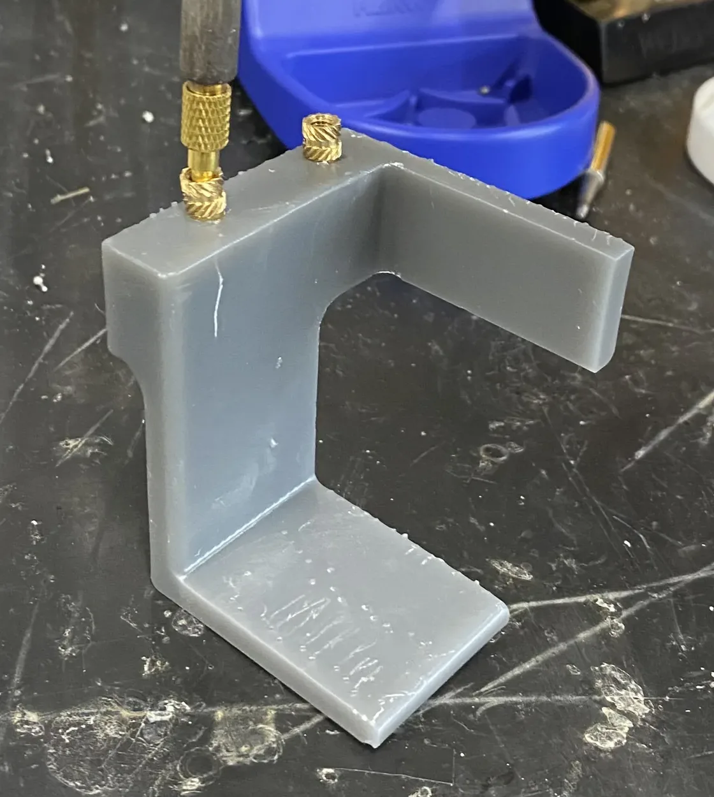

# Printing guide

Print PLA and TPU by fused deposition (FDM) and nylon powder by laser
sintering (SLS).

!!! abstract "At a glance"
    - **You will:** print a test part, then the set.
    - **Parts:** [Printed parts](../bom/printed-parts.md).
    - **Files:** a 3MF per part in the Files column of [Printed parts](../bom/printed-parts.md), all on [CAD downloads](cad-downloads.md).
    - **Before this:** [CNC guide](cnc-guide.md).

## Print profiles


{{ read_csv('data/print_profiles.csv') }}

!!! missing "MISSING — `print_profiles.csv`: material grade, layer height, walls, infill, orientation (which face down, which load the layers must not cross), supports and validated printer for every printed part"
    *Owner: hardware lead, from the printer the reference build used.*


!!! missing "MISSING — material settings: PLA (filament, nozzle and bed temperature, cooling, speed, enclosure); TPU (shore hardness, temperatures, retraction, speed, extruder type, what the parts are for); SLS (powder grade, bureau, finish, tolerance)"
    *Owner: hardware lead.*

## Print the parts

1. Print one small fit-critical part: one that mates with a machined part or
   takes a heat-set insert.
2. Print the full set.

✅ **Check:** the test part matches the drawing before step 2.

!!! missing "MISSING — which parts are FDM or SLS, which are structural, and whether an SLS part can be printed FDM instead"
    *Owner: hardware lead.*

## Post-process

<figure markdown>
  { loading=lazy width="400" }
  <figcaption>Heat-set inserts melted into a printed battery holder with a soldering iron.</figcaption>
</figure>

!!! missing "MISSING — post-processing per part (support removal on mating faces, holes to ream and to what size, heat-set insert size and temperature, annealing) and print time and material mass per part"
    *Owner: hardware lead.*

Next: [Incoming inspection](incoming-inspection.md#check-printed-parts).
