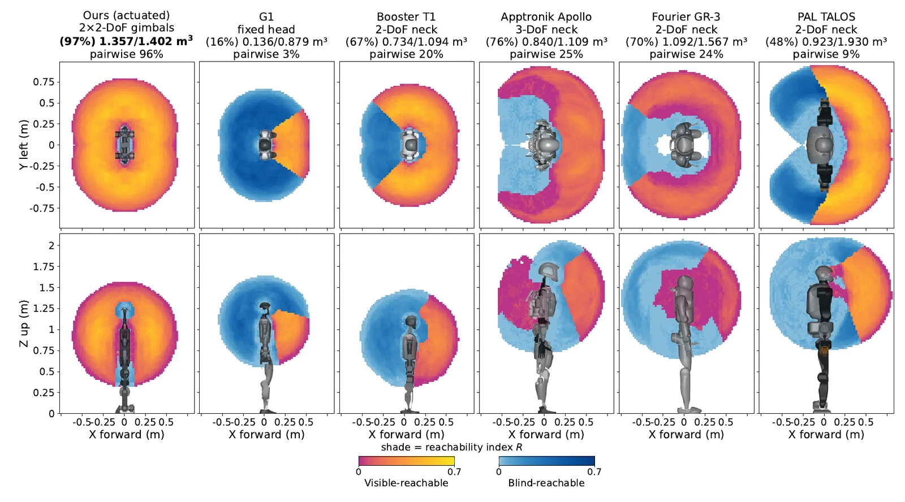

# FAQ

**Can I build it today?** No; see the [home page](../index.md) blockers.

**What does it cost?** At least {{ bom_total() }} in parts; see
[Cost and time](../bom/index.md).

**How long does it take?** **TODO**{ .dh-missing }: not measured.

**Can I build only a camera module?** About 0.58 kg, two axes and about
$600 in hardware per module (project README) **UNVERIFIED**{ .dh-unverified }.
On the reference robot, each module's yaw and pitch actuators are RobStride 05
units on the shared `can25` bus, fed from the 48 V upper-body power
distribution block; each D436 connects to the onboard PC over USB (team wiring
and power diagrams). Deploy configures IDs 5 and 6 for the right module and 7
and 8 for the left (`deploy/control/humanoid_config.py`).

!!! note "Yours to determine — camera module interface for another robot: mounting"
    *Owner: hardware lead.*

<figure markdown>
  { loading=lazy }
  <figcaption>Visible-reachable workspace across six humanoid platforms.</figcaption>
</figure>

**Can I substitute the D436 or the RobStride actuators?** **TODO**{ .dh-missing }:
no alternate is recorded. See [Sourcing](../bom/index.md#sourcing).

**Do I need a 5-axis mill?** **TODO**{ .dh-missing }: unknown. See
[Skills and shop access](../fabrication/index.md#what-you-need).

**Do I need a GPU?** Not on the robot; the planner needs a separate CUDA machine.

**Will the published policy run on my build?** Only if joint order, directions
and calibration match; that contract is **TODO**{ .dh-missing }, see
[Software](../software.md).

**Where do I get help?** The GitHub issue trackers of the three repositories.

!!! note "Yours to determine — issue template, contribution guide, support policy; what to do with an out-of-tolerance part; kits; build-log review"
    *Owner: PI + hardware lead.*
